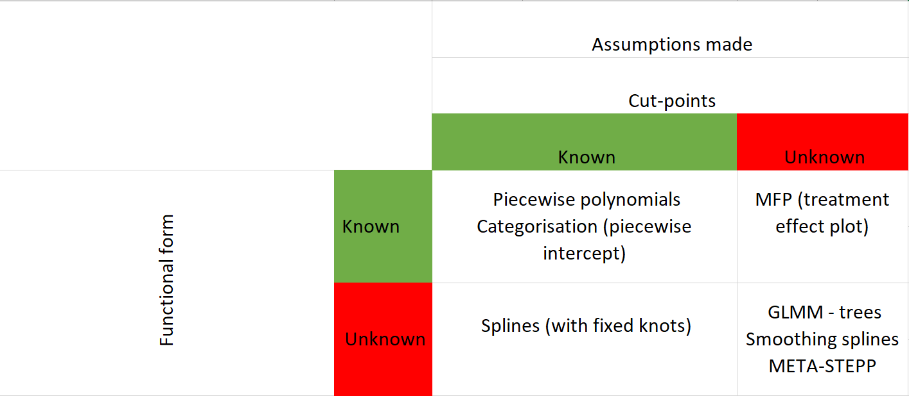

```{r global_options , echo=FALSE, message=FALSE, warning= FALSE}
rm(list=ls()) ### To clear namespace
## Fractional Polynomials
## Load data-set
if(!require("readr")) install.packages("readr")
## Load ggplot2 for plotting
if(!require("ggplot2")) install.packages("ggplot2")
## Load gridExtra for fine tuning
if(!require("gridExtra")) install.packages("gridExtra")
## Load knitr for fine tuning
if(!require("knitr")) install.packages("knitr")
## Load haven for fine tuning
if(!require("haven")) install.packages("haven")
## Load dplyr
if(!require("dplyr")) install.packages("dplyr")
## Load lme4 for lme4
if(!require("lme4")) install.packages("lme4")
## Load lme4 for lme4
if(!require("pander")) install.packages("pander")
## Load lme4 for lme4
if(!require("kableExtra")) install.packages("kableExtra")
## Load lme4 for lme4
if(!require("magick")) install.packages("magick")
## Load lme4 for lme4
if(!require("dplyr")) install.packages("dplyr")
## Load glmertree for glmm trees modeling
if(!require("glmertree")) install.packages("glmertree")
## Load GGally for better ggplot2 manipulation
if(!require("GGally")) install.packages("GGally")


opts_chunk$set(fig.width=9, fig.height=6, fig.path='Figs/',
        echo=F, warning=FALSE, message=FALSE, fig.pos = "H", comment = "")
options(knitr.table.format = "html")


Sys.setenv(PATH=paste(Sys.getenv("PATH"),"C:/Program Files/MiKTeX 2.9/miktex/bin/x64/",sep=";"))

```


# Abstract (116 out of 200 words)

## Objective 

To overview and illustrate a variety of tree-based and regression-based approaches to detect and model effect-modification in meta-analysis(MA) of individual participant data(IPD), such as: covariate-centred IPD-MA, mixed effects fractional polynomials, splines, meta-stepp and glmm-trees.

##  Study Design and Setting

We applied the aforementioned approaches into two empirical data-sets. The first is investigating the effect of somatostatin treatment versus placebo in liver reduction percentage, on participants with polycystic liver disease. The second investigates the effect of antibiotics in fever/ear-pain reduction, on children with acute otitis media(AOM).

## Results
Non-linear association was detected in AOM IPD-MA. 


## Conclusion

We conclude that subgroup detection in IPD-MA requires knowing the underlying assumptions and careful modelling. Effect modification may be distorted by a non-linear association if left unadjusted. 


\newpage

##### 

# 1. Introduction


\par      Individual participant data meta-analysis (IPD-MA) is a type of systematic review, where data gathered from multiple studies are combined and analysed centrally. The capability to standardise subgroup definitions and outcomes across studies, the increased power to investigate other than linear associations, the increased validity and reliability of the subgroups and the flexibility to search for subgroups based on combinations of patient and/or disease characteristics are some of the benefits of using IPD of multiple trials rather than traditional (aggregate) meta-analysis. A vivid field of research towards personalised healthcare is the investigation of effect modification. For this task, IPD-MA is considered a gold standard as single trials rarely have sufficient power to identify relevant effect modification. 
\par      Effect modification is known to be present in both categorical and/or continuous covariates. For example, differences in the treatment effect may be present between smokers and non-smokers. In this case, subgroups are already defined and therefore, only confirmatory hypothesis testing may be conducted. The investigation of subgroup effects is performed using statistical tools, such as generalised linear models combined with meta-analytical tools, or generalised linear mixed-effects models with interaction terms included. Subsequently, the estimated coefficients are checked for statistical significance. On the other hand, effect modification across a continuous covariate is more challenging, as the subgroups are non-existent or not be a-priori known. A common technique is to categorise the continuous covariate. Thereto, subgroups are generated using prior knowledge driven from literature. Nevertheless, categorisation has been criticised for misspecification, loss of information and power, inflation of the type I error rate when adjusting for confounding and biased results [@Royston_2005 ; @Altman_2006 ; @Austin_2004 ; @Maxwell_1993 ; @Weinberg_1995]. Another common practice is to assume linearity over the link function, a method that may also lead to deterioration of power, misspecification and even spurious results [@J_rgensen_2016]. Therefore, besides confirming a variable if is an effect modifier, we may have to the explore the functional form of the outcome-effect modifier association. Various approaches to account for non-linear associations have been developed, such as: fractional polynomials [@Sauerbrei_2011, @royston_interaction_2013] and splines. 
\par      Regression based approaches such as: linear models, piecewise polynomials or fractional polynomials may be performed either in one or two stages. In two-stage approach, each trial is first modelled separately, using an appropriate statistical model of choice. Subsequently, we pool either the extracted estimates or the fitted functions across trials using standard meta-analytical tools. In contrast, in one-stage IPD-MA all IPD from every trial are analysed simultaneously whilst accounting for the clustering of participants within studies. Hereto, researchers may model interactions between treatment and patient-level covariates. Recent recommendations, suggest mean-centring the potential effect modifiers per trial in order to account for potential ecological bias due to unadjusted confounding. Within trials clustering can be accounted using either fixed effect**s** (stratified intercept/slope), fixed effect (common intercept/slope) or random effects (intercept and/slopes driven from a common Normal distribution) [@Legha_2018]. Finally, state-of-the-art plot and tree-based methods have been developed for exploring and confirming effect modification. Generalised linear mixed-effects model trees (glmertree) introduced by Fokkema et al.[@Fokkema_2017] can handle non-linear associations, whilst accounting for within studies clustering of the participants. Meta-stepp is a plot based moving average (sliding window) method that approximates non-linear effects from clustered data [@Wang_2016]. Finally, although, providing the whole information of the outcome-continuous effect modifier association is more informative clinical decisions are based in cut-points in which the treatment effect is altered. These cut-points may be altered if the assumptions are altered or if the outcome-effect modifier functional form is mis-specified.
\par
  It is often unclear when each method should be preferred. Also, it is unclear if the treatment effect function [@Royston_2008] or interaction term analysis [@Sun_2010] is most appropriate and in randomised clinical trials (RCT) meta-analysis framework. We aim to describe and illustrate the aforementioned methods. For that task, we will use both regression-based approaches such as meta-stepp, centred one-stage IPD-MA, mixed effects fractional polynomials and splines, and tree-based approaches such as generalised linear mixed-effects model trees.

# 2. Data

We use 2 empirical IPD-sets. The first data-set [@Rovers_2006] was investigating the effect of antibiotics in acute otitis media on children aged from 0 to 12 years old. Rovers et al. collected IPD from 6 randomised clinical trials with a total of 1643 children, aged from 0-12 years old. The primary outcome was fever and/or ear-pain after 3-7 days (yes/no). Rovers et al. concluded that antibiotics were more beneficial in younger children (less than 2 years old) with bilateral acute otitis media. Bilateral acute otitis media (yes/no), age, otorrhea were also investigated separately for potential effect modification and only bilateral acute otitis media showed a significant result.

The second data-set [@Gevers_2013] was investigating the effect of somatostatin in the liver volume reduction. Gevers et al. collected IPD from 3 randomised placebo-controlled trials with a total of 107 participants. The outcome was continuous (liver volume reduction) and age, sex, baseline liver volume, and diagnosis of autosomal dominant polycystic liver or kidney disease has been investigated for effect modification. Gevers et al. concluded that therapy using somatostatin was more beneficial for young female patients. One of the included trials [Caroli et al.] had a cross-over design, therefore participants were in both treatment groups (control and treated) in different time periods. We matched the participants per age and gender and picked half on the treated and half on the control group. Therefore, some differences between our results and those reported in the original article may occur.

# 3. Methods
## 3.1 Notation

We are denoting the studies as j = 1,2,...,J, individuals as i=1,2...,I, the  per trial mean of age as $\bar{Age_j}$, cut-point as $\kappa$


## 3.2. Recursive-partitioning (tree-based) methods 
### 3.2.1 Generalised Linear Mixed Model Trees (glmm or glmer trees)

Generalised linear mixed model trees approach is a state-of-the-art technique, proposed by Fokkema et al [@Fokkema_2017] for the detection of treatment-effect modifier interaction. A model-based recursive partitioning [@Zeileis_2008;  @Su_2009] algorithm is applied, while also considering the clustered structure of datasets.

The GLMM tree algorithm:

(1) fit the parametric model to the dataset, 
(2) statistically test for parameter instability with respect to each of a set of partitioning variables, 
(3) if there is some overall parameter instability, split the dataset with respect to the variable associated with the highest instability,
(4) repeat the procedure in each of the resulting subgroups.

#####

\newpage


## 3.3 Regression based approaches

We identify 2 assumptions that a researcher may have. The first is over the functional form the the association of the outcome with the continuous covariate have and the second one over the cut-points known also as cut-offs or knots, where the effect is modified. In this framework, we consider that given the assumptions made we may choose the appropriate analysis to perform.




### 3.3.1. Two-stage approaches

In two-stage approaches a statistical model of choice is directly fitted per trial.
The statistical model per trial j is as follows:

$g(Y_{ij}) = f_1(Age)  + f_2(Age) \times Treatment$

Subsequently, we can either pool the coefficients or the fitted functions using typical meta-analytical tools. 

#### 3.3.1.1 First stage: Per-trial modeling

*Known functional form and known cut-points*

The functions $f_1, f_2$ are providing the functional shape of outcome-effect modifier for the treated and the control respectively. Depending on the apriori knowledge of the outcome- effect modifier functional form and the cut-points where the effect is altered we may fit. 

  * Piecewise-polynomials with m cut-points (knots)
  $$f_1 = \sum_{\kappa =1}^{\kappa= m}f_{1\kappa}(X_{x_{k-1} \leq X < x_{k-1}} ), f_2 =  \sum_{\kappa =1}^{\kappa= m}f_{2\kappa}(X_{x_{k-1} \leq X < x_{k-1}} )$$
    - Piecewise intercept: within each interval $\omega$ both f1,f2 have the form of $\beta_{\omega}$ (equivalent to Dichotomisation for k=2 and categorisation k>2)
    - Piece-linear:  within each interval $\omega$ both f1,f2 have the form of $\beta_{\omega} \times X$
    - Piece-linear:  within each interval $\omega$ both f1,f2 have the form of $\beta_{\omega} \times X^2$
  * Global-polynomials: $$f_1 =  \sum_{p=1}^{p=m} \beta_{1p} \times X^p , f_2 = \sum_{p=1}^{p=m} \beta_{2p} \times X^p$$
    - linear: $f_1 =  \beta_{10} +  \beta_{11} \times X , f_2 = \beta_{20} +  \beta_{21} \times X$
    - Quadratic: $f_1 =  \beta_{10} +  \beta_{11} \times X +  \beta_{12} \times X^2 , f_2 = \beta_{20} +  \beta_{21} \times X +   \beta_{22} \times X^2$

#### Fractional polynomials
Fractional polynomials [@Royston_1994] are an extension of typical polynomials, that also include negative powers. The fractional polynomials model the effect of an covariate X as $f(x;\beta) =  \sum_{k=1}^{k=m} \beta_{k} \times X^{p_{k}}$, where m is the degree of the fractional polynomial and the $p_k \in S :$ {-2,-1,-0.5, 0=(log),0.5,1,2}.
An algorithm (FSP) has been proposed [@Ambler_2001,@Sauerbrei_1999] to explore the best fitting fractional polynomial, where all fractional polynomials of common degree are tested using the deviance difference criterion, while the best fitting fractional polynomials of different degree are compared using a $\chi^2$ test. When multiple data-sets are present Sauerbrei and Royston [@Sauerbrei_2011], have proposed 3 methods to produce a general functional form. 

  * Overall FP, where the FSP is applied in the pooled data , to find the best FP (stratified by data-set).
  * Study-wise FP2, the best FP2 is selected for each study
  * Study wise selected FP, where the best fitting FP is extracted per study


#### 3.3.1.2 Second-stage 

As a second-stage in the two-stage IPD-MA, we either pool the estimates or the fitted functions extracted from the first stage. 


### 3.3.2. One-stage approach
#### 3.3.2.1 Centred One-stage IPD-MA

We follow recent recommendations [@Hua_2016, @Legha_2018 ] and centre per trial the effect modifier. This way we separate the within and across trial information. Recent recommendations propose to mean centre the continuous covariate in order to separate within and across trial heterogeneity [@Hua_2016]. Assuming the $X_{ij} = Age_{ij} - \bar Age_j$

$g(Y_{ij}) = \beta_{0j} + \beta_{Tj} \times Treatment  + \beta_{Aj} \times( Age_{ij} - \bar{Age_{j}})   + \beta_{xj} \times Treatment \times ( Age_{ij} - \bar{Age_{j}}))$


$\beta_{0j} \sim N(\beta_{0}, \tau_{0}^2)$

$\beta_{Tj} \sim N(\beta_{T}, \tau_{T}^2)$

$\beta_{Aj} \sim N(\beta_{A}, \tau_{A}^2)$

$\beta_{xj} \sim N(\beta_{x}, \tau_{x}^2)$


## Mixed effect fractional polynomials

We follow recent recommendations [@Hua_2016, @Legha_2018 ] and centre per trial the effect modifier. This way we separate the within and across trial information. 

$g(Y_{ij}) = \beta_{0j} + \beta_{Tj} \times Treatment  + \beta_{Aj} \times fp( Age - \bar{Age})   + \beta_{xj} \times Treatment \times fp( Age - \bar{Age}))$

mixed

$\beta_{0j} \sim N(\beta_{0}, \tau_{0}^2)$

$\beta_{Tj} \sim N(\beta_{T}, \tau_{T}^2)$

$\beta_{Aj} \sim N(\beta_{A}, \tau_{A}^2)$

$\beta_{xj} \sim N(\beta_{x}, \tau_{x}^2)$


\newpage

##### 


\newpage

##### 

# References


