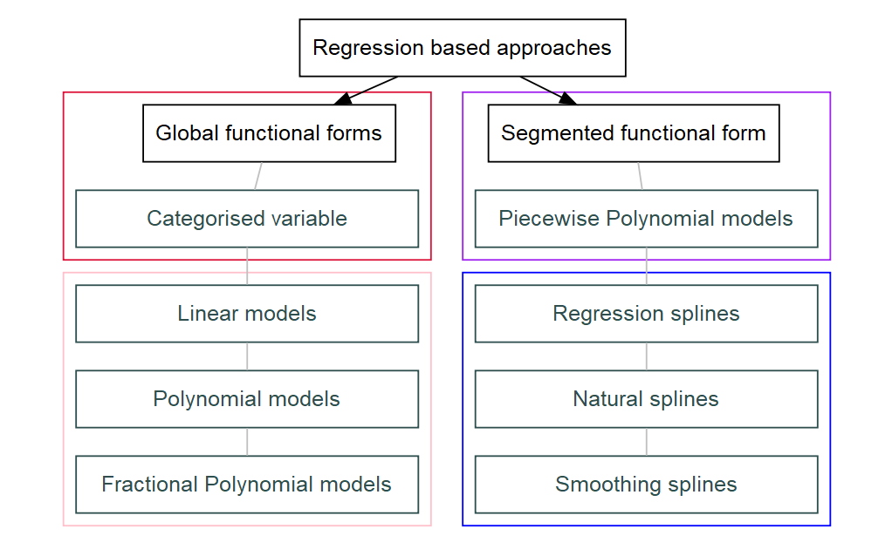
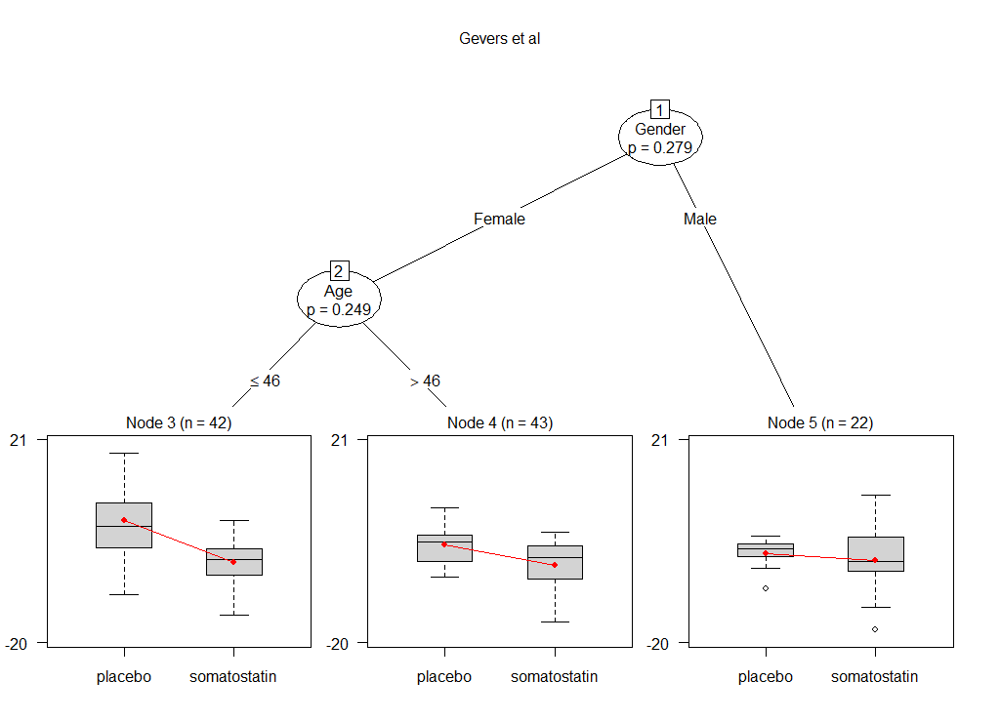
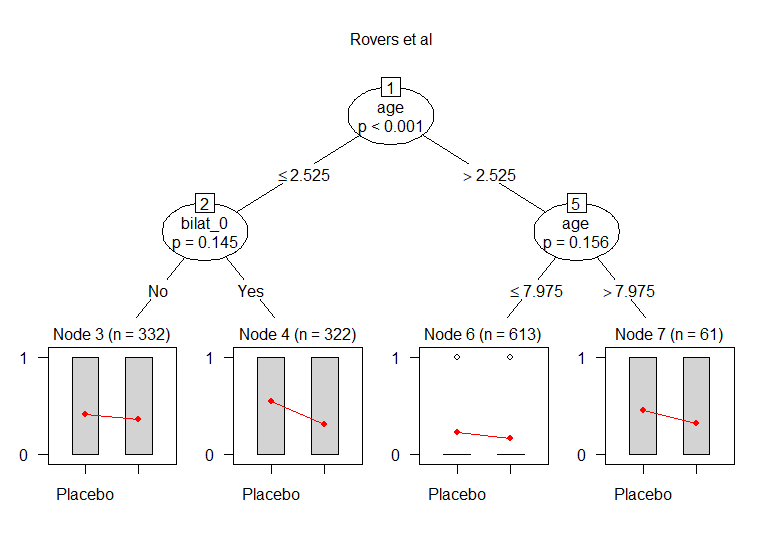

```{r global_options , echo=FALSE, message=FALSE, warning= FALSE}
.libPaths( c( .libPaths(), "C:/Users/Michael Belias/Documents/R/win-library/3.4") )
rm(list=ls()) ### To clear namespace
## Fractional Polynomials
## Load data-set
if(!require("readr")) install.packages("readr")
## Load ggplot2 for plotting
if(!require("ggplot2")) install.packages("ggplot2")
## Load gridExtra for fine tuning
if(!require("gridExtra")) install.packages("gridExtra")
## Load knitr for fine tuning
if(!require("knitr")) install.packages("knitr")
## Load haven for fine tuning
if(!require("haven")) install.packages("haven")
## Load dplyr
if(!require("dplyr")) install.packages("dplyr")
## Load lme4 for lme4
if(!require("lme4")) install.packages("lme4")
## Load lme4 for lme4
if(!require("pander")) install.packages("pander")
## Load lme4 for lme4
if(!require("kableExtra")) install.packages("kableExtra")
## Load lme4 for lme4
if(!require("magick")) install.packages("magick")
## Load glmertree for glmm trees modelling
if(!require("glmertree")) install.packages("glmertree")
## Load GGally for better ggplot2 manipulation
if(!require("GGally")) install.packages("GGally")
## Load GGally for better ggplot2 manipulation
if(!require("readxl")) install.packages("readxl")
## Load GGally for better ggplot2 manipulation
if(!require("kableExtra")) install.packages("kableExtra")
## Load GGally for better ggplot2 manipulation
if(!require("ggsci")) install.packages("ggsci")
## Load broom for ggplot2  manipulation
if(!require("broom")) install.packages("broom")
## Load broom for ggplot2  manipulation
if(!require("metafor")) install.packages("metafor")
if(!require(effects)) install.packages("effects")
if(!require(mgcv)) install.packages("mgcv")
if(!require(itsadug)) install.packages("itsadug")
if(!require(mvmeta)) install.packages("mvmeta")
if(!require(mfp)) install.packages("mfp")
if(!require(knitr)) install.packages("knitr")
if(!require(aods3)) install.packages("aods3")
if(!require(car)) install.packages("car", dependencies = T)
if(!require(data.table)) install.packages("data.table")


opts_chunk$set(fig.width=9, fig.height=6, fig.path='Figs/',
        echo=F, warning=FALSE, message=FALSE, fig.pos = "H", comment = "")
options(knitr.table.format = "html")


Sys.setenv(PATH=paste(Sys.getenv("PATH"),"C:/Program Files/MiKTeX 2.9/miktex/bin/x64/",sep=";"))

```

```{r loading the datasets}

IPDMA <- read_sas("Data/IPDMA.sas7bdat")
names(IPDMA) <- tolower(names(IPDMA))
IPDMA$treat =  factor(IPDMA$treat  , labels = c("Placebo","Antibiotics") )
IPDMA$study = factor(IPDMA$study, labels = c("Damoiseaux","Burke","Appelman","Little","Saux","McCormick"))
IPDMA$bilat_0 =  factor(IPDMA$bilat_0  , labels = c("No","Yes") )


somatostatin <- read_sav("Data/somatostatin.sav")
source("Data/somatostatin_descriptives.R")
```

# Abstract (116 out of 200 words)

## Objective 

To provide an overview and illustrate a variety of tree-based and regression-based approaches to detect and model effect-modification in meta-analysis(MA) of individual participant data(IPD). For instance, covariate-centred one-stage IPD-MA, mixed effects fractional polynomials, splines, meta-stepp and GLMM-trees, using both two and one stage approach when possible.

## Study Design and Setting

We applied the approaches on two empirical examples. In the first we investigate possible modification of the effect of Somatostatin  on liver reduction in participants with polycystic liver disease, in the second effect modification of antibiotics on fever/ear-pain reduction in children with acute otitis media.

## Results

We show that GLMM-trees is a helpful exploratory tool, providing evidence for three-way interactions. On the regression-based methods two-stage approaches showed increased risk of non-convergance and dropping whole trials due to missing data. On the other hand one-stage methods produced results using all information available. Nevertheless, they produced varying results over the power to detect the effect modification, the modeling efficiency and the produced cut-points.


## Conclusion

We conclude that subgroup detection in IPD-MA requires knowing the underlying assumptions and careful modelling. Effect modification may be distorted by unadjusted non-linear associations. We propose the use of more flexible apporaches such GLMM-trees and splines to explore and investigate effect modification.


\newpage

##### 

# 1. Introduction


Individual participant data meta-analysis (IPD-MA) is a type of systematic review where data gathered from multiple studies are combined and analysed centrally. The capability to standardise subgroup definitions and outcomes across studies, the increased power to investigate other than linear associations, the increased validity and reliability of the subgroups and the flexibility to search for subgroups based on combinations of patient and/or disease characteristics are some of the benefits of using IPD of multiple trials rather than traditional (aggregate) meta-analysis. A vivid field of research towards personalised healthcare is the investigation of effect modification. For this, IPD-MA is considered the gold standard as single trials rarely have sufficient power to identify relevant effect modification.
Effect modification may be present in both categorical and/or continuous covariates. For instance, differences in the treatment effect may be present between smokers and non-smokers, or across the levels of the age of the patients. If subgroups are already predefined it may be sufficient to only conduct hypothesis testing, using statistical tools such as generalised linear models or generalised linear mixed-effects models with interaction terms included, combined with meta-analytical tools. However, effect modification across a continuous variable is more challenging, because if the possible subgroups still have to be detected. In that situation, we may need to evaluate effect modification and at the same time want to define a threshold from which point the treatment effect is relevantly different.
A common technique to explore subgroups is by starting with the categorization of the continuous covariate. If subgroups are created based on good prior knowledge from literature then this approach is valid. Then, we can proceed as if we had a categorical variable. Nevertheless, categorization has been criticised for misspecification, loss of information and power, inflation of the type I error rate and even biased results[@Royston_2005 ; @Altman_2006 ; @Austin_2004 ; @Maxwell_1993 ; @Weinberg_1995].Another common practice is using the covariable as it is, but assuming linearity over the link function, a method that may also lead to deterioration of power, misspecification, and even spurious results [@J_rgensen_2016]. Therefore, it is important to explore the functional form of the association between outcome and effect modifier. Various approaches to account for non-linear associations have been developed, such as splines and fractional polynomials (FP) [@Sauerbrei_2011, @royston_interaction_2013]. 
\par      Regression based approaches such as linear models, piecewise polynomials, FPs and smoothing splines may be performed either in one or two stages. In a two-stage approach, first each trial is modelled separately using an appropriate statistical model. Subsequently, we pool either the extracted coefficients if shared across the trials or their fitted functions, using standard meta-analytical tools. In contrast, in one-stage IPD-MA the IPD from all trials are analysed simultaneously whilst accounting for the clustering of participants within studies. Hereto, we model interactions between treatment and patient-level variables while accounting also for the shape of the associations with the outcome. Recent recommendations suggest mean-centring the potential effect modifiers per trial in order to account for potential ecological bias due to unadjusted confounding. In such a one-stage model, within-trial clustering can be accounted for using either a fixed effect (common intercept/slope), fixed effects (stratified intercept/slope), or random effects [@Legha_2018]. Other methods to explore effect modification are plot- and tree-based methods such as the generalised linear mixed-effects model tree (GLMM-tree) method  [@Wang_2016]or meta-stepp, a plot based moving average (sliding window) method. Clinical decision making is often based on subgroup categories, separated by cut-points where the treatment effect is changing. The full association between the outcome and the continuous effect modifier is most informative and should be the start for the definition of these cut-points. Still, the locations of these cut-points are not straightforward. They may be based on point estimates or confidence intervals of the treatment effect function, i.e. the difference between the two treatments over the range of the covariable [@Royston_2008]. Interaction term analysis [@Sun_2010] may also be a suitable alternative.  
\par        Given all these methods, it is often unclear which method should be preferred in which situation. We aim to describe and illustrate the aforementioned methods by applying them on two empirical examples, while discussing the pros and cons. 

# 2. Empirical examples

  We use 2 IPD-sets to illustrate our methods. The first data-set [@Rovers_2006] was investigating the effect of antibiotics in acute otitis media on children aged from 0 to 12 years old. Rovers et al. collected IPD from 6 randomised clinical trials with a total of 1643 children, aged from 0-12 years old. The primary outcome was fever and/or ear-pain after 3-7 days (yes/no). They concluded that antibiotics were more beneficial in younger children (less than 2 years old) with bilateral acute otitis media. Bilateral acute otitis media (yes/no), age, otorrhea were investigated also separately for potential effect modification and only bilateral acute otitis media showed a significant result.
The second data-set [@Gevers_2013] was used to investigate the effect of Somatostatin on liver volume reduction. Gevers et al. collected IPD from 3 randomised placebo-controlled trials with a total of 107 participants. In this example, the outcome was continuous (liver volume reduction), and age, sex, baseline liver volume, and diagnosis of either autosomal dominant polycystic liver or kidney disease were investigated for effect modification. They concluded that use of Somatostatin was more beneficial for younger (<47) female patients. One of the 3 trials had a cross-over design, therefore participants were treated both with the active and the control treatment in different time periods. In order to use these data for our illustrative purposes, we removed the cross-over design and used all patients only once, by selecting half of the patients from the active period and the other half (sex and age-matched) from the control period. Therefore, differences between our results and those reported in the original article will occur.

```{r}
b = somatostatin %>%
    group_by(Study, Drug)%>% 
    summarise(`Number of participants` = n(), 
              `Age, median [range]` =  paste(median(Age,na.rm = T)  , " [" , min(Age,na.rm = T) , ",",max(Age,na.rm = T) ,"]", sep = "" ) ,
              Female = paste(sum(Gender == "Female") , " (" , paste(round(100*mean(as.numeric(Gender == "Female"))),"%",sep = "") , ")", sep = "" ),
              Male = paste(sum(Gender == "Male") , " (" , paste(round(100*mean(as.numeric(Gender == "Male"))),"%",sep = "") , ")", sep = "" ),
              `Log-scaled Liver volume difference, median [range]` =  paste(round(median(dif_LnLiver,na.rm = T),3 ) , " [" , round(min(dif_LnLiver,na.rm = T),3 ) , ",",round(max(dif_LnLiver,na.rm = T),3 ) ,"]", sep = "" ))


final=t(b[,3:7])
colnames(final) = rep(c("Placebo","Somatostatin"),3)


if(isTRUE(is_latex_output() || is_html_output() )){
  kable(final, format = "latex",
      longtable = T, 
      booktabs = T, caption = "Baseline Characteristics (Gevers et al.)" ) %>%
  kable_styling(latex_options = c("striped"),font_size =8, full_width = T, position = "center") %>%
  row_spec(row = 0,  bold = T) %>%
    column_spec(column =  0,  bold = T) %>%
  add_header_above(c(" " = 1, "van Keimpema et al" = 2, "Hogan et al" = 2, "Caroli et al" = 2), bold = T  )#%>%
  #landscape()
}else{
      kable(final, format = "latex",
      longtable = T, 
      booktabs = T, caption = "Baseline Characteristics (Gevers et al.)" ) %>%
  kable_styling(latex_options = c("striped"),font_size =8, full_width = T, position = "center") %>%
  row_spec(row = 0,  bold = T) %>%
    column_spec(column =  0,  bold = T) %>%
  add_header_above(c(" " = 1, "van Keimpema et al" = 2, "Hogan et al" = 2, "Caroli et al" = 2), bold = T  )#%>%
  #landscape()
}

a = IPDMA %>%
    group_by(study, treat)%>%
  summarise(`Number of participants` = n(), 
            `Age, median [range]` =  paste(round(median(age),2)  , " [" , round(min(age),2), ",",round(max(age),2) ,"]", sep = "" ) ,
            `Males (%)` = paste(sum(gender) , " (" , paste(round(100*mean(as.numeric(gender))),"%",sep = "") , ")", sep = "" ),
            `Bilateral AOM (%)` = paste(sum(as.numeric(bilat_0) -1), " (" , paste(round(100*mean(as.numeric(bilat_0) -1)),"%",sep = "") , ")", sep = "" ),
            `Otorrhoea (%)` = paste(sum(oto_0) , " (" , paste(round(100*mean(as.numeric(oto_0))),"%",sep = "") , ")", sep = "" ),
            `RAOM (%)`= paste(sum(raom) , " (" , paste(round(100*mean(as.numeric(raom))),"%",sep = "") , ")", sep = "" ), 
            `Sibling (%)`= paste(sum(sibling) , " (" , paste(round(100*mean(as.numeric(sibling))),"%",sep = "") , ")", sep = "" ),
            `Winter season (%)` =  paste(sum(season) , " (" , paste(round(100*mean(as.numeric(season))),"%",sep = "") , ")", sep = "" ),
            `Being breastfed (%)`=  paste(sum(breast) , " (" , paste(round(100*mean(as.numeric(breast))),"%",sep = "") , ")", sep = "" ),
            `Passive smoking (%)` = paste(sum(smoke) , " (" , paste(round(100*mean(as.numeric(smoke))),"%",sep = "") , ")", sep = "" ),
            `Crying (%)` =paste(sum(cry_0) , " (" , paste(round(100*mean(as.numeric(cry_0))),"%",sep = "") , ")", sep = "" ),
            `Runny nose (%)`=paste(sum(rnose_0) , " (" , paste(round(100*mean(as.numeric(rnose_0))),"%",sep = "") , ")", sep = "" ),
            `Ear pain (%)` = paste(sum(pain_0) , " (" , paste(round(100*mean(as.numeric(pain_0))),"%",sep = "") , ")", sep = "" ),
             `Fever (%)` = paste(sum(fever_0) , " (" , paste(round(100*mean(as.numeric(fever_0))),"%",sep = "") , ")", sep = "" ),
            `Red tympanic membrane (%)` = paste(sum(tmcol_0) , " (" , paste(round(100*mean(as.numeric(tmcol_0))),"%",sep = "") , ")", sep = "" ),
            `Bulging tympanic membrane (%)` = paste(sum(tmbul_0) , " (" , paste(round(100*mean(as.numeric(tmbul_0))),"%",sep = "") , ")", sep = "" ))


final=t(a[,3:7])
colnames(final) = rep(c("Placebo","Antibiotics"),6)
#%>%
  #kable_as_image()
if(isTRUE(is_latex_output() || is_html_output() )){
kable(final, format = "latex",
      longtable = T, 
      booktabs = T, caption = "Baseline Characteristics (Rovers et al.)" ) %>%
  kable_styling(latex_options = c("striped"),font_size =8, full_width = T, position = "center") %>%
  row_spec(row = 0,  bold = T) %>%
    column_spec(column =  0,  bold = T) %>%
  add_header_above(c(" " = 1, "Damoiseaux" = 2, "Burke" = 2, "Appelman" = 2, "Little" = 2, "Saux" = 2, "McCormick" = 2), bold = T )%>%
  landscape()
}else{
  kable(final, format = "latex",
      longtable = T, 
      booktabs = T, caption = "Baseline Characteristics (Rovers et al.)" ) %>%
  kable_styling(latex_options = c("striped"),font_size =8, full_width = T, position = "center") %>%
  row_spec(row = 0,  bold = T) %>%
    column_spec(column =  0,  bold = T) %>%
  add_header_above(c(" " = 1, "Damoiseaux" = 2, "Burke" = 2, "Appelman" = 2, "Little" = 2, "Saux" = 2, "McCormick" = 2) , bold = T )%>%
  landscape()
  }

```


# 3. Methods
## 3.1 Notation

As described in section 2, both our datasets are composed of multiple trials. Therefore, we introduce some notation that will be used hereto.
We are denoting:


* The studies as j = 1,2, ...,J, 
* Individuals as i = 1,2, ...,I, 
* The per trial mean of age as  $\bar{Age_j}$
* The per trial centred age as $X_j$ = $\bar{Age_j} - Age_{ij}$
* Cut-point (knot) as  $\kappa$
* The degree of a fractional polynomial as m
* The degree of a polynomial as p


## 3.2. Recursive-partitioning (tree-based) methods 

Recursive partitioning can be a first step to explore the underlying structure of the data, such as whether there are outcome differences across the levels of a continuous or categorical variable. It is a statistical method typically used in multivariable analysis [@Breiman_2017]. A decision tree is generated by dichotomising the variable by cut-points creating subgroups. These subgroups are generated such that they have the highest difference in outcome. Recursive partitioning techniques can handle non-linear associations as they make no functional form assumptions. However, splitting the data-set into groups is a process that is sensitive to minor changes in the data, which may lead to completely different trees. 
\par  The Generalised linear mixed model (GLMM) tree approach is a state-of-the-art technique using a model-based recursive partitioning [@Zeileis_2008;  @Su_2009] algorithm. It was proposed by Fokkema et al. [@Fokkema_2017] to detect treatment-effect modifier interactions when we have clustered data, as in IPD-MA, where the participants are clustered within the trials. Since this approach is exploratory, we can play with the significance level $\alpha$ for detecting subgroups, to be more or less liberal. Furthermore, we can use GLMM-trees to detect the possibly relevant variables, their crude cut-points and their underlying subgroups. If GLMM-tree results in subgroups, we can evaluate the corresponding variable using a more sophisticated approach.  For example, if we identify age and gender as subgrouping variables using the GLMM-tree, we can use a regression technique to model this relationship.
\par  The GLMM tree algorithm (1) starts by fitting a regression model with interaction terms (treatment x subgroup variables) included (2) statistically tests the interaction terms using a user-defined α, i.e. whether treatment is modified with respect to the subgroup variables, then (3) if test indicates modification, splits the dataset in order to create 2 subgroups with the largest difference in treatment effect. This procedure is (4) repeated in each of the resulting subgroups, until a user-defined convergence is achieved.


## 3.3 Regression based approaches

In regression-based approaches it is important to model the appropriate functional form of the association between the effect modifier and the outcome. If the appropriate form is already known, modelling will be straightforward. However, if not, splines and/or fractional polynomials may be used to evaluate the functional form of the association. Another aspect to take into consideration while modelling the functional form, is whether there may be cut-points (knots) where the shape of the association changes. If these exist, this should be also taken into consideration. Again, if the cut-points are known, modelling will be more straightforward than when they are unknown. These two dimensions define how to proceed with the regression model.  

```{r, out.height="80%", out.width="80%"}
include_graphics("Figs/Assumption.png")
```

```{r, out.height="80%", out.width="80%"}

```

Finally, within-trial clustering should be accounted for[@Abo_Zaid_2013]. This may be achieved, as described in the introduction, either by conducting a two-stage meta-analysis, or by using a mixed effects models or an equivalent method in a one-stage approach. We will describe both, starting with approaches based on global functional forms as they make more assumptions, and adding gradually more flexibility with the segmented functional form approaches.

```{r }

MethodsComparison <- read_excel("Figs/MethodsComparison.xlsx")
MethodsComparison <- as.data.frame(MethodsComparison)

MethodsComparison[is.na(MethodsComparison)] <-  ""


kable(MethodsComparison, caption = "Characteristics of the methods",  format = "latex", booktabs = T )%>%
kable_styling(latex_options = c("striped", "scale_down"),full_width = F)%>%
column_spec(1, bold = T, width = "10em") %>%
column_spec(2, width = "10em")%>%
column_spec(3, width = "6em")%>%
column_spec(4, width = "10em")

```

### 3.3.1. Two-stage approaches 

In two-stage approaches a statistical model of choice is directly fitted per trial.
The statistical model per trial j is as follows:

$$g(Y_{ij}) = \hat f_{1j}(X)  + \hat f_{2j}(X) \times Treatment$$ \begin{flushright} [1] \end{flushright}

Subsequently, we can either pool the coefficients or the fitted functions using typical meta-analytical tools. 

#### 3.3.1.1 First stage: Per-trial modelling

The functions $\hat f_{1j}, \hat f_{2j}$ are providing the functional shape of the outcome-effect modifier association per trial j for the treated and the control respectively. Depending on the a priori knowledge of the association’s functional form and the cut-points where the effect is altered we may fit.

*Known functional form and known $\kappa = 0$ knots (global functions)*

  * Global-polynomials: 
  
  $$f_1 =  \sum_{\pi=1}^{\pi=p} \beta_{1\pi} \times X^{\pi}$$ $$ f_2 = \sum_{\pi=1}^{\pi=p} \beta_{2\pi} \times X^{\pi}$$
    - Global polynomials typically are limited to either linear, Quadratic or Cubic, but can go to higher degrees.


*Known functional form and known $\kappa \geq 1$ knots and known position of the knots (segmented functions)*

  * Piecewise-polynomials with $\kappa$ knots 
    $$f_1 = \sum_{k =1}^{ k= \kappa}f_{1\kappa}(X_{x_{k-1} \leq X < x_{k-1}} ) f_2 =  \sum_{k =1}^{k= \kappa}f_{2\kappa}(X_{x_{k-1} \leq X < x_{k-1}} )$$
Piecewise-polynomials mostly used are piecewise constant, linear, quadratic and cubic. 


*Unknown functional form and known $\kappa = 0$ knots (global function)*

Fractional polynomials [@Royston_1994] are an extension of polynomials, that also include negative powers. FPs provide a global functional form. FPs model the effect of a covariate X as $f(x;\beta) =  \sum_{k=1}^{k=m} \beta_{k} \times X^{p_{k}}$, where m is the degree of the fractional polynomial and the power is derived from a fixed set of powers $p_k \in S :$ {-2,-1,-0.5, 0=(log),0.5,1,2}. The Fractional selection procedure FSP algorithm (FSP) has been proposed [@Ambler_2001,@Sauerbrei_1999] to explore the best fitting fractional polynomial. The fractional polynomials of a common degree **m** are tested using the deviance difference criterion, whilst fractional polynomials of different degree are compared using a $\chi^2$ test. When multiple data-sets are present Sauerbrei and Royston [@Sauerbrei_2011], have proposed 3 methods to evaluate the general functional form. 

  * Overall FP, where the FSP is applied in the pooled data, in order to find the best FP (stratified by data-set).
  * Study-wise FP2, the best FP2 is selected for each study
  * Study wise selected FP, where the best fitting FP is extracted per study


*Unknown functional form and known knots * 

Splines are a generalisation of piecewise polynomials and can offer great flexibility to explore the shape of the outcome-effect modifier association. Regression splines of **p** degree should be continuous, have **p-1** continuous derivatives and the $p^{th}$ derivative should constant across the knots. They are quite similar to piecewise polynomials, with the difference that they are continuous across the knots. A natural spline has an extra assumption that the second derivative of the function over the edges $k_0, k_{\kappa}$ of the association is 0. This is a something that should be considered when the goal of our research is to forecast future outcomes, as for instance in longitudinal or time series studies. 
When using splines, the real underlying shape is not known or we don't want to assume it is known, therefore, we explore it. However, information over the position of the knots and their number may be also unknown. Thus, we can introduce even more flexibility into our model by fitting smoothing splines. Smoothing splines by-pass the problem of knot selection by shrinking the coefficients to their basis expansion, which is a piecewise polynomial. In order to do so, they minimise the penalised least squares criterion or equivalently the maximum likelihood criterion with an extra parameter representing the wingliness of the line, 
$MLE + \lambda\int_0^1[f^{''}(x)]^2 dx$ equivalently $|| y - X\beta ||^2 + \lambda\int_0^1[f^{''}(x)]^2 dx$ or in algebraic form $|| y - X\beta ||^2 + \lambda\beta^TS\beta$.


#### 3.3.1.2 Second-stage combination of the first stage results

As a second-stage in the two-stage IPD-MA, we may either pool the estimates or the fitted functions $\hat f_{1j}(X)$, $\hat f_{2j}(X)$ extracted from the first stage. The simplest approach is to pool the extracted per trial $beta_{kj}$ into one $b_k$, using a multi-variate meta-analysis, whilst assuming common effect or random effects. This approach only works when common powers are present across studies. Therefore, it is applicable in piecewise, global polynomials, and fractional polynomials fitted using the overall FP procedure. We applied a random-effects meta-analysis, using the EB method for the $\tau^2$ estimation [@Stijnen_2007] and the HKSJ adjustment [@Hartung_2001,@IntHout_2014].

Another suggested pooling method is to pool the fitted functions. For each x in the data (pointwise) we calculate per study the fitted function $\hat{g_j}(x; \beta_j)$ and its standard error from $SE_j(x)$. This $\hat{g_j}(x; \beta_j)$ is the per trial predicted line or equivalently the mean expected outcome for given X E(g(x)|X) and the $S_j(x)$ is the confidence intervals of the predicted line. Afterwards, for each x in the data (pointwise), we calculate the pooled estimate $\hat{g}(x)$ and its SE(x), using either common or random-effects meta-analysis [@White_2018]. 


### 3.3.2. One-stage approaches
#### 3.3.2.1 Centred One-stage IPD-MA

We follow recent recommendations [@Hua_2016, @Legha_2018 ] and centre per trial the effect modifier. This way we can separate the within and across trial information of the effect modification. As in the two stage methods we can fit piecewise and global polynomials, but using a mixed-effect model to account for within trials clustering.
Therefore, assuming that $X_{ij} = Age_{ij} - \bar Age_j$ the statistical model will be: 

$g(Y_{ij}) = \hat f_{1j}(X)  + \hat f_{2j}(X) \times Treatment$          

The $\hat f_{1j}$ and $\hat f_{2j}$ can be either piecewise polynomials, global polynomials or splines as described in section *3.3.1.1*. This 


For the $\beta_{1kpj}$ and $\beta_{2kpj}$ we can assume, either fixed (common) effect, fixed effect*s* (stratified betas), or random effects. If we choose the fixed effect approach a common beta is assumed, in the stratified approach j betas will be generated which correspond to the per trial beta, while in the random effects we assume that the per trial coefficients are driven from a common Normal distribution N($b, \sigma^2$). 

#### 3.3.2.2 Multilevel Fractional polynomials

Fractional polynomials may be used using one stage approach [@Long_2010,  @Johnson_2012]. In this case, we use the same set of powers as in the FSP method. Furthermore, we fit a mixed effect model of our choice, with either stratified, fixed or random effects. For model selection we can use the lowest deviance or the Akaike Information Criterion (AIC) [@Akaike_1974], or Bayesian Information Criterion (BIC) [@Schwarz_1978]. 

Therefore, the statistical model applied is:

$g(Y_{ij}) = FP_{1j}(X)  + FP_{2j}(X) \times Treatment$

\newpage

##### 

# Results

We will illustrate the results of the aforementioned approaches beginning with the more exploratory to the more confirmatory methods. Therefore, we will start with the tree-based approach and smoothing splines, as we believe that these should be the first exploratory steps. Subsequently, we will show the results of FPs and we end with generalised linear models.

## GLMM-Trees

### FIGURE.1 MPLA MPLA

In the Gevers et al . data-set we increased the level of significance into $\alpha$ =0.3 , due to small sample size per trial.

```{r lmer tree Somatostatin, eval=FALSE  }
tree  = lmertree(dif_liver_perc~Drug |(1| Study) | Age + Gender  , alpha=0.3,
               data = somatostatin, lmer.control = lmerControl(calc.derivs = F))
plot(tree, which = "tree",main = "")
``` 


```{r, out.height="80%", out.width="80%"}

```

We show that there is a difference between the treatment effects of males and females. Furthermore, age seems to be an effect modifier in the subgroup of females (cut-point at 46 years).

### FIGURE.2 MPLA MPLA

```{r glmer tree AOM , eval=FALSE }
tree  = glmertree(poutcome ~treat |(1|study) | bilat_0 + age+  gender,
                  family = binomial("log"),
                  alpha=0.17, data = IPDMA)
plot(tree, which = "tree",main = "Rovers et al")

```

```{r, out.height="80%", out.width="80%"}

```

On the Rovers et al., dataset  we show that age is a potential effect modifier and we may also have a three-way interaction with bilateral otitis.

## Regression-based approaches

We will show the results for each approach, first when performing a two-stage and then when using a one-stage method. The somatostatin data set provided trials with few participants, see table 1. For instance, Caroli et.al had only 1 female participant in the somatostatin group. On the other hand, Keimpema et al. and Hogan et al. had limited participation of men. Therefore, the two-stage approaches were limited to linear assumptions, and suffered from trial dropouts.


## Two-stage smoothing splines 

In contrast with linear regression models, in smoothing spline models we cannot interpret the shape of the regression line from the summary. Therefore, visualization is an important tool to investigate effect modification. We show that women younger than 57 have a treatment benefit, probably due to menopause.

```{r Two-Stage smoothing splines in Somatostatin, eval=FALSE }

# this is really not the best fitting model for the data:

ymat <- matrix(NA,length(unique(somatostatin$Study)),
               8,dimnames=list(unique(somatostatin$Study),c("intercept","Treatment","Age","Gender","Treatment x Age","Treatment x Gender", "Age x Gender", "Treatment x Age x Gender")))
Slist <- vector("list",length(unique(somatostatin$Study)))
names(Slist) <- unique(somatostatin$Study)

for(i in unique(somatostatin$Study)) {
    
    # LOAD study
    data <- somatostatin[somatostatin$Study == i ,]

    # RUN THE MODEL
    model <- lm(paste(" dif_liver_perc ~Drug *",I(lm$trafo$formula[1]),"* Gender" ), data = data)
    
    # EXTRACT AND SAVE THE RELATED COEF AND VCOV
    ymat[i,] <- model$coefficients
    Slist[[i]] <- vcov(model)
  }

out <- summary(mvmeta(ymat, Slist,method = "ml" ))$coef

betas =  summary(mvmeta(ymat, Slist,method = "ml" ))$coef
vcov  = vcov(mvmeta(ymat, Slist,method = "ml" ))
row.names(out) <-row.names(vcov) <- row.names(betas) <- c("Intercept","Treatment","Age","Gender","Treatment x Age","Treatment x Gender", "Age x Gender", "Treatment x Age x Gender")
kable(out, format = "pandoc")

a= wald.test( b = betas[grep("Treatment x Age" ,rownames(betas)), 1], varb = vcov[grep("Treatment x Age" ,rownames(vcov)),grep("Treatment x Age" ,rownames(vcov))],Terms = 1:2 )
a


par(mfrow=c(2,1), cex=0.75)
plot_diff(m1, view='Age',cond = list(Gender="Male") , comp=list(Drug=c("placebo", "somatostatin")), 
    rm.ranef=F, col = "darkblue",print.summary = F, main = "Men", 
    xlab = "Age (in years)",
    ylab = "Estimated treatment difference")

plot_diff(m1, view='Age',cond = list(Gender="Female") , comp=list(Drug=c("placebo", "somatostatin")), 
    rm.ranef=F, col = "darkgreen",print.summary = F, main = "Women",
    xlab = "Age (in years)",
    ylab = "Estimated treatment difference ")

```


In the acute otitis media data-set we show that children 0-5 years have a treatment benefit.

```{r Two-Stage smoothing splines in AOM, message=FALSE, warning=FALSE }

# Note: this is really not the best fitting model for the data:
m1 <- gam(poutcome ~ bilat_0 * treat*age + s(age, by = treat) + 
            s(age,study,bs = "re") + 
            s(bilat_0,study,bs = "re") + 
            s(treat,study,bs="re") ,
          data=IPDMA, discrete=TRUE, family = binomial("log"))


par(mfrow=c(2,1), cex=0.75)
plot_diff(m1, view='age',cond = list(bilat_0="No") , 
          comp=list(treat=c("Placebo", "Antibiotics")), 
    rm.ranef=TRUE, col = "darkblue",
    print.summary = F, 
    main = "Children with unilateral otitis media", 
    xlab = "Age (in years)",
    ylab = "Estimated difference (log-scale)")

plot_diff(m1, view='age',
          cond = list(bilat_0="Yes") , 
          comp=list(treat=c("Placebo", "Antibiotics")), 
    rm.ranef=TRUE, 
    col = "darkgreen",
    print.summary = F, 
    main = "Children with bilateral otitis media",
    xlab = "Age (in years)",
    ylab = "Estimated difference (log-scale)")

plot_smooth(m1, view = "age", rm.ranef = F, plot_all = c("treat"))
plot_smooth(m1, view = "age", rm.ranef = F, plot_all = c("study"))

```


##  One-stage smoothing splines


```{r One-Stage smoothing splines in Somatostatin }

# Note: this is really not the best fitting model for the data:
m1 <- bam(dif_liver_perc ~ Drug * Gender*Age + 
            s(Study,Age,bs = "re") + 
            s(Study,Gender,bs = "re") + 
            s(Study,Drug,bs="re") , data = somatostatin,method="REML" ,  discrete=TRUE)


par(mfrow=c(2,1), cex=0.75)
plot_diff(m1, view='Age',cond = list(Gender="Male") , comp=list(Drug=c("placebo", "somatostatin")), 
    rm.ranef=TRUE, col = "darkblue",print.summary = F, main = "Men", 
    xlab = "Age (in years)",
    ylab = "Estimated treatment difference")

plot_diff(m1, view='Age',cond = list(Gender="Female") , comp=list(Drug=c("placebo", "somatostatin")), 
    rm.ranef=TRUE, col = "darkgreen",print.summary = F, main = "Women",
    xlab = "Age (in years)",
    ylab = "Estimated treatment difference ")

```


```{r One-Stage smoothing splines in AOM, message=FALSE, warning=FALSE, eval = FALSE }

# Note: this is really not the best fitting model for the data:
m1 <- gamm(poutcome ~ bilat_0*treat*age, random = list(study = ~1 + age + treat ) , 
           data=IPDMA, discrete=TRUE, family = binomial("log"))


par(mfrow=c(2,1), cex=0.75)
plot_diff(m1$gam, view='age',cond = list(bilat_0="No") , 
          comp=list(treat=c("Placebo", "Antibiotics")), 
          rm.ranef=TRUE, col = "darkblue",print.summary = F, main = "Children with unilateral otitis media", 
          xlab = "Age (in years)", ylab = "Estimated difference (log-scale)")

plot_diff(m1$gam, view='age',cond = list(bilat_0="Yes") , comp=list(treat=c("Placebo", "Antibiotics")), 
    rm.ranef=TRUE, col = "darkgreen",print.summary = F, main = "Children with bilateral otitis media",
    xlab = "Age (in years)",
    ylab = "Estimated difference (log-scale)")

```


## Two-stage Fractional Polynomials

*Overall FP, where the FSP is applied in the pooled data, in order to find the best FP (stratified by data-set).*

We extracted the fractional polynomial transformations for age per treatment group and stratified per Study. 
Then we fit a GLM per trial with this overall FP. The FP for the somatostatin data was linear. In this method we couldn't investigate threeway interactions, as 2 studies had insufficient **female** participants and limited sample size.


```{r MFP algorithm for Somatostatin, eval=FALSE}
lm = mfp(dif_liver_perc ~ fp(Age) + Gender  , data=  somatostatin[ somatostatin$Drug == "placebo",])
lm1 = mfp(dif_liver_perc ~ fp(Age)+ Gender  , data=  somatostatin[ somatostatin$Drug == "somatostatin",])

# BUILT OBJECTS WHERE RESULTS WILL BE STORED:
#   ymat IS THE MATRIX FOR THE OUTCOME PARAMETERS
#   Slist IS THE LIST WITH (CO)VARIANCE MATRICES
ymat <- matrix(NA,length(unique(somatostatin$Study)),
               8,dimnames=list(unique(somatostatin$Study),c("intercept","Treatment","Age","Gender","Treatment x Age","Treatment x Gender", "Age x Gender", "Treatment x Age x Gender")))
Slist <- vector("list",length(unique(somatostatin$Study)))
names(Slist) <- unique(somatostatin$Study)

for(i in unique(somatostatin$Study)) {
    
    # LOAD study
    data <- somatostatin[somatostatin$Study == i ,]

    # RUN THE MODEL
    model <- lm(paste(" dif_liver_perc ~Drug *",I(lm$trafo$formula[1]),"* Gender" ), data = data)
    
    # EXTRACT AND SAVE THE RELATED COEF AND VCOV
    ymat[i,] <- model$coefficients
    Slist[[i]] <- vcov(model)
  }

out <- summary(mvmeta(ymat, Slist,method = "ml" ))$coef

betas =  summary(mvmeta(ymat, Slist,method = "ml" ))$coef
vcov  = vcov(mvmeta(ymat, Slist,method = "ml" ))
row.names(out) <-row.names(vcov) <- row.names(betas) <- c("Intercept","Treatment","Age","Gender","Treatment x Age","Treatment x Gender", "Age x Gender", "Treatment x Age x Gender")
kable(out, format = "pandoc")

a= wald.test( b = betas[grep("Treatment x Age" ,rownames(betas)), 1], varb = vcov[grep("Treatment x Age" ,rownames(vcov)),grep("Treatment x Age" ,rownames(vcov))],Terms = 1:2 )
a


```

Little et al. had no information over the bilateral otitis media and Appelman et al. didn't have enough participants to investigate the FP shape. So we droped these studies. 

```{r MFP algorithm for AOM}
glm = mfp(poutcome ~  fp(age) +  strata(study),
          data=  IPDMA[ IPDMA$treat == "Placebo",], family = binomial("logit") )
glm1= mfp(poutcome ~  fp(age) +  strata(study), 
          data=  IPDMA[IPDMA$treat == "Antibiotics",], family = binomial("logit") )


studies =  unique(IPDMA[IPDMA$study != "Little" & IPDMA$study != "Appelman" ,]$study) 
ymat <- matrix(NA,length(studies),
               8,dimnames=list(studies,c("Intercept","Treatment","FP(Age)","Bilateral","Treatment x FP(Age)","Treatment x Bilateral", "Treatment x FP(Age)" , "Treatment x FP(Age) x Bilateral")))


Slist <- vector("list",length(studies))
names(Slist) <- studies

for(i in studies){
    # LOAD study
    data <- IPDMA[IPDMA$study == i ,]
    if( i == "Damoiseaux") data$age =  jitter(data$age)
    data$Agesq =  (data$age)^2
    # RUN THE MODEL
    model <- glm(   paste("poutcome ~ treat *I(",glm1$trafo$formula[1],")* bilat_0" )  , 
                    family = binomial("logit"), data)
    
    # EXTRACT AND SAVE THE RELATED COEF AND VCOV
    ymat[i,] <- model$coefficients
    Slist[[i]] <- vcov(model)
  }

out <- summary(mvmeta(ymat, Slist,method = "ml" ))$coef

betas =  summary(mvmeta(ymat, Slist,method = "ml" ))$coef
vcov  = vcov(mvmeta(ymat, Slist,method = "ml" ))
row.names(out) <-row.names(vcov) <- row.names(betas) <-  c("Intercept","Treatment","FP(Age)","Bilateral","Treatment x FP(Age)","Treatment x Bilateral", "Treatment x FP(Age)" , "Treatment x FP(Age) x Bilateral")
kable(out, format = "pandoc")


a= wald.test( b = betas[grep("Treatment x FP" ,rownames(betas)), 1], varb = vcov[grep("Treatment x FP" ,rownames(vcov)),grep("Treatment x FP" ,rownames(vcov))],Terms = 1:3 )
a


```

We couldn't show that age is an effect modifier on 0.05 $\alpha$.


## Study-wise FP2, the best FP2 is selected for each study


The best fitting FP2s for the somatostatin per trial suffered from the same problems as the overall FP. 

```{r studywise MFP algorithm for Somatostatin, eval=F}
# BUILT OBJECTS WHERE RESULTS WILL BE STORED:
#   ymat IS THE MATRIX FOR THE OUTCOME PARAMETERS
#   Slist IS THE LIST WITH (CO)VARIANCE MATRICES
ymat <- matrix(NA,length(unique(somatostatin$Study)),
               8,dimnames=list(unique(somatostatin$Study),c("intercept","Treatment","Age","Gender","Treatment x Age","Treatment x Gender", "Age x Gender", "Treatment x Age x Gender")))
Slist <- vector("list",length(unique(somatostatin$Study)))
names(Slist) <- unique(somatostatin$Study)

for(i in unique(somatostatin$Study)){
    
    # LOAD study
    data <- somatostatin[somatostatin$Study == i ,]

    # RUN THE MODEL
    lm = mfp(dif_liver_perc ~ fp(Age) , data=  data[ data$Drug == "placebo",])
    lm1 = mfp(dif_liver_perc ~ fp(Age) , data=  data[ data$Drug == "somatostatin",])
    
    model <- lm(paste("dif_liver_perc ~ Drug* ",lm1$trafo$formula[1],"*Gender"),data)
    
    # EXTRACT AND SAVE THE RELATED COEF AND VCOV
    ymat[i,] <- model$coefficients
    Slist[[i]] <- vcov(model)
  }

out <- summary(mvmeta(ymat, Slist,method = "ml" ))$coef

row.names(out) <- c("intercept","Treatment","Age","Gender","Treatment x Age","Treatment x Gender", "Age x Gender", "Treatment x Age x Gender")
kable(out, format = "pandoc")
```


Only 2 studies (Damoiseaux, Burke) could converge using the FP2 method. 

```{r studywise MFP algorithm for AOM , eval=FALSE}

studies =  unique(IPDMA[IPDMA$study != "Little" & IPDMA$study != "Appelman" 
                        & IPDMA$study != "Saux" & IPDMA$study != "McCormick",]$study) 
ymat <- matrix(NA,length(studies),
               8,dimnames=list(studies,c("Intercept","Treatment","FP(Age)","Bilateral","Treatment x FP(Age)","Treatment x Bilateral", "Treatment x FP(Age)" , "Treatment x FP(Age) x Bilateral")))


Slist <- vector("list",length(studies))
names(Slist) <- studies

for(i in unique(IPDMA$study)) {
    # LOAD study
    data <- IPDMA[IPDMA$study == i ,]
    if( i == "Damoiseaux") data$age =  jitter(data$age)
    glm = mfp(poutcome ~  fp(age) , data=  data[data$treat == "Placebo",], family = binomial("logit") )
    glm1= mfp(poutcome ~  fp(age), data=  data[data$treat == "Antibiotics",], family = binomial("logit") )
    # RUN THE MODEL
    model <- glm(   paste("poutcome ~ treat *I(",glm1$trafo$formula[1],")* bilat_0" )  , family = binomial("logit"), data)
    
    # EXTRACT AND SAVE THE RELATED COEF AND VCOV
    ymat[i,] <- model$coefficients
    Slist[[i]] <- vcov(model)
  }

out <- summary(mvmeta(ymat, Slist,method = "reml" ))$coef

row.names(out) <- c("Intercept","Treatment","FP(Age)","Bilateral","Treatment x FP(Age)","Treatment x Bilateral", "Treatment x FP(Age)" , "Treatment x FP(Age) x Bilateral")
kable(out, format = "pandoc")


a= wald.test( b = betas[grep("Treatment x FP" ,rownames(betas)), 1], varb = vcov[grep("Treatment x FP" ,rownames(vcov)),grep("Treatment x FP" ,rownames(vcov))],Terms = 1:3 )
a
```


*Study wise selected FP, where the best fitting FP is extracted per study*  
  
The best fitting FPs for the somatostatin  per trial were linear, so the analysis is identical with the two-stage global polynomial.

*Two-stage Global polynomials (coefficient pooling)*

For the Gevers et al. data-analysis, we assumed a linear functional form, as we had limited data (108 observations) and spending $2 \times p$ (degree of polynomial) $\times  J$ (trial number) was considered inefficient. Furthermore, the initial pooled plot showed no significant non-linearity. In contrast, for the Rovers et al. we observed an overall quadratic shape. Damoiseaux et al. had age rounded and the participants were only 1- and 2-years old children. To avoid non-convergence of the log-binomial models we created a slight artificial deviation for the Damoiseaux et al. using the **jitter()** command.

In two-stage meta-analysis using linear assumptions, effect modification across age was not statistically significant. 

```{r Gasparini approach with mvmeta  for somatostatin, eval=FALSE}
# BUILT OBJECTS WHERE RESULTS WILL BE STORED:
#   ymat IS THE MATRIX FOR THE OUTCOME PARAMETERS
#   Slist IS THE LIST WITH (CO)VARIANCE MATRICES
ymat <- matrix(NA,length(unique(somatostatin$Study)),
               8,dimnames=list(unique(somatostatin$Study),c("intercept","Treatment","Age","Gender","Treatment x Age","Treatment x Gender", "Age x Gender", "Treatment x Age x Gender")))
Slist <- vector("list",length(unique(somatostatin$Study)))
names(Slist) <- unique(somatostatin$Study)

for(i in unique(somatostatin$Study)) {
    
    # LOAD study
    data <- somatostatin[somatostatin$Study == i ,]
    
    # RUN THE MODEL
    model <- lm(dif_liver_perc~ Drug *Age*Gender, data = data)
    
    # EXTRACT AND SAVE THE RELATED COEF AND VCOV
    ymat[i,] <- model$coefficients
    Slist[[i]] <- vcov(model)
  }

out <- summary(mvmeta(ymat, Slist,method = "ml" ))$coef

betas =  summary(mvmeta(ymat, Slist,method = "ml" ))$coef
vcov  = vcov(mvmeta(ymat, Slist,method = "ml" ))
row.names(out) <-row.names(vcov) <- row.names(betas) <- c("intercept","Treatment","Age","Gender","Treatment x Age","Treatment x Gender", "Age x Gender", "Treatment x Age x Gender")
kable(out, format = "pandoc")

a= wald.test( b = betas[grep("Treatment x Age" ,rownames(betas)), 1], varb = vcov[grep("Treatment x Age" ,rownames(vcov)),grep("Treatment x Age" ,rownames(vcov))],Terms = 1:2 )
a


```


For the Gevers et al the two-stage meta-analysis of interaction terms showed no statistically significant results. 

Little et al had no bilateral information. The study was dropped.

```{r Gasparini approach with mvmeta  for AOM }
# BUILT OBJECTS WHERE RESULTS WILL BE STORED:
#   ymat IS THE MATRIX FOR THE OUTCOME PARAMETERS
#   Slist IS THE LIST WITH (CO)VARIANCE MATRICES

completeIPDMA =  IPDMA[complete.cases(IPDMA$bilat_0),]

ymat <- matrix(NA,length(unique(completeIPDMA$study)),
               12,dimnames=list(unique(completeIPDMA$study),c("Intercept","Treatment","Age","Bilateral","Age^2","Treatment x Age","Treatment x Bilateral","Age x Bilateral", "Treatment x Age^2","Age^2 x Bilateral", "Treatment x Age x Bilateral", "Treatment x Age^2 x Bilateral")))


Slist <- vector("list",length(unique(completeIPDMA$study)))
names(Slist) <- unique(completeIPDMA$study)

for(i in unique(completeIPDMA$study)) {
    
    # LOAD study
    data <- completeIPDMA[completeIPDMA$study == i ,]
    if( i == "Damoiseaux") data$age =  jitter(data$age)
    data$Agesq =  (data$age)^2
    # RUN THE MODEL
    model <- glm(poutcome ~ treat*age*bilat_0 + treat*Agesq*bilat_0, family = binomial("logit"), data)
    
    # EXTRACT AND SAVE THE RELATED COEF AND VCOV
    ymat[i,] <- model$coefficients
    Slist[[i]] <- vcov(model)
  }

out <- summary(mvmeta(ymat, Slist,method = "fixed" ))$coef

betas =  summary(mvmeta(ymat, Slist,method = "fixed" ))$coef
vcov  = vcov(mvmeta(ymat, Slist,method = "fixed"  ))
row.names(out) <-row.names(vcov) <- row.names(betas) <- c("Intercept","Treatment","Age","Bilateral","Age^2","Treatment x Age","Treatment x Bilateral","Age x Bilateral", "Treatment x Age^2","Age^2 x Bilateral", "Treatment x Age x Bilateral", "Treatment x Age^2 x Bilateral")
kable(out, format = "pandoc")

a= wald.test( b = betas[grep("Treatment x Age" ,rownames(betas)), 1], varb = vcov[grep("Treatment x Age" ,rownames(vcov)),grep("Treatment x Age" ,rownames(vcov))],Terms = 1:4 )
a


```

*One-stage IPD-MA*

```{r}
library(lmerTest)

lmLinear <- lmer(dif_liver_perc ~ Drug * Age*Gender + (Drug|Study) + (1|Study) ,
                 data = somatostatin , 
                 control = lmerControl(calc.derivs = F))


IPDMA$bilateral = factor(IPDMA$bilat_0 , labels = c("Unilateral acute otitis","Bilateral acute otitis" ),  levels = c("No","Yes") )
glmLinear <- glmer(poutcome ~ treat * poly(age)*bilateral + (treat|study) + (1|study) , 
                   family = binomial("log"),data = IPDMA )
```


```{r, eval=FALSE}


out <- summary(lmLinear)$coef
out <- cbind(out, Anova(lmLinear,3)$`Pr(>Chisq)`)

colnames(out)<- c("Estimate","Std. Error","t value","P-value")


row.names(out) <- c("intercept","Treatment","Age","Gender","Treatment x Age","Treatment x Gender", "Age x Gender", "Treatment x Age x Gender")

kable(out, format = "pandoc")


out <- summary(glmLinear)$coef
colnames(out)<- c("Estimate","Std. Error","t value","P-value")

row.names(out) <- c("Intercept","Treatment","Age","Age^2","Treatment x Age","Treatment x Age^2")
kable(out, format = "pandoc")


```


```{r plots of one-stage IPD-MA, eval=FALSE}
effect.boundaries =  data.frame(effect(c("Age","Drug","Gender"),lmLinear, xlevels=100))
glm.effect.boundaries =  data.frame(effect(c("age","treat","bilateral"),glmLinear, xlevels=100))


ggplot() + 
  geom_point(somatostatin, mapping = aes(y= dif_liver_perc, x = Age, color =Drug)) + 
  scale_x_continuous(breaks = seq(from = 30, to = 70, by = 5))+ facet_grid(.~Gender)+
  theme_bw() +
  theme(legend.key = element_blank()) + ggtitle("Liver difference over age") +
  theme(plot.title = element_text(hjust = 0.5)) +   
  geom_line(effect.boundaries,mapping = aes(y= fit, x = Age,  color= Drug))+
  geom_ribbon(data = effect.boundaries,aes(ymin=lower, ymax=upper,y= fit, x = Age,  
                                           fill= Drug), alpha=0.2) +
  scale_color_lancet()+scale_fill_lancet()

ggplot() + 
  geom_point( subset(IPDMA, !is.na(bilateral)), mapping = aes(y= poutcome, x = age, color =treat, fill=treat)) + 
  scale_x_continuous(breaks = seq(from = 0, to = 13, by = 2))+ facet_grid(.~bilateral)+
  theme_bw() + xlab("Probability  of having fever after 3/7 days") +
  theme(legend.key = element_blank()) + ggtitle("Fever probability across age") +
  theme(plot.title = element_text(hjust = 0.5)) +   
  geom_line(glm.effect.boundaries,mapping = aes(y= fit, x = age,  color= treat))+
  geom_ribbon(data = glm.effect.boundaries,aes(ymin=lower, ymax=upper,y= fit, x = age,fill= treat), alpha=0.2) +
  scale_color_lancet()+scale_fill_lancet()

new.data =  somatostatin%>% 
  select(c("Study","Drug","Age","Gender"))


Female = cbind(effect.boundaries[effect.boundaries$Gender == "Female",])


Female.df =data.frame(predicted.difference  =  Female$fit [Female$Drug=="somatostatin"] - Female$fit [Female$Drug=="placebo"]) 

Female.df$se = sqrt(Female$se[Female$Drug=="somatostatin"] + Female$se[Female$Drug=="placebo"])
Female.df$Gender = rep("Female")


Male = cbind(effect.boundaries[effect.boundaries$Gender == "Male",])

Male.df =data.frame(predicted.difference  =  Male$fit [Male$Drug=="somatostatin"] - Male$fit [Male$Drug=="placebo"]) 

Male.df$se = sqrt(Male$se[Male$Drug=="somatostatin"] + Male$se[Male$Drug=="placebo"])
Male.df$Gender = rep("Male")
rm(Female,Male)


Full =  rbind(Female.df, Male.df)

rm(Female.df,Male.df)


new.data =  cbind(Age =effect.boundaries$Age[1:140], Full)
new.data$upper =  new.data$predicted.difference + 1.96*new.data$se
new.data$lower =  new.data$predicted.difference - 1.96*new.data$se


ggplot(new.data, mapping = aes(y= predicted.difference, x = Age)) + 
  geom_line() + facet_grid(Gender~.)+
  scale_x_continuous(breaks = seq(from = 30, to = 70, by = 5))+ 
  theme_bw() + 
  theme(legend.key = element_blank()) + ggtitle("Treatment effect (linear)") +
  theme(plot.title = element_text(hjust = 0.5))+
  geom_ribbon(data = new.data,aes(ymin=lower, ymax=upper,y= predicted.difference, x = Age), alpha=0.2) +
  scale_color_lancet() + geom_hline(yintercept = 0, linetype =3, colour= "purple", size = 1)

rm(lmLinear,effect.boundaries,effect.data.frame, new.data)


### For the AOM NOW
new.data =  IPDMA%>% 
  select(c("study","treat","age","bilateral"))


bilateral = glm.effect.boundaries[glm.effect.boundaries$bilateral == "Bilateral acute otitis",]


bilateral.df =data.frame(predicted.difference  =  bilateral$fit [bilateral$treat=="Antibiotics"] - bilateral$fit [bilateral$treat=="Placebo"]) 

bilateral.df$se = sqrt(bilateral$se[bilateral$treat=="Antibiotics"] + bilateral$se[bilateral$treat=="Placebo"])
bilateral.df$bilat = rep("bilateral")


unilateral = glm.effect.boundaries[glm.effect.boundaries$bilateral == "Unilateral acute otitis",]

unilateral.df =data.frame(predicted.difference  =  unilateral$fit [unilateral$treat=="Antibiotics"] - unilateral$fit [unilateral$treat=="Placebo"]) 

unilateral.df$se = sqrt(unilateral$se[unilateral$treat=="Antibiotics"] + unilateral$se[unilateral$treat=="Placebo"])
unilateral.df$bilat = rep("unilateral")
rm(bilateral,unilateral)


Full =  rbind(bilateral.df,unilateral.df)

rm(bilateral.df,unilateral.df)


new.data =  cbind(Age =glm.effect.boundaries$age[1:200], Full)
new.data$upper =  new.data$predicted.difference + 1.96*new.data$se
new.data$lower =  new.data$predicted.difference - 1.96*new.data$se


ggplot(new.data, mapping = aes(y= predicted.difference, x = Age)) + 
  geom_line() + facet_grid(bilat~.)+
  scale_x_continuous(breaks = seq(from = 30, to = 70, by = 5))+ 
  theme_bw() + 
  theme(legend.key = element_blank()) + ggtitle("Treatment effect (linear)") +
  theme(plot.title = element_text(hjust = 0.5))+
  geom_ribbon(data = new.data,aes(ymin=lower, ymax=upper,y= predicted.difference, x = Age), alpha=0.2) +
  scale_color_lancet() + geom_hline(yintercept = 0, linetype =3, colour= "purple", size = 1)

rm(glmLinear,glm.effect.boundaries, new.data,Full)

```


```{r table acute otitis media, eval=FALSE}


ggplot(IPDMA, aes(x=age, y=poutcome, color= treat)) + geom_point() + 
  stat_smooth(method="glm", method.args=list(family="binomial"), se=FALSE) + xlim(c(-1,15))+ scale_color_lancet() + 
  labs(title = "Scatterplot of AOM data-set",y = "Fever/Pain after 3/7 days probability ",x = "Age")

```


\newpage

#####

# Discussion


\newpage

##### 

# References


