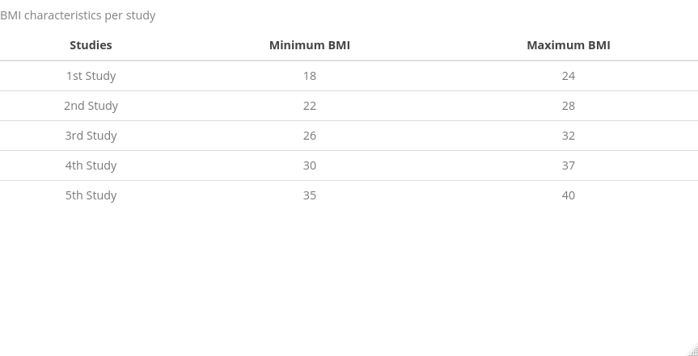

```{r, echo=FALSE}
library(knitr)
## General output of the chunks 
opts_chunk$set(fig.path='Figs/',                # The path where to save the figures
               echo=F,                          # Logical whether the chunck will be printed 
               warning=FALSE,                   # Logical whether the warnings will be printed
               message=FALSE,                   # Logical whether the messages will be printed
               fig.pos = " ",                   # The position of the 
               comment = "",                     #
               fig.height=8, 
               fig.width=9 
               )

options(knitr.table.format = "html")


Sys.setenv(PATH=paste(Sys.getenv("PATH"),"C:/Program Files/MiKTeX 2.9/miktex/bin/x64/",sep=";"))
Sys.setenv(R_GSCMD = "/usr/local/bin/gs")
```

```{r global_options , echo=FALSE, message=FALSE, warning= FALSE}
rm(list=ls()) ### To clear namespace

# Libraries for loading and saving data
## Load data-set for loading xlsx data-sets
if(!require("readr")) install.packages("readr")
## Load readxl for loading xlsx data-sets
if(!require("readxl")) install.packages("readxl")
## Load haven for loading sas data-sets 
if(!require("haven")) install.packages("haven")

################################################
# Libraries for plotting
## Load ggpubr for plotting
if(!require("ggpubr")) install.packages("ggpubr") # automatically loads the ggplot2
## Load gridExtra  to arrange multiple grid-based plots on a page, and draw tables
if(!require("gridExtra")) install.packages("gridExtra")
## Load ggsci for better looking colors
if(!require("ggsci")) install.packages("ggsci")
## Load sjPlot to get easy statistical summaries and plots
if(!require("sjPlot")) install.packages("sjPlot")
## Load itsadug to have nice plots of GAMMs
if(!require("itsadug")) install.packages("itsadug")
## Load magick for graphics and image processing in R
if(!require("magick")) install.packages("magick")
## Load webshot for tranforming HTML objects into pictures
if(!require("webshot")) install.packages("webshot")
## Load lme4 for lme4
if(!require("pander")) install.packages("pander")
## Load kableExtra for better looking kable objects
if(!require("kableExtra")) install.packages("kableExtra") # automatically loads kable

################################################
# Libraries for data manipulation
## Load knitr for fine tuning
if(!require("knitr")) install.packages("knitr")
## Load dplyr for data manipulation
if(!require("dplyr")) install.packages("dplyr")
## Load tidyr for data manipulation
if(!require("tidyr")) install.packages("tidyr")
## Load broom for data manipulation
if(!require("broom")) install.packages("broom")
## Load tidyverse for data manipulation
if(!require("tidyverse")) install.packages("tidyverse")


################################################
# Libraries for the statistical analysis 
## Load lme4 for lme4
if(!require("lme4")) install.packages("lme4")
## Load lmerTest to add information into the summaries  
if(!require("lmerTest")) install.packages("lmerTest")
## Load mcgv to fit gamms and bamm
if(!require("mgcv")) install.packages("mgcv")
if(!require("splines")) install.packages("splines")
library(gamm4)
library(meta)
library(mvmeta)

################################################


## General output of the chunks 
opts_chunk$set(fig.path='Figs/',                # The path where to save the figures
               echo=F,                          # Logical whether the chunck will be printed 
               warning=FALSE,                   # Logical whether the warnings will be printed
               message=FALSE,                   # Logical whether the messages will be printed
               fig.pos = " ",                   # The position of the 
               comment = ""                     #
               )


```

```{r Simulating the datasets}
set.seed(25)

df = data.frame(BMI= rep(seq(18.5,to = 40, length.out = 2500),each= 2),
                Treat =  rep(c(0,1),2500), 
                Study = sample(1:5, size = 1000, replace = T), 
                Study2= c(rep(1,750), sample(1:2,replace = T,size = 500), 
          rep(2,500), sample(2:3,replace = T, size = 500),
          rep(3,500), sample(3:4,replace = T, size = 500),
          rep(4,500), sample(4:5,replace = T, size = 500),
          rep(5,750)))

df$BMI.standardised =  with(df, 2*(BMI-25)/40)
df$`Mortality risk` = NA
df$`Mortality risk 2` = NA
df$Study.noise.intercept =  df$Study
df$Study.noise.slope =  df$Study
noise =  round(runif(5, -0.05,0.05),2)
noise2 = round(runif(5, -0.05,0.05),2)

df=df%>%
  mutate(Study.noise.intercept=recode(Study.noise.intercept,
                '1' = noise[1],
                '2' = noise[2],
                '3' = noise[3],
                '4' = noise[4],
                '5'= noise[5]  ), 
         Study.noise.slope = recode(Study.noise.slope,
                '1' = noise2[1],
                '2' = noise2[2],
                '3' = noise2[3],
                '4' = noise2[4],
                '5'= noise2[5]  ))
df =  df%>%
  mutate(Study = recode(Study, 
                '1' = "1st Study",
                '2' = "2nd Study",
                '3' = "3rd Study",
                '4' = "4th Study",
                '5'= "5th Study"  ),
         Study2 = recode(Study2, 
                '1' = "1st Study",
                '2' = "2nd Study",
                '3' = "3rd Study",
                '4' = "4th Study",
                '5'= "5th Study"  ))

df[df$Treat==0,]$`Mortality risk` =  with(df[df$Treat==0,], 0.2+BMI.standardised^2 + Study.noise.intercept)
df[df$Treat==1,]$`Mortality risk` =  with(df[df$Treat==1,], 0.2+ Study.noise.intercept + BMI.standardised^4+ Study.noise.slope)
df$Y <-rbinom(5000,1,df$`Mortality risk`)  

df[df$Treat==0,]$`Mortality risk 2` =  with(df[df$Treat==0,], 0.2+BMI.standardised^2 )
df[df$Treat==1,]$`Mortality risk 2` =  with(df[df$Treat==1,], 0.2+ BMI.standardised^4)
df$Y <-rbinom(5000,1,df$`Mortality risk`) 
df$Y2 <-rbinom(5000,1,df$`Mortality risk 2`) 

df$Treatment =  factor(df$Treat, levels = c(0,1), labels = c("Control","Treated"))

df = df %>% mutate(Study = factor(Study, levels = c("1st Study","2nd Study",
                                             "3rd Study","4th Study", "5th Study" )))
df = df %>% mutate(Study2 = factor(Study2, levels = c("1st Study","2nd Study",
                                             "3rd Study","4th Study", "5th Study" )))

df$dum <- rep(1,dim(df)[1])
source(file = "Functions/help functions.R")
rm(noise,noise2)
```


```{r}
set.seed(1703)
fig_cap <- captioner::captioner()
tab_cap <- captioner::captioner("Table")
```


\newpage

## Background

Individual participant data(IPD) meta-analysis(MA) is considered the gold standard since a variety of opportunities are offered. The investigation of treatment-effect modification is one of them. Nevertheless, effect modification over a continuous co-variables may be challenging, as non-linear associations may be present. Most researchers either ignore non-linearities, or use forward techniques to model them relying on statistical tests with arbitrary significance levels.

## Objective 
We propose the use of flexible approaches to model and investigate treatment-effect modification, while modelling non-linear associations with splines. 

## Methods
We applied three types of splines on two simulated data-sets to indicate potential pitfalls and smoothing splines on two empirical data-sets. The first example is an IPD-set of 5 randomised placebo-controlled trials investigating the effect of antibiotics on children (0-12 years old) with unilateral or bilateral acute otitis media(AOM). The outcome is fever and/or ear pain after 1 week (yes/no). The second empirical example is an IPD-set of 3 randomised controlled trials investigating the effect of somatostatin on patients with with polycystic liver disease. The outcome is liver size reduction in volume.


## Results

Splines detected quadratic associations in the AOM IPD-set and showed linear association in the polycystic liver disease data-set 


## Conclusion
Splines can be beneficial to detect effect modification when non-linearities are present. Flexible approaches provide better results and avoid naive assumptions that may cloud treatment decisions.

\newpage

##### 

# 1. Introduction

$\qquad$ The effect of a treatment may differ depending on patient characteristics. One of the main goals of an individual participant data (IPD) meta-analysis (MA) is to investigate whether treatment effect differences are present, and how they are associated with these characteristics [@Simmonds_2015]. Patient characteristics can be represented by either categorical or continuous variables. Especially for the latter, treatment effect modification over a continuous variable, may be challenging to investigate because the association between the outcome and the effect modifier and/or the interaction may not be known.

$\qquad$ Often, regression based approaches are used in combination with several assumptions and strategies to deal with continuous effect modifiers. A naive approach is to ignore possible non-linearity either through categorization of the continuous variable, or using the continuous variable as it is in a linear regression model. Categorization involves splitting the continuous co-variable into subgroups based on clinical reasoning. For instance, the risk of developing ovarian cancer may be associated with menopause. Therefore, if age is investigated as a potential effect modifier it is reasonable to categorize the age to younger ( $\leq$  50 years older) and older (> 50 years old) participants. Due to loss of information, categorization has been criticized for misspecification, reduced power, inflation of the type I error rates and biased results [@Royston_2005 ; @Altman_2006 ; @Austin_2004 ; @Maxwell_1993 ; @Weinberg_1995]. When clinical knowledge to define the subgroups is not available, tree-based approaches have been proposed to estimate these subgroups [@Zeileis_2008; @Seibold_2016 ; @Su_2009 ; @Mistry_2018 ; @Fokkema_2017 ;@Wang_2016].  However, tree-based approaches rely on statistical tests with arbitrary levels of significance, are data sensitive and fit well only when the underlying functional form is a step function. 

$\qquad$   Another naive approach is to include the effect modifier as it is and fit a linear model, without adjusting for non-linearity. Nevertheless, if the underlying association is not linear the results may be biased. For instance, if we assume linearity between BMI and mortality while the underlying shape is quadratic (U-shape) we may draw the conclusion that BMI and mortality are not associated at all. Additionally, any predictions made from a misspecified model will be biased and increasing the sample size will only make things worse. 

$\qquad$   Often the association between potential effect modifiers and the outcome has already been investigated and a non-linear baseline functional form may have been already known. For instance, in an IPD-MA of 44 cohort studies Liu et al. showed a J-shaped association between BMI and risk of stroke [@Liu_2018]. Researchers investigating thrombolysis treatment and potential effect modification by BMI may include this finding as an a-priori knowledge and introduce exponential or quadratic terms in their regression model. However, the association between BMI and risk of stroke may have a different shape for the treated group than for the control group. Misspecifying this functional shape may lead to the same problems as the naive linear approach mentioned above.

$\qquad$   The aforementioned approaches are either ignoring or assuming the functional shape of the associations known. Another approach is to estimate the functional shape from the data and use this estimate to investigate effect modification. One commonly applied strategy is finding the best fit for the association by trial and error. Thereto, researchers fit regression models including various transformations of the effect modifier, such as polynomial, trigonometric (sine, cosine), exponential and logarithmic. Then, the fits of these models are compared with each other using statistical tests such as Wald and likelihood ratio tests or criteria such as AIC [@Akaike_1973] and BIC [@Schwarz_1978]. The trial and error procedure can be time-consuming, thus automated approaches are also available. Royston and Altman [@Royston_1994] proposed a multi-variable fractional polynomial procedure (MFP) in order to detect the best fitting fractional polynomial. Nevertheless, their approach was initially limited to single studies and didn't include interactions. Therefore, in a subsequent article Royston and Sauerbrei [@Royston_2004] extended the algorithm to include also interactions between binary variables such as treatments and continuous co-variables. Their proposal included estimating treatment effect functions and using treatment effect plots for illustration purposes. Finally, Sauerbrei and Royston [@Sauerbrei_2011] extended this for IPD-MA, proposing a two-stage approach. First an appropriate statistical model is fitted per trial and either the estimated coefficients with their standard errors or the treatment effect functions with their 95% confidence intervals are extracted. On a second stage, these estimates are pooled using either multivariate or point-wise meta-analysis respectively. Nevertheless,their two-stage approach may be prone to power loss when IPD-set with limited observations are included and the outcome is binary [@Debray_2015]  or when the means of the continuous effect modifier is highly heterogeneous over the trials [@Simmonds_2007]. Furthermore, both the trial and error approach and the fractional polynomial approach rely on statistical tests with arbitrary $\alpha$ significance levels. Further, they estimate global functions which may not fit well on the boundaries of a continuous effect modifier. For instance, using the previous example, the regression model for BMI and mortality may on average fit well, using regression models with quadratic terms, but the fit may not be adequate for extreme cases such as underweight (BMI <18.5) and severely obese (BMI>40) participants. Splitting the BMI into 3 intervals [<18.5 , 18.5-40 , 40+] and fitting a model within each interval could provide a better fit, but the resulting piece-wise functional shapes will probably be discontinuous on the knots (18.5, 40). Therefore, piece-wise approaches are usually combined with smoothing techniques in order to result in continuous functional shapes.

$\qquad$    Wang et al. [@Wang_2016 ;  @Wang_2018] proposed a two-stage IPD-MA moving average (sliding window) approach for binary and time-to-event outcomes, called meta-STEPP.  First the continuous effect modifier is split into intervals with the same number of events. Then for each interval and per study treatment effects are estimated using an effect size of choice.  At the second stage, these within-interval treatment effects are pooled using either fixed or random effects meta-analysis. Finally, the pooled effect sizes are tested for heterogeneity using Cochran’s Q $\chi^2$ test. This algorithm is repeated multiple times with overlapping sliding windows for smoother results. However, Cochran’s Q lacks power to detect non-linear effect modification, compared to smoother approaches. Furthermore, the size of the window and the moving step may influence the results.

$\qquad$     A more flexible approach is to use splines and in the case of multiple co-variables generalized additive models (GAMs) [@hastie1986]. The simplest form of GAMs are piece-wise polynomials, where we split the effect modifier into intervals separated by a-priori known knots and fit a polynomial regression model within each interval. Nevertheless, this approach results in non-continuous over the knots functional shapes, while on the other hand, polynomial splines constraint the regression lines to be continuous over the knots. The most often used polynomials are cubic splines, but quadratic and linear are also available. If we don't have prior knowledge for the knots these can be estimated using a cross-validation technique. Another approach is locally (weighted) estimated scatter-plot smoothing (loess or lowess) [@Cleveland_1979]. Loess is a non-parametric regression method that uses a sliding window technique for smoothing. Specifically, a weighted linear or quadratic model is fitted per data point using as a dataset a subset of the original dataset consisting of the data-point's nearest observations. The number of these observations determines the size of the sliding window and along with the degree of the polynomial they control the smoothness of the functional shape.  A intuitive combination of splines and loess is smoothing splines. Hereby, all data-points act as knots. To avoid over-fitting though a penalty factor for wiggliness ($\lambda$) is introduced in the maximum likelihood calculation. The functional shapes are adjusted by either manually tuning the values of $\lambda$ or through an automated cross-validation procedure.

$\qquad$     Finally, when non-linearities are present effect modification may be difficult to investigate using the significance of coefficients or likelihood ratio tests. Therefore, it may be more efficient to estimate risk differences between participants with same characteristics rather than rely on relative risks. Furthermore, risk differences can be interpreted by clinicians and patients with more ease.  

$\qquad$     Applying splines or GAMs may be beneficial for research as they are based on limited assumptions and can detect complex shapes. Specifically, with GAMs we may begin with smooth functions rather than naive linearity and let the data decide the underlying functional shape. This procedure involves less assumptions, no use of multiple statistical tests and may lead to better fitted regression lines. Nevertheless, if needed researchers can include a-priori knowledge, such as underlying functional shapes, number of knots (intervals) with or without fixed values. GAMs with splines are rarely adopted and it is still unknown how should we may apply, when information from multiple studies is available. Our goal is to advocate the use of flexible over naive and restricting methods, inform for the available approaches and provide a guidance how to fit them in empirical examples of IPD-MA.

$\qquad$     Therefore, in section 2 we describe the data, one large IPD-set were children with Otitis media are allocated to antibiotics and placebo and a small IPD-set with participants polycystic liver disease allocated to somatostatin and control. In section 3, we introduce three commonly used splines and describe two pooling methods and a one-stage IPD-MA approach using generalised additive mixed effects models. Finally, in section 4 we analyse the datasets mentioned above and provide their results.

##### 
\newpage 


# 2 Data

## 2.1 Simulated data-sets

We simulated data that resemble a BMI association with mortality. A baseline J-shaped association was generated showing increased mortality in underweight and overweight patients for the control while obese patients showed exponentially higher risk. On the other hand, for the treated a leveled J-shape has been generated. Thereto, the underweight and overweight participants have approximately the same risk as the normal patients, while the obese show an exponential increase in risk. For ease the underlying functional shape for both data-sets is on average the same. Nevertheless, for plausibility we introduced in the first IPD-set across study heterogeneity in both the baseline risk and treated (for parameters and underlying risk figures see Table 1, Figure 1 and Figure 2). On the second IPD-set we haven't introduced across study heterogeneity, but we varied the ranges of the participant's BMI see Table 1.  

```{r eval=FALSE}
df%>%
    group_by(Study2)%>%
    rename(Studies =  Study2)%>%
    summarise("Minimum BMI" =round(min(BMI)), `Maximum BMI`= round(max(BMI)))%>%
    kable(format = "html",caption = "BMI characteristics per study",align = "c")%>%
    kable_styling()
```


```{r fig.height=8, fig.width=9}

ggplot(df, aes(x = BMI, `Mortality risk`, linetype= Treatment, color= Treatment)) + 
  geom_line() + facet_wrap(.~Study, dir="v")+ ylab("Mortality risk") + 
  scale_color_jama()+
  theme_bw()+ 
  theme(plot.title    = element_text(hjust = 0.5,size = 18,face = "bold.italic"),
        plot.subtitle = element_text(hjust = 0.5,size = 26,face = "bold.italic"),
        axis.text.x.bottom  = element_text(angle = 0, vjust = 0.5, size=12),
        plot.margin = unit(c(0,0,0,0), "cm"),
        panel.spacing = unit(0, "lines"),
        strip.text = element_text(face="bold", size=16, hjust = 0.5),
        axis.title.y = element_text(size = 30),
        axis.title.x = element_text(size = 30),
        axis.text.y = element_text(face="bold",  size=18),
        legend.key.size = unit(1.5, "cm"),
        legend.key.width = unit(1.5,"cm"),
        legend.text=element_text(size=20, hjust = 0), 
        legend.title =element_text(size=28, hjust = 0.5),
        legend.position = c(1, 0), legend.justification = c(1, 0.25)) 
```

`r fig_cap(1,caption = "True underlying probabilities of simulated IPDs defined in the same range of the effect modifier showing heterogeneous shapes", display = "full")`


```{r fig.height=8, fig.width=9}
df %>%
  bind_rows(df %>% mutate(Study2 = "Studies combined"))%>%
ggplot(aes(x = BMI, `Mortality risk 2`, linetype= Treatment, color= Treatment)) + 
  geom_line() + facet_wrap(fct_relevel(Study2, "total", after = Inf)~., ncol = 2, dir="v")+ ylab("Mortality risk") + scale_color_jama()+ 
  theme_bw()+ 
  theme(plot.title    = element_text(hjust = 0.5,size = 18,face = "bold.italic"),
        plot.subtitle = element_text(hjust = 0.5,size = 26,face = "bold.italic"),
        axis.text.x.bottom  = element_text(angle = 0, vjust = 0.5, size=12),
        plot.margin = unit(c(0,0,0,0), "cm"),
        panel.spacing = unit(0, "lines"),
        strip.text = element_text(face="bold", size=16, hjust = 0.5),
        axis.title.y = element_text(size = 30),
        axis.title.x = element_text(size = 30),
        axis.text.y = element_text(face="bold",  size=18),
        legend.key.size = unit(1.5, "cm"),
        legend.key.width = unit(1.5,"cm"),
        legend.text=element_text(size=20, hjust = 0), 
        legend.title =element_text(size=28, hjust = 0.5),
        legend.position = "top") 
```

`r fig_cap(2, caption = "True underlying probabilities of simulated IPDs defined in different ranges of the effect modifier showing non-heterogeneous shapes", display = "full")`


## 2.2 Empirical data-sets
$\qquad$ We use 2 IPD-sets to illustrate smoothing splines approach. The first IPD-MA investigates the effect of antibiotics in children with acute otitis media [@Rovers_2006]. Rovers et al. collected IPD from 6 randomized clinical trials with a total of 1643 children, aged from 0-12 years old. The primary outcome was fever and/or ear-pain after 3-7 days (yes/no). They concluded that antibiotics were more beneficial in younger children (less than 2 years old) with bilateral acute otitis media. Bilateral acute otitis media (yes/no), age, otorrhea were investigated also separately for potential effect modification and only bilateral acute otitis media showed a significant result. The second IPD-set [@Gevers_2013] considers an IPD-MA to investigate the effect of somatostatin on liver volume reduction. Gevers et al. collected IPD from 3 randomized placebo-controlled trials with a total of 107 participants. In this example, the outcome was continuous (liver volume reduction), and age, sex, baseline liver volume, and diagnosis of either autosomal dominant polycystic liver or kidney disease were investigated for effect modification. They concluded that use of somatostatin was more beneficial for younger (<47) female patients. One of the 3 trials had a cross-over design, therefore participants were treated both with the active and the control treatment in different time periods. In order to use these data for our illustrative purposes, we removed the cross-over design and used all patients only once, by selecting half of the patients from the active period and the other half (sex and age-matched) from the control period. Therefore, differences between our results and those reported in the original article may occur.

# 3. Methods

A variety of splines is available and since not all readers are familiar with, we first describe 3 main types in a simplified scenario involving one continuous treatment effect modifier in a single study. Subsequently, we present 2 pooling techniques a) using point-wise meta-analysis and b) using multivariate meta-analysis and a one-stage approach using generalised additive mixed effects model.

## 3.1 Notation

For readability we adopt the following notation throughout our manuscript:

* The trials as j = 1,2, ...,$N$, 
* Trial participants as i = 1,2, ...,$n$, 
* Smooth function:  fs(.)
* Effect modifier: $\mathbb{X}$
* Binary co-variable: $\mathbb{T}$
* $\kappa$: the number of knots, and $\kappa -1$ the intervals
* $g^{-1}$: an appropriate inverse link function
* B(x;q)  an underlying basis function of q degree for a basis of a spline

## 3.2 Statistical approaches

### 3.2.1 Functional shape determination using splines

Splines may be considered as piece-wise polynomials constrained to be continuous in the whole range of a continuous co-variable. Three of the most commonly used splines are B-splines [@de_Boor_1978 ; @Dierckx_1993], smoothing splines and P-splines [@Eilers_1996]. We present them throughout 3.2.1.1 - 3.2.1.3 sections. 

#### 3.2.1.1  B-splines
B-splines are piece-wise polynomials connected over the knots in order to be continuous. B-splines can be of any polynomial degree. For instance, linear B-splines consist of $\kappa$ linear pieces, quadratic of $\kappa$ quadratic pieces and cubic of $\kappa$ cubic pieces. Continuity can be achieved over a knot $\kappa$ by setting right and left limits to be equal $\lim_{x \to \kappa-} f(x_\kappa) = \lim_{x \to {\kappa+}} f(x_{\kappa})$. For smoothness we can set the d first derivatives to be also equal.

The general statistical model for a B-spline of Q degree for each trial **j** is:

$g^{-1}(\mu_j) = \sum_{k= 1}^\kappa \sum_{T=0}^1 \hat\alpha_{\kappa qTj} \times B_{\kappa qTj}(\mathbb{X};q)= fs_\mathbb{C}(\mathbb{X}) + fs_\mathbb{T}(\mathbb{X})$

For a cubic spline the resulting piece-wise polynomial per trial would be:

$g^{-1}(\mu_j) = \beta_{0j\kappa} + \beta_{1j\kappa} \times \mathbb{X}  + \beta_{2j\kappa} \times \mathbb{X}^2 + \beta_{3j\kappa} \times \mathbb{X}^3 + \beta_{0Tj\kappa} + \beta_{1Tj\kappa} \times \mathbb{X} \times \mathbb{T}  + \beta_{2Tj\kappa} \times \mathbb{X}^2 \times \mathbb{T} + \beta_{3Tj\kappa} \times \mathbb{X}^3 \times \mathbb{T}$

The least squared objective function to minimise is $\mathbb{S} = [\sum_{i=1}^n \alpha_kB_k(\mathbb{X}_i)]^2$. Hereby, the knots may be either manually or through cross-validation defined.

#### 3.2.1.2 Smoothing splines 

An extension of the B-splines is smoothing splines (or smooth B-splines). Hereby, the number of knots are equal to the number of observations. In a sense, smoothing splines circumvent the problem of knot selection as they use all values of the continuous co-variable. However, in order to avoid over-fitting a penalty term $\lambda$ multiplied with the integral of the $d^{th}$ derivative of the basis function and introduced in the the objective function ($\int_{\mathbb{X}_{min}}^{\mathbb{X}_{max}} (a_q B^{(d)}(\mathbb{X}))^2$). Depending on the degree of the basis function the derivative can be of any degree. Nevertheless, O' Sullivan [@O_Sullivan_1986 ; @O_Sullivan_1988] suggested that Reinsch's [@Reinsch_1967] integral of the second derivative $\lambda \int(fs^{''}(\mathbb{X}))^2$ adequate for most smoothing problems. 

The statistical model would be similar to the one of b-spline:
$g^{-1}(\mu_j) = fs_{\mathbb{C}j}(\mathbb{X}) + fs_{\mathbb{T}j}(\mathbb{X})$

The only difference is that all observations are used and the objective function to be minimised is $\sum (y_i - fs(\mathbb{X}_i))^2 + \lambda \int(fs^{''}(\mathbb{X}))^2$, where $\lambda$ is a tuning parameter and $f(\mathbb{X}) = f_\mathbb{C}(\mathbb{X}) + f_\mathbb{T}(\mathbb{X})$ is the overall functional shape. 

#### 3.2.1.3 P-splines

P-splines proposed by Eilers and Marx are also penalised splines like smoothing splines. However, instead of penalising the objective function with $\lambda \int(fs^{''}(\mathbb{X}))^2$  they penalise it with the second-order difference $\lambda\sum_{k=3}^{K+4} (\Delta^2 \beta_\kappa)^2$, where $\Delta^2 \beta_\kappa = (\beta_\kappa - \beta_{\kappa-1}) - (\beta_{\kappa-1} - \beta_{\kappa-2}))$). *In simpler words they borrow some of the smoothness from nearby basis estimates $\alpha$*. This reduces the dimensionality from **n** (the number of observations) to **m** (the number of the B-splines). We can still use a $\lambda$ parameter to control the smoothness of the fit. Although this penalty has no exact interpretation in terms of function shape, P-splines perform almost as well as conventional splines in many occasions, and can perform better in particular cases where it is advantageous to mix different orders of basis and penalty.


### 3.2.2 Meta-analysis of individual participant data

IPD-MA may be conducted in one-stage and two-stage. In two-stage IPD-MA we may fit a GAM per trial and subsequently pool either their estimated coefficients or their regression lines. 

#### 3.2.2.1 Point-wise meta-analysis

In point wise meta-analysis a regression line with the 95% confidence intervals is estimated in the first stage. At a second stage, for each x in the data (point-wise) a meta-analysis is performed using either fixed or random effects. For a continuous variable x the algorithm proceeds as follows:

1. Fit a GAM per study j
2. Estimate a regression line $\hat f_j(x)$ along with their confidence bands
3. For each $\mathbb{X}$ perform a meta-analysis using either common or random effects to get a pooled regression line $\hat fs_{pooled}$
4. Back transform the regression lines for the controls and treated into absolute risks $P_C(X), P_T(X)$ using the inverse link function if necessary
5. Calculate the absolute risk difference $P_C(X) - P_T(X)$

#### 3.2.2.2 Multi-variate meta-analysis

Multi-variate meta-analysis approach pools the set of regression coefficients estimated in the first stage, accounting for their correlation. Fixed or random effects may be applied, but with a significant limitation. This approach only works when common powers and knots have been used across studies. Therefore, some splines methods may not be feasible to be performed this way. 

For a continuous variable x the algorithm proceeds as follows:

1. Fit a GAM per study j
2. Extract the estimated coefficients $\hat \beta_{kqTj}$ and their variance-covariance matrix 
3. Pool $\hat \beta_{kqTj}$ to estimate the pooled beta $\hat \beta_{kqT_{pooled}}$ and the pooled fitted regression line  $\hat fs_{pooled}$
4. Back transform the pooled linear predictor for the controls and treated into absolute risks $P_C(X), P_T(X)$ using the inverse link function if necessary. 
5. Calculate the absolute risk difference $P_C(X) - P_T(X)$


#### 3.1.1.3 Generalised additive mixed effects model

Generalised additive mixed effects model combines GAMs with mixed effects models. Thereto, the functional shape is investigated, while accounting for the clustering of the participants within the studies. Equivalently this means that the regression lines per trial are driven from a distribution of lines.
The statistical model is:

$g^{-1}(\mu_j) = fs_{j\mathbb{C}}(x) + fs_{j\mathbb{T}}(x)$ 

## Statistical packages used

All analyses were performed in R version 3.6.1. For data manipulation we used **dplyr** , **tidyr** and **broom** packages. For the analysis we used **mgcv** and **lme4** packages. 


##### 
\newpage 

# 4.Results

In this section we present the results for the aforementioned approaches. We start with the results of the simulated IPD-sets and then show the results from the empirical data-sets. First we show the results of the two-stage approaches and then the one-stage approach. 

## 4.1 Two-stage results
### 4.1.1 B-splines

```{r Script for B-splines (cubic) Heterogeneous Data}

 ### To clear all enviroment besides the data-set

### fit a preliminary model in order to get the lengths of the coefficients and 
### use it as a guide for further data manipulation

Knots =   c(min(df$BMI),20,25,30,35,max(df$BMI))
formula = Y~ bs(x = BMI,knots = Knots,intercept = T,degree = 3, Boundary.knots = c(min(df$BMI),max(df$BMI)))*Treatment

fit = gam( formula =formula , family = binomial("logit"), data = df)

#####
#   ggplot(df, aes(BMI, Y, linetype= Treatment)) + geom_point()+
#    geom_line(aes(y = expit(predict(fit)))) + 
#    geom_vline(xintercept = fit$smooth[[1]]$knots,linetype =2, show.legend = F)  
#        

### Create an empty data frame for the fitted values of the gam
predicted.values = data.frame(   BMI= rep(rep(seq(18.5,40, length.out = 1000),each=2)),
                                 Treatment = rep(rep(rep(levels(df$Treatment),500),2)),
                                 matrix(NA, nrow = 2000,ncol=10,dimnames = list(NULL, apply(expand.grid(c("fit","se.fit"),c(1:5)),1, paste, collapse=""))))
### Create an empty matrix for the estimated splines coefficients

estimated.coefficients = matrix(NA,ncol = length(fit$coefficients),nrow=5,dimnames = list( apply(expand.grid(c("Study"),c(1:5)),1, paste, collapse=" "),
c(1:length(fit$coefficients))))

### Create an empty matrix for the variance-covariance matrix of the coefficients

S = matrix(NA, ncol=sum(c(1:length(fit$coefficients))), nrow = 5 )


k=3
j=1
for( i in c("1st Study","2nd Study","3rd Study","4th Study", "5th Study" )){

minidf = df%>%
    filter(Study == i)

# Fit the GAM

fit = gam(formula =formula , family = binomial("logit"), data = minidf)

## Extract the fitted lines
new.data = predicted.values[,1:2]

temp.pred.df = data.frame(predict.gam(fit,se.fit = T,newdata.guaranteed = T,newdata = new.data))

### Store the fitted values with their 95% CI in the data.frame

predicted.values[,k] =  temp.pred.df[,1]
predicted.values[,k+1] =  temp.pred.df[,2]


### Extract the coefficients and their standard errors for mvmeta
estimated.coefficients[j,] = fit$coefficients
S[j,] = vcov(fit)[lower.tri(vcov(fit), diag = T)]

#mat1 <- predict.gam(fit, type = "lpmatrix")

k=k+2
j=j+1
rm(i,minidf,temp.pred.df,fit)
}
rm(k,j)

#### Multi-variate meta-analysis
fit = gam(formula =formula  , family = binomial("logit"), data = df)

Xp =  predict.gam(fit, type="lpmatrix",se.fit = T)

mv.fit = mvmeta(estimated.coefficients, S)


mv.vcov =  as.data.frame(cbind(Lower = coef(mv.fit)-qt(0.975,df = Inf) *sqrt(diag(vcov(mv.fit))),
                 Upper = coef(mv.fit)+qt(0.975,df = Inf) *sqrt(diag(vcov(mv.fit)))))

prediction.interval.mvmeta =  Xp%*% coef(mv.fit)
prediction.interval.mvmeta.lower =  Xp%*%mv.vcov$Lower
prediction.interval.mvmeta.upper =  Xp%*% mv.vcov$Upper

mvmeta.df = cbind(df[,c("Study","BMI","Treatment")],
                  fit =  prediction.interval.mvmeta, 
                  Lower= prediction.interval.mvmeta.lower,
                  Upper =prediction.interval.mvmeta.upper )

#### Point-wise meta-analysis
#### Here we meta-analyse the fitted lines

#### We generate 2 new columns to accept the Pooled estimates
predicted.values$Overall_fit = NA
predicted.values$Overall_se.fit =  NA

for(i in 1:dim(predicted.values)[1]){
  minidf =  predicted.values[i,]
  betas =  t(predicted.values[i,]%>%
    select(-contains("."))%>%
    select(-contains("Overall"))%>%
    select(contains("fit")))
  se.betas =  t(predicted.values[i,]%>%
                      select(-contains("Overall"))%>%
                  select(contains("se.fit")))
  
  
  meta = metagen(TE = betas, seTE = se.betas, hakn = T, method.tau = "REML")
  predicted.values[i,]$Overall_fit = meta$TE.random
  predicted.values[i,]$Overall_se.fit =  meta$seTE.random
  # print(i) for controlling erroneous meta-analyses
  rm(i)
}


#### Create a long object that contains the predicted lines with their standard error
long.predicted.values = predicted.values%>%
  select(-contains("se.fit"))%>%
  gather(key ,value= fit, -c("BMI","Treatment" ))
### Save the predicted standard errors in the long object
long.predicted.values$se.fit =
  as.vector(predicted.values%>%
  select(contains("se.fit"))%>%
  gather(key ,value= se.fit)%>%
  select(contains("se.fit")))
### Recode the fit values to Study IDs
  long.predicted.values =  long.predicted.values%>%
  mutate(Study=recode(key,
                'fit1' = "1st Study",
                'fit2' = "2nd Study",
                'fit3' = "3rd Study",
                'fit4' = "4th Study",
                'fit5'= "5th Study",
                'Overall_fit'= "Pooled fit"))

### Calculate the CIs in log-scale using 1.96*standard errors 
  
  long.predicted.values$Lower = long.predicted.values$fit - 1.96*long.predicted.values$se.fit$se.fit
  long.predicted.values$Upper = long.predicted.values$fit + 1.96*long.predicted.values$se.fit$se.fit
  
### Back transform to absolute risk the logit transformed predicted values  
  long.predicted.values$Lower =  expit(long.predicted.values$Lower)
  long.predicted.values$Upper =  expit(long.predicted.values$Upper)
  long.predicted.values$probability =  expit(long.predicted.values$fit)

  

```

```{r Plot of multi-variate meta-analysis B-splines (cubic) Heterogeneous Data }
ggplot(mvmeta.df,aes(x = BMI, fit, linetype= Treatment, color= Treatment)) + 
  geom_line()+ 
  ylab("Estimated Mortality risk") + scale_color_jama()+ 
  theme_bw()+ geom_ribbon(mapping = aes(ymin=Lower, ymax=Upper),alpha=0.25)+
  theme(plot.title    = element_text(hjust = 0.5,size = 26,face = "bold.italic"),
        plot.subtitle = element_text(hjust = 0.5,size = 18,face = "bold.italic"),
        axis.text.x.bottom  = element_text(angle = 0, vjust = 0.5, size=12),
        plot.margin = unit(c(0,0,0,0), "cm"),
        panel.spacing = unit(0, "lines"),
        strip.text = element_text(face="bold", size=16, hjust = 0.5),
        axis.title.y = element_text(size = 30),
        axis.title.x = element_text(size = 30),
        axis.text.y = element_text(face="bold",  size=18),
        legend.key.size = unit(1.5, "cm"),
        legend.key.width = unit(1.5,"cm"),
        legend.text=element_text(size=20, hjust = 0), 
        legend.title =element_text(size=28, hjust = 0.5),
        legend.position = "top") 

```

`r fig_cap(3,caption = "Multi-variate meta-analysis pooled fitted lines using B-splines on $1^{st}$ IPD-set", display = "full") `

```{r Plot of point-wise meta-analysis Basis splines (cubic) Heterogeneous Data }
### Plot the fitted lines per study and Pooled
long.predicted.values[long.predicted.values$Study == "Pooled fit",]%>%
ggplot(aes(x = BMI, probability, linetype= Treatment, color= Treatment)) + 
  geom_line() +
  ylab("Estimated Mortality risk") + scale_color_jama()+ 
  theme_bw()+ geom_ribbon(mapping = aes(ymin=Lower, ymax=Upper),alpha=0.25)+
  theme(plot.title    = element_text(hjust = 0.5,size = 26,face = "bold.italic"),
        plot.subtitle = element_text(hjust = 0.5,size = 18,face = "bold.italic"),
        axis.text.x.bottom  = element_text(angle = 0, vjust = 0.5, size=12),
        plot.margin = unit(c(0,0,0,0), "cm"),
        panel.spacing = unit(0, "lines"),
        strip.text = element_text(face="bold", size=16, hjust = 0.5),
        axis.title.y = element_text(size = 30),
        axis.title.x = element_text(size = 30),
        axis.text.y = element_text(face="bold",  size=18),
        legend.key.size = unit(1.5, "cm"),
        legend.key.width = unit(1.5,"cm"),
        legend.text=element_text(size=20, hjust = 0), 
        legend.title =element_text(size=28, hjust = 0.5),
        legend.position = "top") 
```

`r fig_cap(4,caption = "Point-wise meta-analysis pooled fitted lines using B-splines on $1^{st}$ IPD-set", display = "full")`

```{r Script for Basis splines (cubic) different range Data}

 ### To clear all enviroment besides the data-set

### fit a preliminary model in order to get the lengths of the coefficients and 
### use it as a guide for further data manipulation

Knots =  seq(min(df$BMI),max(df$BMI),length.out = 3)

formula =  Y2~ bs(x = BMI,knots = Knots,intercept = T,degree = 3,Boundary.knots = c(min(df$BMI),max(df$BMI)))*Treatment

# Fit on the full data a GAM to get lengths for coefficients and variance-covariance matrices

fit = gam(formula = formula, family = binomial("logit"), data = df)

### Create an empty data frame for the fitted values of the gam
predicted.values = data.frame(   df[,c("BMI","Treatment")],
                                 matrix(NA, nrow = 5000,ncol=10,dimnames = list(NULL, apply(expand.grid(c("fit","se.fit"),c(1:5)),1, paste, collapse=""))))
### Create an empty matrix for the estimated splines coefficients

estimated.coefficients = matrix(NA,ncol = length(fit$coefficients),nrow=5,dimnames = list( apply(expand.grid(c("Study"),c(1:5)),1, paste, collapse=" "),
c(1:length(fit$coefficients))))

### Create an empty matrix for the variance-covariance matrix of the coefficients

S = matrix(NA, ncol=sum(c(1:length(fit$coefficients))), nrow = 5 )


k=3
j=1
i ="5th Study"
for( i in c("1st Study","2nd Study","3rd Study","4th Study", "5th Study" )){

### Load the different range data-sets
minidf = df%>%
    filter(Study2 == i)

# Fit the GAM
Knots =  seq(min(minidf$BMI),max(minidf$BMI),length.out = 3)
fit = gam(formula = formula , family = binomial("logit"), data = minidf)

## Extract the fitted lines
new.data = predicted.values[,1:2]

### Here I introduce a some lag points to handle smoothness over the non-overlapping Studies

lag.points = 0.5
new.data = new.data[which(max(minidf$BMI)+lag.points>=new.data$BMI & new.data$BMI  >= min(minidf$BMI )-lag.points),]


temp.pred.df = data.frame(predict.gam(fit,se.fit = T,newdata.guaranteed = T,newdata = new.data))

### Store the fitted values with their 95% CI in the data.frame

predicted.values[which(max(minidf$BMI)+lag.points>=predicted.values$BMI & predicted.values$BMI  >= min(minidf$BMI )-lag.points),k] =  temp.pred.df[,1]
predicted.values[which(max(minidf$BMI)+lag.points>=predicted.values$BMI & predicted.values$BMI  >= min(minidf$BMI )-lag.points),k+1] =  temp.pred.df[,2]


### Extract the coefficients and their standard errors for mvmeta
estimated.coefficients[j,] = fit$coefficients
S[j,] = vcov(fit)[lower.tri(vcov(fit), diag = T)]

#mat1 <- predict.gam(fit, type = "lpmatrix")

k=k+2
j=j+1
rm(i,minidf,temp.pred.df,fit)
}
rm(k,j)

#### Multi-variate meta-analysis
fit = gam(formula = formula , family = binomial("logit"), data = df)

Xp =  predict.gam(fit, type="lpmatrix",se.fit = T)

mv.fit = mvmeta(estimated.coefficients, S)


mv.vcov =  as.data.frame(cbind(Lower = coef(mv.fit)-qt(0.975,df = Inf) *sqrt(diag(vcov(mv.fit))),
                 Upper = coef(mv.fit)+qt(0.975,df = Inf) *sqrt(diag(vcov(mv.fit)))))

prediction.interval.mvmeta =  Xp%*% coef(mv.fit)
prediction.interval.mvmeta.lower =  Xp%*%mv.vcov$Lower
prediction.interval.mvmeta.upper =  Xp%*% mv.vcov$Upper

mvmeta.df = cbind(df[,c("Study","BMI","Treatment")],
                  fit =  prediction.interval.mvmeta, 
                  Lower= prediction.interval.mvmeta.lower,
                  Upper =prediction.interval.mvmeta.upper )


#### Point-wise meta-analysis
#### Here we meta-analyse the fitted lines

#### We generate 2 new columns to accept the Pooled estimates
predicted.values$Overall_fit = NA
predicted.values$Overall_se.fit =  NA

for(i in 1:dim(predicted.values)[1]){
  minidf =  predicted.values[i,]
  betas =  t(predicted.values[i,]%>%
    select(-contains("."))%>%
    select(-contains("Overall"))%>%
    select(contains("fit")))
  se.betas =  t(predicted.values[i,]%>%
                      select(-contains("Overall"))%>%
                  select(contains("se.fit")))
  
  
  meta = metagen(TE = betas, seTE = se.betas, hakn = T, method.tau = "REML",warn = F)
  predicted.values[i,]$Overall_fit = meta$TE.random
  predicted.values[i,]$Overall_se.fit =  meta$seTE.random
  # print(i) # for controlling erroneous meta-analyses
  
  rm(i)
}

#### Create a long object that contains the predicted lines with their standard error
long.predicted.values = predicted.values%>%
  select(-contains("se.fit"))%>%
  gather(key ,value= fit, -c("BMI","Treatment" ))
### Save the predicted standard errors in the long object
long.predicted.values$se.fit =
  as.vector(predicted.values%>%
  select(contains("se.fit"))%>%
  gather(key ,value= se.fit)%>%
  select(contains("se.fit")))
### Recode the fit values to Study IDs
  long.predicted.values =  long.predicted.values%>%
  mutate(Study2=recode(key,
                'fit1' = "1st Study",
                'fit2' = "2nd Study",
                'fit3' = "3rd Study",
                'fit4' = "4th Study",
                'fit5'= "5th Study",
                'Overall_fit'= "Pooled fit"))
### Calculate the CIs in log-scale using 1.96*standard errors 
  
  long.predicted.values$Lower = long.predicted.values$fit - 1.96*long.predicted.values$se.fit$se.fit
  long.predicted.values$Upper = long.predicted.values$fit + 1.96*long.predicted.values$se.fit$se.fit
  
### Back transform to absolute risk the logit transformed predicted values  
  long.predicted.values$Lower =  expit(long.predicted.values$Lower)
  long.predicted.values$Upper =  expit(long.predicted.values$Upper)
  long.predicted.values$probability =  expit(long.predicted.values$fit)
  

```

```{r Plot of multi-variate meta-analysis B-splines (cubic) different range Data}

ggplot(mvmeta.df,aes(x = BMI, fit, linetype= Treatment, color= Treatment)) + 
  geom_line()+ 
  ylab("Estimated Mortality risk") + scale_color_jama()+ 
  theme_bw()+ geom_ribbon(mapping = aes(ymin=Lower, ymax=Upper),alpha=0.25)+
  theme(plot.title    = element_text(hjust = 0.5,size = 26,face = "bold.italic"),
        plot.subtitle = element_text(hjust = 0.5,size = 18,face = "bold.italic"),
        axis.text.x.bottom  = element_text(angle = 0, vjust = 0.5, size=12),
        plot.margin = unit(c(0,0,0,0), "cm"),
        panel.spacing = unit(0, "lines"),
        strip.text = element_text(face="bold", size=16, hjust = 0.5),
        axis.title.y = element_text(size = 30),
        axis.title.x = element_text(size = 30),
        axis.text.y = element_text(face="bold",  size=18),
        legend.key.size = unit(1.5, "cm"),
        legend.key.width = unit(1.5,"cm"),
        legend.text=element_text(size=20, hjust = 0), 
        legend.title =element_text(size=28, hjust = 0.5),
        legend.position = "top") 

```

`r fig_cap(5,caption = "Multi-variate meta-analysis pooled fitted lines using B-splines on $2^{nd}$ IPD-set", display = "full") `

```{r Plot of point-wise meta-analysis B-splines(cubic) different range Data}
### Plot the fitted lines per study and Pooled
long.predicted.values[long.predicted.values$Study == "Pooled fit",]%>%
ggplot(aes(x = BMI, probability, linetype= Treatment, color= Treatment)) + 
  geom_line() +
  ylab("Estimated Mortality risk") + scale_color_jama()+ 
  theme_bw()+ geom_ribbon(mapping = aes(ymin=Lower, ymax=Upper),alpha=0.25)+
  theme(plot.title    = element_text(hjust = 0.5,size = 26,face = "bold.italic"),
        plot.subtitle = element_text(hjust = 0.5,size = 18,face = "bold.italic"),
        axis.text.x.bottom  = element_text(angle = 0, vjust = 0.5, size=12),
        plot.margin = unit(c(0,0,0,0), "cm"),
        panel.spacing = unit(0, "lines"),
        strip.text = element_text(face="bold", size=16, hjust = 0.5),
        axis.title.y = element_text(size = 30),
        axis.title.x = element_text(size = 30),
        axis.text.y = element_text(face="bold",  size=18),
        legend.key.size = unit(1.5, "cm"),
        legend.key.width = unit(1.5,"cm"),
        legend.text=element_text(size=20, hjust = 0), 
        legend.title =element_text(size=28, hjust = 0.5),
        legend.position = "top") 
```

`r fig_cap(6,caption = "Point-wise meta-analysis pooled fitted lines using B-splines on $2^{nd}$ IPD-set", display = "full") `


### 4.1.2 Smoothing splines

```{r Script for smoothing splines heterogeneous data}
 ### To clear all enviroment besides the data-set
source("Functions/help functions.R")
### fit a preliminary model in order to get the lengths of the coefficients and 
### use it as a guide for further data manipulation

fit = gam(Y ~ s(BMI,bs="tp",by = Treatment),
          family = binomial("logit"), data = df, nthreads = 8, method = "GCV.Cp")

#ggplot(df, aes(BMI, Y, linetype= Treatment)) + geom_point()+
#    geom_line(aes(y = expit(predict(fit))))


### Create an empty data frame for the fitted values of the gam
predicted.values = data.frame(   BMI= rep(rep(seq(18.5,40, length.out = 1000),each=2)),
                                 Treatment = rep(rep(rep(levels(df$Treatment),500),2)),
                                 matrix(NA, nrow = 2000,ncol=10,dimnames = list(NULL, apply(expand.grid(c("fit","se.fit"),c(1:5)),1, paste, collapse=""))))

### Create an empty matrix for the estimated splines coefficients

estimated.coefficients = matrix(NA,ncol = length(fit$coefficients),nrow=5,dimnames = list( apply(expand.grid(c("Study"),c(1:5)),1, paste, collapse=" "),
c(1:length(fit$coefficients))))

### Create an empty matrix for the variance-covariance matrix of the coefficients

S = matrix(NA, ncol=sum(c(1:length(fit$coefficients))), nrow = 5 )


k=3
j=1
for( i in c("1st Study","2nd Study","3rd Study","4th Study", "5th Study" )){

minidf = df%>%
    filter(Study == i)

# Fit the GAM

fit = gam(Y ~ s(BMI,bs="tp",by = Treatment),
          family = binomial("logit"), data = minidf, nthreads = 8, method = "GCV.Cp")

## Extract the fitted lines

temp.pred.df = data.frame(predict(fit,se.fit = T, 
                                  newdata = data.frame(BMI= rep(seq(18.5,40, length.out = 1000),each=2),
                                                       Treatment = rep(rep(levels(df$Treatment),500),2))))

### Store the fitted values with their 95% CI in the data.frame

predicted.values[,k] =  temp.pred.df[,1]
predicted.values[,k+1] =  temp.pred.df[,2]


### Extract the coefficients and their standard errors for mvmeta
estimated.coefficients[j,] = fit$coefficients
S[j,] = vcov(fit)[lower.tri(vcov(fit), diag = T)]


#mat1 <- predict.gam(fit, type = "lpmatrix")

k=k+2
j=j+1
rm(i,minidf,temp.pred.df,fit)
}
rm(k,j)

#### Point-wise meta-analysis
#### Here we meta-analyse the fitted lines

#### We generate 2 new columns to accept the Pooled estimates
predicted.values$Overall_fit = NA
predicted.values$Overall_se.fit =  NA

for(i in 1:dim(predicted.values)[1]){
  minidf =  predicted.values[i,]
  betas =  t(predicted.values[i,]%>%
    select(-contains("."))%>%
    select(-contains("Overall"))%>%
    select(contains("fit")))
  se.betas =  t(predicted.values[i,]%>%
                      select(-contains("Overall"))%>%
                  select(contains("se.fit")))
  
  
  meta = metagen(TE = betas, seTE = se.betas, hakn = T, method.tau = "REML")
  predicted.values[i,]$Overall_fit = meta$TE.random
  predicted.values[i,]$Overall_se.fit =  meta$seTE.random
  # print(i) for controlling erroneous meta-analyses
  rm(i)
}


#### Create a long object that contains the predicted lines with their standard error
long.predicted.values = predicted.values%>%
  select(-contains("se.fit"))%>%
  gather(key ,value= fit, -c("BMI","Treatment" ))
### Save the predicted standard errors in the long object
long.predicted.values$se.fit =
  as.vector(predicted.values%>%
  select(contains("se.fit"))%>%
  gather(key ,value= se.fit)%>%
  select(contains("se.fit")))
### Recode the fit values to Study IDs
  long.predicted.values =  long.predicted.values%>%
  mutate(Study=recode(key,
                'fit1' = "1st Study",
                'fit2' = "2nd Study",
                'fit3' = "3rd Study",
                'fit4' = "4th Study",
                'fit5'= "5th Study",
                'Overall_fit'= "Pooled fit"))
### Load some help function for expit transformation


  
### Calculate the CIs in log-scale using 1.96*standard errors 
  
  long.predicted.values$Lower = long.predicted.values$fit - 1.96*long.predicted.values$se.fit$se.fit
  long.predicted.values$Upper = long.predicted.values$fit + 1.96*long.predicted.values$se.fit$se.fit
  
### Back transform to absolute risk the logit transformed predicted values  
  long.predicted.values$Lower =  expit(long.predicted.values$Lower)
  long.predicted.values$Upper =  expit(long.predicted.values$Upper)
  long.predicted.values$probability =  expit(long.predicted.values$fit)

```

```{r Plot of point-wise meta-analysis using smoothing splines heterogeneous data}
### Plot the fitted lines per study and Pooled
long.predicted.values[long.predicted.values$Study == "Pooled fit",]%>%
ggplot(aes(x = BMI, probability, linetype= Treatment, color= Treatment)) + 
  geom_line() +
  ylab("Estimated Mortality risk") + scale_color_jama()+ 
  theme_bw()+ geom_ribbon(mapping = aes(ymin=Lower, ymax=Upper),alpha=0.25)+
  theme(plot.title    = element_text(hjust = 0.5,size = 26,face = "bold.italic"),
        plot.subtitle = element_text(hjust = 0.5,size = 18,face = "bold.italic"),
        axis.text.x.bottom  = element_text(angle = 0, vjust = 0.5, size=12),
        plot.margin = unit(c(0,0,0,0), "cm"),
        panel.spacing = unit(0, "lines"),
        strip.text = element_text(face="bold", size=16, hjust = 0.5),
        axis.title.y = element_text(size = 30),
        axis.title.x = element_text(size = 30),
        axis.text.y = element_text(face="bold",  size=18),
        legend.key.size = unit(1.5, "cm"),
        legend.key.width = unit(1.5,"cm"),
        legend.text=element_text(size=20, hjust = 0), 
        legend.title =element_text(size=28, hjust = 0.5),
        legend.position = "top") 
```

`r fig_cap(7,caption = "Point-wise meta-analysis pooled fitted lines using smoothing splines on $1^{st}$ IPD-set", display = "full") `

```{r Script for smoothing splines different range Data}

 ### To clear all enviroment besides the data-set

### fit a preliminary model in order to get the lengths of the coefficients and 
### use it as a guide for further data manipulation

formula = Y2 ~ s(BMI,bs="tp",by = Treatment)
fit = gam(formula =formula ,
          family = binomial("logit"), data = df, nthreads = 8, method = "GCV.Cp")


### Create an empty data frame for the fitted values of the gam
predicted.values = data.frame(   df[,c("BMI","Treatment")],
                                 matrix(NA, nrow = 5000,ncol=10,dimnames = list(NULL, apply(expand.grid(c("fit","se.fit"),c(1:5)),1, paste, collapse=""))))
### Create an empty matrix for the estimated splines coefficients

estimated.coefficients = matrix(NA,ncol = length(fit$coefficients),nrow=5,dimnames = list( apply(expand.grid(c("Study"),c(1:5)),1, paste, collapse=" "),
c(1:length(fit$coefficients))))

### Create an empty matrix for the variance-covariance matrix of the coefficients

S = matrix(NA, ncol=sum(c(1:length(fit$coefficients))), nrow = 5 )


k=3
j=1
i = "1st Study"
for( i in c("1st Study","2nd Study","3rd Study","4th Study", "5th Study" )){

minidf = df%>%
    filter(Study2 == i)

# Fit the GAM

fit = gam(formula =formula ,
          family = binomial("logit"), data = minidf, nthreads = 8, method = "GCV.Cp")

## Extract the fitted lines
new.data = predicted.values[,1:2]

### Here I introduce a some lag points to handle smoothness over the non-overlapping Studies

lag.points = 0.5
new.data = new.data[which(max(minidf$BMI)+lag.points>=new.data$BMI & new.data$BMI  >= min(minidf$BMI )-lag.points),]


temp.pred.df = data.frame(predict.gam(fit,se.fit = T,newdata.guaranteed = T,newdata = new.data))

### Store the fitted values with their 95% CI in the data.frame

predicted.values[which(max(minidf$BMI)+lag.points>=predicted.values$BMI & predicted.values$BMI  >= min(minidf$BMI )-lag.points),k] =  temp.pred.df[,1]
predicted.values[which(max(minidf$BMI)+lag.points>=predicted.values$BMI & predicted.values$BMI  >= min(minidf$BMI )-lag.points),k+1] =  temp.pred.df[,2]


### Extract the coefficients and their standard errors for mvmeta
estimated.coefficients[j,] = fit$coefficients
S[j,] = vcov(fit)[lower.tri(vcov(fit), diag = T)]

#mat1 <- predict.gam(fit, type = "lpmatrix")

k=k+2
j=j+1
rm(i,minidf,temp.pred.df,fit)
}
rm(k,j)


#### Point-wise meta-analysis
#### Here we meta-analyse the fitted lines
#### We generate 2 new columns to accept the Pooled estimates
predicted.values$Overall_fit = NA
predicted.values$Overall_se.fit =  NA

for(i in 1:dim(predicted.values)[1]){
  minidf =  predicted.values[i,]
  betas =  t(predicted.values[i,]%>%
    select(-contains("."))%>%
    select(-contains("Overall"))%>%
    select(contains("fit")))
  se.betas =  t(predicted.values[i,]%>%
                      select(-contains("Overall"))%>%
                  select(contains("se.fit")))
  
  
  meta = metagen(TE = betas, seTE = se.betas, hakn = T, method.tau = "REML")
  predicted.values[i,]$Overall_fit = meta$TE.random
  predicted.values[i,]$Overall_se.fit =  meta$seTE.random
  # print(i) for controlling erroneous meta-analyses
  rm(i)
}


#### Create a long object that contains the predicted lines with their standard error
long.predicted.values = predicted.values%>%
  select(-contains("se.fit"))%>%
  gather(key ,value= fit, -c("BMI","Treatment" ))
### Save the predicted standard errors in the long object
long.predicted.values$se.fit =
  as.vector(predicted.values%>%
  select(contains("se.fit"))%>%
  gather(key ,value= se.fit)%>%
  select(contains("se.fit")))
### Recode the fit values to Study IDs
  long.predicted.values =  long.predicted.values%>%
  mutate(Study2=recode(key,
                'fit1' = "1st Study",
                'fit2' = "2nd Study",
                'fit3' = "3rd Study",
                'fit4' = "4th Study",
                'fit5'= "5th Study",
                'Overall_fit'= "Pooled fit"))
### Calculate the CIs in log-scale using 1.96*standard errors 
  
  long.predicted.values$Lower = long.predicted.values$fit - 1.96*long.predicted.values$se.fit$se.fit
  long.predicted.values$Upper = long.predicted.values$fit + 1.96*long.predicted.values$se.fit$se.fit
  
### Back transform to absolute risk the logit transformed predicted values  
  long.predicted.values$Lower =  expit(long.predicted.values$Lower)
  long.predicted.values$Upper =  expit(long.predicted.values$Upper)
  long.predicted.values$probability =  expit(long.predicted.values$fit)

```

```{r Plot of point-wise meta-analysis smoothing splines different range Data}
 ### Plot the fitted lines per study and Pooled
long.predicted.values[long.predicted.values$Study == "Pooled fit",]%>%
ggplot(aes(x = BMI, probability, linetype= Treatment, color= Treatment)) + 
  geom_line() +
  ylab("Estimated Mortality risk") + scale_color_jama()+ 
  theme_bw()+ geom_ribbon(mapping = aes(ymin=Lower, ymax=Upper),alpha=0.25)+
  theme(plot.title    = element_text(hjust = 0.5,size = 26,face = "bold.italic"),
        plot.subtitle = element_text(hjust = 0.5,size = 18,face = "bold.italic"),
        axis.text.x.bottom  = element_text(angle = 0, vjust = 0.5, size=12),
        plot.margin = unit(c(0,0,0,0), "cm"),
        panel.spacing = unit(0, "lines"),
        strip.text = element_text(face="bold", size=16, hjust = 0.5),
        axis.title.y = element_text(size = 30),
        axis.title.x = element_text(size = 30),
        axis.text.y = element_text(face="bold",  size=18),
        legend.key.size = unit(1.5, "cm"),
        legend.key.width = unit(1.5,"cm"),
        legend.text=element_text(size=20, hjust = 0), 
        legend.title =element_text(size=28, hjust = 0.5),
        legend.position = "top") 
```

`r fig_cap(8,caption = "Point-wise meta-analysis pooled fitted lines using smoothing splines on $2{^nd}$ IPD-set", display = "full") `


### 4.1.2 P-splines

```{r Script for P-splines splines heterogeneous data}

#rm(list=ls()[! ls() %in% c("df","expit")]) ### To clear all enviroment besides the data-set

### fit a preliminary model in order to get the lengths of the coefficients and 
### use it as a guide for further data manipulation
Knots =   c(min(df$BMI),20,25,30,35,max(df$BMI))
Knots =   list(BMI= c(seq(min(df$BMI)-1,min(df$BMI),length.out = 5), Knots[-c(1,6)],seq(max(df$BMI),max(df$BMI) + 1,length.out = 5)) )
formula = Y~ BMI + s(BMI,bs = "ps",by = Treatment,fx = T,k = 10,m = c(2,2))
fit = gam(formula =formula,
          gamma =1,knots =  Knots,
          family = binomial("logit"), data = df)

#ggplot(df, aes(BMI, Y, linetype= Treatment)) + geom_point()+
#    geom_line(aes(y = expit(predict(fit)))) + 
#    geom_vline(xintercept = fit$smooth[[1]]$knots,linetype =2, show.legend = F)


### Create an empty data frame for the fitted values of the gam
predicted.values = data.frame(   BMI= rep(rep(seq(18.5,40, length.out = 1000),each=2)),
                                 Treatment = rep(rep(rep(levels(df$Treatment),500),2)),
                                 matrix(NA, nrow = 2000,ncol=10,dimnames = list(NULL, apply(expand.grid(c("fit","se.fit"),c(1:5)),1, paste, collapse=""))))

### Create an empty matrix for the estimated splines coefficients

estimated.coefficients = matrix(NA,ncol = length(fit$coefficients),nrow=5,dimnames = list( apply(expand.grid(c("Study"),c(1:5)),1, paste, collapse=" "),
c(1:length(fit$coefficients))))

### Create an empty matrix for the variance-covariance matrix of the coefficients

S = matrix(NA, ncol=sum(c(1:length(fit$coefficients))), nrow = 5 )


k=3
j=1
i = "1st Study"
for( i in c("1st Study","2nd Study","3rd Study","4th Study", "5th Study" )){

minidf = df%>%
    filter(Study == i)

# Fit the GAM
fit = gam(formula =formula ,
          gamma =1,knots = Knots,
          family = binomial("logit"), data = minidf)


## Extract the fitted lines

temp.pred.df = data.frame(predict(fit,se.fit = T, 
newdata = predicted.values[,1:2]))

### Store the fitted values with their 95% CI in the data.frame

predicted.values[,k] =  temp.pred.df[,1]
predicted.values[,k+1] =  temp.pred.df[,2]


### Extract the coefficients and their standard errors for mvmeta
estimated.coefficients[j,] = fit$coefficients
S[j,] = vcov(fit)[lower.tri(vcov(fit), diag = T)]


#mat1 <- predict.gam(fit, type = "lpmatrix")

k=k+2
j=j+1
rm(i,minidf,temp.pred.df,fit)
}
rm(k,j)

#### Point-wise meta-analysis
#### Here we meta-analyse the fitted lines

#### We generate 2 new columns to accept the Pooled estimates
predicted.values$Overall_fit = NA
predicted.values$Overall_se.fit =  NA

for(i in 1:dim(predicted.values)[1]){
  minidf =  predicted.values[i,]
  betas =  t(predicted.values[i,]%>%
    select(-contains("."))%>%
    select(-contains("Overall"))%>%
    select(contains("fit")))
  se.betas =  t(predicted.values[i,]%>%
                      select(-contains("Overall"))%>%
                  select(contains("se.fit")))
  
  
  meta = metagen(TE = betas, seTE = se.betas, hakn = T, method.tau = "REML")
  predicted.values[i,]$Overall_fit = meta$TE.random
  predicted.values[i,]$Overall_se.fit =  meta$seTE.random
  # print(i) # for controlling erroneous meta-analyses
  rm(i)
}


#### Create a long object that contains the predicted lines with their standard error
long.predicted.values = predicted.values%>%
  select(-contains("se.fit"))%>%
  gather(key ,value= fit, -c("BMI","Treatment" ))
### Save the predicted standard errors in the long object
long.predicted.values$se.fit =
  as.vector(predicted.values%>%
  select(contains("se.fit"))%>%
  gather(key ,value= se.fit)%>%
  select(contains("se.fit")))
### Recode the fit values to Study IDs
  long.predicted.values =  long.predicted.values%>%
  mutate(Study=recode(key,
                'fit1' = "1st Study",
                'fit2' = "2nd Study",
                'fit3' = "3rd Study",
                'fit4' = "4th Study",
                'fit5'= "5th Study",
                'Overall_fit'= "Pooled fit"))
### Load some help function for expit transformation


  
### Calculate the CIs in log-scale using 1.96*standard errors 
  
  long.predicted.values$Lower = long.predicted.values$fit - 1.96*long.predicted.values$se.fit$se.fit
  long.predicted.values$Upper = long.predicted.values$fit + 1.96*long.predicted.values$se.fit$se.fit
  
### Back transform to absolute risk the logit transformed predicted values  
  long.predicted.values$Lower =  expit(long.predicted.values$Lower)
  long.predicted.values$Upper =  expit(long.predicted.values$Upper)
  long.predicted.values$probability =  expit(long.predicted.values$fit)
  

```

```{r Plot of point-wise meta-analysis P-splines splines heterogeneous data}
### Plot the fitted lines per study and Pooled
long.predicted.values[long.predicted.values$Study == "Pooled fit",]%>%
ggplot(aes(x = BMI, probability, linetype= Treatment, color= Treatment)) + 
  geom_line() +
  ylab("Estimated Mortality risk") + scale_color_jama()+ 
  theme_bw()+ geom_ribbon(mapping = aes(ymin=Lower, ymax=Upper),alpha=0.25)+
  theme(plot.title    = element_text(hjust = 0.5,size = 26,face = "bold.italic"),
        plot.subtitle = element_text(hjust = 0.5,size = 18,face = "bold.italic"),
        axis.text.x.bottom  = element_text(angle = 0, vjust = 0.5, size=12),
        plot.margin = unit(c(0,0,0,0), "cm"),
        panel.spacing = unit(0, "lines"),
        strip.text = element_text(face="bold", size=16, hjust = 0.5),
        axis.title.y = element_text(size = 30),
        axis.title.x = element_text(size = 30),
        axis.text.y = element_text(face="bold",  size=18),
        legend.key.size = unit(1.5, "cm"),
        legend.key.width = unit(1.5,"cm"),
        legend.text=element_text(size=20, hjust = 0), 
        legend.title =element_text(size=28, hjust = 0.5),
        legend.position = "top") 
```

`r fig_cap(9,caption = "Point-wise meta-analysis results using P-splines on $1{^st}$ IPD-set", display = "full") `

```{r Script for P-splines different range Data}

#rm(list=ls()[! ls() %in% c("df","expit")]) ### To clear all enviroment besides the data-set

### fit a preliminary model in order to get the lengths of the coefficients and 
### use it as a guide for further data manipulation
formula = Y2~ BMI + s(BMI,bs = "ps",by = Treatment,fx = T,k = 4,m = c(2,2))
fit = gam(formula =formula ,gamma =1,
          family = binomial("logit"), data = df, nthreads = 8, method = "GCV.Cp")

### Create an empty data frame for the fitted values of the gam
predicted.values = data.frame(   df[,c("BMI","Treatment")],
                                 matrix(NA, nrow = 5000,ncol=10,dimnames = list(NULL, apply(expand.grid(c("fit","se.fit"),c(1:5)),1, paste, collapse=""))))
### Create an empty matrix for the estimated splines coefficients

estimated.coefficients = matrix(NA,ncol = length(fit$coefficients),nrow=5,dimnames = list( apply(expand.grid(c("Study"),c(1:5)),1, paste, collapse=" "),
c(1:length(fit$coefficients))))

### Create an empty matrix for the variance-covariance matrix of the coefficients

S = matrix(NA, ncol=sum(c(1:length(fit$coefficients))), nrow = 5 )


k=3
j=1
i = "1st Study"
for( i in c("1st Study","2nd Study","3rd Study","4th Study", "5th Study" )){

minidf = df%>%
    filter(Study2 == i)

formula = Y2~ BMI + s(BMI,bs = "ps",by = Treatment,fx = T,k = 4,m = c(2,2))
# Fit the GAM

fit = gam(formula =formula ,gamma =1,
          family = binomial("logit"), data = minidf, nthreads = 8, method = "GCV.Cp")

#####
#   ggplot(minidf, aes(BMI, Y, linetype= Treatment)) + geom_point()+
#    geom_line(aes(y = expit(predict(fit)))) + 
#    geom_vline(xintercept = fit$smooth[[1]]$knots,linetype =2, show.legend = F)  
#        


## Extract the fitted lines
new.data = predicted.values[,1:2]

### Here I introduce a some lag points to handle smoothness over the non-overlapping Studies

lag.points = 0.5
new.data = new.data[which(max(minidf$BMI)+lag.points>=new.data$BMI & new.data$BMI  >= min(minidf$BMI )-lag.points),]


temp.pred.df = data.frame(predict.gam(fit,se.fit = T,newdata.guaranteed = T,newdata = new.data))

### Store the fitted values with their 95% CI in the data.frame

predicted.values[which(max(minidf$BMI)+lag.points>=predicted.values$BMI & predicted.values$BMI  >= min(minidf$BMI )-lag.points),k] =  temp.pred.df[,1]
predicted.values[which(max(minidf$BMI)+lag.points>=predicted.values$BMI & predicted.values$BMI  >= min(minidf$BMI )-lag.points),k+1] =  temp.pred.df[,2]


### Extract the coefficients and their standard errors for mvmeta
estimated.coefficients[j,] = fit$coefficients
S[j,] = vcov(fit)[lower.tri(vcov(fit), diag = T)]

#mat1 <- predict.gam(fit, type = "lpmatrix")

k=k+2
j=j+1
rm(i,minidf,temp.pred.df,fit)
}
rm(k,j)

#### Point-wise meta-analysis
#### Here we meta-analyse the fitted lines
#### We generate 2 new columns to accept the Pooled estimates
predicted.values$Overall_fit = NA
predicted.values$Overall_se.fit =  NA

for(i in 1:dim(predicted.values)[1]){
  minidf =  predicted.values[i,]
  betas =  t(predicted.values[i,]%>%
    select(-contains("."))%>%
    select(-contains("Overall"))%>%
    select(contains("fit")))
  se.betas =  t(predicted.values[i,]%>%
                      select(-contains("Overall"))%>%
                  select(contains("se.fit")))
  
  
  meta = metagen(TE = betas, seTE = se.betas, hakn = T, method.tau = "REML")
  predicted.values[i,]$Overall_fit = meta$TE.random
  predicted.values[i,]$Overall_se.fit =  meta$seTE.random
  # print(i) for controlling erroneous meta-analyses
  rm(i)
}


#### Create a long object that contains the predicted lines with their standard error
long.predicted.values = predicted.values%>%
  select(-contains("se.fit"))%>%
  gather(key ,value= fit, -c("BMI","Treatment" ))
### Save the predicted standard errors in the long object
long.predicted.values$se.fit =
  as.vector(predicted.values%>%
  select(contains("se.fit"))%>%
  gather(key ,value= se.fit)%>%
  select(contains("se.fit")))
### Recode the fit values to Study IDs
  long.predicted.values =  long.predicted.values%>%
  mutate(Study2=recode(key,
                'fit1' = "1st Study",
                'fit2' = "2nd Study",
                'fit3' = "3rd Study",
                'fit4' = "4th Study",
                'fit5'= "5th Study",
                'Overall_fit'= "Pooled fit"))
### Calculate the CIs in log-scale using 1.96*standard errors 
  
  long.predicted.values$Lower = long.predicted.values$fit - 1.96*long.predicted.values$se.fit$se.fit
  long.predicted.values$Upper = long.predicted.values$fit + 1.96*long.predicted.values$se.fit$se.fit
  
### Back transform to absolute risk the logit transformed predicted values  
  long.predicted.values$Lower =  expit(long.predicted.values$Lower)
  long.predicted.values$Upper =  expit(long.predicted.values$Upper)
  long.predicted.values$probability =  expit(long.predicted.values$fit)
  

```

```{r Plot of point-wise meta-analysis P-splines splines different range Data}
### Plot the fitted lines per study and Pooled
long.predicted.values[long.predicted.values$Study == "Pooled fit",]%>%
ggplot(aes(x = BMI, probability, linetype= Treatment, color= Treatment)) + 
  geom_line() +
  ylab("Estimated Mortality risk") + scale_color_jama()+ 
  theme_bw()+ geom_ribbon(mapping = aes(ymin=Lower, ymax=Upper),alpha=0.25)+
  theme(plot.title    = element_text(hjust = 0.5,size = 26,face = "bold.italic"),
        plot.subtitle = element_text(hjust = 0.5,size = 18,face = "bold.italic"),
        axis.text.x.bottom  = element_text(angle = 0, vjust = 0.5, size=12),
        plot.margin = unit(c(0,0,0,0), "cm"),
        panel.spacing = unit(0, "lines"),
        strip.text = element_text(face="bold", size=16, hjust = 0.5),
        axis.title.y = element_text(size = 30),
        axis.title.x = element_text(size = 30),
        axis.text.y = element_text(face="bold",  size=18),
        legend.key.size = unit(1.5, "cm"),
        legend.key.width = unit(1.5,"cm"),
        legend.text=element_text(size=20, hjust = 0), 
        legend.title =element_text(size=28, hjust = 0.5),
        legend.position = "top") 
```

`r fig_cap(10,caption = "Point-wise meta-analysis results using P-splines on $2{^nd}$ IPD-set", display = "full") `


Penalised cubic splines showed instability and were difficult to tune. Since we used a cubic basis spline the number of knots should be equal to the basis dimension plus the degree of the penalisation 


## 4.2 One-stage results
### 4.2.1 B-splines

```{r B-splines with random effects heterogeneous data}
#rm(list=ls()[! ls() %in% c("df","expit")]) ### To clear all enviroment besides the data-set
fit = gam(Y ~ bs(BMI,knots = c(min(df$BMI),20,25,30,35,max(df$BMI)))*Treatment +  
            s(Study,by =  dum,bs = "re"),
          family = binomial("logit"), data = df, nthreads = 8, method = "REML",  discrete=TRUE)

new.data = data.frame(cbind(df[,c("Study","BMI","Treatment")],dum=rep(0,dim(df)[1])))
preds=  predict.gam(fit, se.fit = T,newdata = new.data,newdata.guaranteed = T)

preds$lower = preds$fit -1.96*preds$se.fit
preds$upper = preds$fit +1.96*preds$se.fit

```

```{r Plot B-splines with random effects heterogeneous data}
ggplot(df, aes(BMI, Y, linetype= Treatment,color = Treatment)) + geom_point()+
    geom_line(aes(y = expit(preds$fit))) + 
  geom_ribbon(ymin = expit(preds$lower),ymax=expit(preds$upper),alpha=0.2)+ 
  ylab("Estimated Mortality risk") + scale_color_jama()+ 
  theme(plot.title    = element_text(hjust = 0.5,size = 26,face = "bold.italic"),
        plot.subtitle = element_text(hjust = 0.5,size = 18,face = "bold.italic"),
        axis.text.x.bottom  = element_text(angle = 0, vjust = 0.5, size=12),
        plot.margin = unit(c(0,0,0,0), "cm"),
        panel.spacing = unit(0, "lines"),
        strip.text = element_text(face="bold", size=16, hjust = 0.5),
        axis.title.y = element_text(size = 30),
        axis.title.x = element_text(size = 30),
        axis.text.y = element_text(face="bold",  size=18),
        legend.key.size = unit(1.5, "cm"),
        legend.key.width = unit(1.5,"cm"),
        legend.text=element_text(size=20, hjust = 0), 
        legend.title =element_text(size=28, hjust = 0.5),
        legend.position = "top") 
```

`r fig_cap(11,caption = "B-splines with random effects pooled fitted lines on $1^{st}$ IPD-set", display = "full") `

```{r B-splines with random effects different range data}

#rm(list=ls()[! ls() %in% c("df","expit")]) ### To clear all enviroment besides the data-set


fit = gam(Y2 ~ bs(BMI,knots = c(min(df$BMI),20,25,30,35,max(df$BMI)))*Treatment +  
            s(Study2,by =  dum,bs = "re"),
          family = binomial("logit"), data = df, nthreads = 8, method = "REML")

new.data = data.frame(cbind(df[,c("Study2","BMI","Treatment")],dum=rep(0,dim(df)[1])))
preds=  predict.gam(fit, se.fit = T,newdata = new.data,newdata.guaranteed = T)

preds$lower = preds$fit -1.96*preds$se.fit
preds$upper = preds$fit +1.96*preds$se.fit

```

```{r Plot of B-splines with random effects different range data}
ggplot(df, aes(BMI, Y2, linetype= Treatment,color = Treatment)) + geom_point()+
    geom_line(aes(y = expit(preds$fit))) + 
  geom_ribbon(ymin = expit(preds$lower),ymax=expit(preds$upper),alpha=0.2)+ 
  ylab("Estimated Mortality risk") + scale_color_jama()+ 
  theme(plot.title    = element_text(hjust = 0.5,size = 26,face = "bold.italic"),
        plot.subtitle = element_text(hjust = 0.5,size = 18,face = "bold.italic"),
        axis.text.x.bottom  = element_text(angle = 0, vjust = 0.5, size=12),
        plot.margin = unit(c(0,0,0,0), "cm"),
        panel.spacing = unit(0, "lines"),
        strip.text = element_text(face="bold", size=16, hjust = 0.5),
        axis.title.y = element_text(size = 30),
        axis.title.x = element_text(size = 30),
        axis.text.y = element_text(face="bold",  size=18),
        legend.key.size = unit(1.5, "cm"),
        legend.key.width = unit(1.5,"cm"),
        legend.text=element_text(size=20, hjust = 0), 
        legend.title =element_text(size=28, hjust = 0.5),
        legend.position = "top") 
```

`r fig_cap(12,caption = "B-splines with random effects pooled fitted lines on $2{^nd}$ IPD-set", display = "full") `

### 4.2.2 Smoothing-splines

```{r Smoothing splines with random effects heterogeneous data}
#rm(list=ls()[! ls() %in% c("df","expit")]) ### To clear all enviroment besides the data-set

df$dum <- rep(1,dim(df)[1])

fit = gam(Y ~ s(BMI,by = Treatment,bs="tp") +  s(Study,by =  dum,bs = "re"),
          family = binomial("logit"), data = df, nthreads = 8, method = "REML",  discrete=TRUE)

new.data = data.frame(cbind(df[,c("Study","BMI","Treatment")],dum=rep(0,dim(df)[1])))
preds=  predict.gam(fit, se.fit = T,newdata = new.data,newdata.guaranteed = T)


preds$lower = preds$fit -1.96*preds$se.fit
preds$upper = preds$fit +1.96*preds$se.fit
```

```{r Plot of smoothing splines with random effects heterogeneous data}
ggplot(df, aes(BMI, Y, linetype= Treatment,color = Treatment)) + geom_point()+
    geom_line(aes(y = expit(preds$fit))) + 
  geom_ribbon(ymin = expit(preds$lower),ymax=expit(preds$upper),alpha=0.2)+ 
  ylab("Estimated Mortality risk") + scale_color_jama()+ 
  theme(plot.title    = element_text(hjust = 0.5,size = 26,face = "bold.italic"),
        plot.subtitle = element_text(hjust = 0.5,size = 18,face = "bold.italic"),
        axis.text.x.bottom  = element_text(angle = 0, vjust = 0.5, size=12),
        plot.margin = unit(c(0,0,0,0), "cm"),
        panel.spacing = unit(0, "lines"),
        strip.text = element_text(face="bold", size=16, hjust = 0.5),
        axis.title.y = element_text(size = 30),
        axis.title.x = element_text(size = 30),
        axis.text.y = element_text(face="bold",  size=18),
        legend.key.size = unit(1.5, "cm"),
        legend.key.width = unit(1.5,"cm"),
        legend.text=element_text(size=20, hjust = 0), 
        legend.title =element_text(size=28, hjust = 0.5),
        legend.position = "top") 
```

`r fig_cap(13,caption = "Smoothing splines with random effects pooled fitted lines on $1^{st}$ IPD-set", display = "full") `

```{r Smoothing splines with random effects different range data}
#rm(list=ls()[! ls() %in% c("df","expit")]) ### To clear all enviroment besides the data-set

df$dum <- rep(1,dim(df)[1])

fit = gam(Y2 ~ s(BMI,by = Treatment,bs="tp") +  s(Study2,by =  dum,bs = "re"),
          family = binomial("logit"), data = df, nthreads = 8, method = "REML",  discrete=TRUE)

new.data = data.frame(cbind(df[,c("Study2","BMI","Treatment")],dum=rep(0,dim(df)[1])))
preds=  predict.gam(fit, se.fit = T,newdata = new.data,newdata.guaranteed = T)


preds$lower = preds$fit -1.96*preds$se.fit
preds$upper = preds$fit +1.96*preds$se.fit
```


```{r Plot of smoothing splines with random effects different range data}
ggplot(df, aes(BMI, Y2, linetype= Treatment,color = Treatment)) + geom_point()+
    geom_line(aes(y = expit(preds$fit))) + 
  geom_ribbon(ymin = expit(preds$lower),ymax=expit(preds$upper),alpha=0.2)+ 
  ylab("Estimated Mortality risk") + scale_color_jama()+ 
  theme_bw()+
  theme(plot.title    = element_text(hjust = 0.5,size = 26,face = "bold.italic"),
        plot.subtitle = element_text(hjust = 0.5,size = 18,face = "bold.italic"),
        axis.text.x.bottom  = element_text(angle = 0, vjust = 0.5, size=12),
        plot.margin = unit(c(0,0,0,0), "cm"),
        panel.spacing = unit(0, "lines"),
        strip.text = element_text(face="bold", size=16, hjust = 0.5),
        axis.title.y = element_text(size = 30),
        axis.title.x = element_text(size = 30),
        axis.text.y = element_text(face="bold",  size=18),
        legend.key.size = unit(1.5, "cm"),
        legend.key.width = unit(1.5,"cm"),
        legend.text=element_text(size=20, hjust = 0), 
        legend.title =element_text(size=28, hjust = 0.5),
        legend.position = "top") 
```

`r fig_cap(14,caption = "Smoothing splines with random effects pooled fitted lines on $2{^nd}$ IPD-set", display = "full") `


### 4.2.3 P-splines

```{r P-splines with random effects heterogeneous data}

#rm(list=ls()[! ls() %in% c("df","expit")]) ### To clear all enviroment besides the data-set

fit = gam(Y ~ s(BMI,by = Treatment,bs="ps") +  s(Study,by =  dum,bs = "re"),
          family = binomial("logit"), data = df, nthreads = 8, method = "REML",  discrete=TRUE)

new.data = data.frame(cbind(df[,c("Study","BMI","Treatment")],dum=rep(0,dim(df)[1])))
preds=  predict.gam(fit, se.fit = T,newdata = new.data,newdata.guaranteed = T)


preds$lower = preds$fit -1.96*preds$se.fit
preds$upper = preds$fit +1.96*preds$se.fit
```

```{r Plot of P-splines with random effects heterogeneous data}
ggplot(df, aes(BMI, Y, linetype= Treatment)) + geom_point()+
    geom_line(aes(y = expit(preds$fit))) + 
  geom_ribbon(ymin = expit(preds$lower),ymax=expit(preds$upper),alpha=0.2)+ 
  ylab("Estimated Mortality risk") + scale_color_jama()+ 
  theme_bw()+ 
  theme(plot.title    = element_text(hjust = 0.5,size = 26,face = "bold.italic"),
        plot.subtitle = element_text(hjust = 0.5,size = 18,face = "bold.italic"),
        axis.text.x.bottom  = element_text(angle = 0, vjust = 0.5, size=12),
        plot.margin = unit(c(0,0,0,0), "cm"),
        panel.spacing = unit(0, "lines"),
        strip.text = element_text(face="bold", size=16, hjust = 0.5),
        axis.title.y = element_text(size = 30),
        axis.title.x = element_text(size = 30),
        axis.text.y = element_text(face="bold",  size=18),
        legend.key.size = unit(1.5, "cm"),
        legend.key.width = unit(1.5,"cm"),
        legend.text=element_text(size=20, hjust = 0), 
        legend.title =element_text(size=28, hjust = 0.5),
        legend.position = "top") 
```

`r fig_cap(15,caption = "P-splines with random effects pooled fitted lines on $1^{st}$ IPD-set", display = "full") `

```{r P-splines with random effects different range data}

#rm(list=ls()[! ls() %in% c("df","expit")]) ### To clear all enviroment besides the data-set

fit = gam(Y2 ~ s(BMI,by = Treatment,bs="ps") +  s(Study2,by = dum,bs = "re"),
          family = binomial("logit"), data = df, nthreads = 8, method = "REML")

new.data = data.frame(cbind(df[,c("Study2","BMI","Treatment")],dum=rep(0,dim(df)[1])))
preds=  predict.gam(fit, se.fit = T,newdata = new.data,newdata.guaranteed = T)

preds$lower = preds$fit -1.96*preds$se.fit
preds$upper = preds$fit +1.96*preds$se.fit

```

```{r Plot of P-splines with random effects different range data}

ggplot(df, aes(BMI, Y2, linetype= Treatment,color = Treatment)) + geom_point()+
    geom_line(aes(y = expit(preds$fit))) + 
  geom_ribbon(ymin = expit(preds$lower),ymax=expit(preds$upper),alpha=0.2)+ 
  ylab("Estimated Mortality risk") + scale_color_jama()+ 
  theme_bw()+ 
  theme(plot.title    = element_text(hjust = 0.5,size = 26,face = "bold.italic"),
        plot.subtitle = element_text(hjust = 0.5,size = 18,face = "bold.italic"),
        axis.text.x.bottom  = element_text(angle = 0, vjust = 0.5, size=12),
        plot.margin = unit(c(0,0,0,0), "cm"),
        panel.spacing = unit(0, "lines"),
        strip.text = element_text(face="bold", size=16, hjust = 0.5),
        axis.title.y = element_text(size = 30),
        axis.title.x = element_text(size = 30),
        axis.text.y = element_text(face="bold",  size=18),
        legend.key.size = unit(1.5, "cm"),
        legend.key.width = unit(1.5,"cm"),
        legend.text=element_text(size=20, hjust = 0), 
        legend.title =element_text(size=28, hjust = 0.5),
        legend.position = "top") 
```

`r fig_cap(16,caption = "P-splines with random effects pooled fitted lines on $2{^nd}$ IPD-set", display = "full") `


## 4.3 Empirical-data results

```{r loading the datasets}
IPDMA <- read_sas("Data/IPDMA.sas7bdat")
names(IPDMA) <- tolower(names(IPDMA))
IPDMA$treat =  factor(IPDMA$treat  , labels = c("Placebo","Antibiotics") )
IPDMA$study = factor(IPDMA$study, labels = c("Damoiseaux","Burke","Appelman","Little","Saux","McCormick"))
IPDMA$bilat_0 =  factor(IPDMA$bilat_0  , labels = c("No","Yes") )
Tubano <- read_csv("Data/VolledigeDS.csv")
somatostatin <- read_sav("Data/somatostatin.sav")
source("Data/somatostatin_descriptives.R")
```

```{r Random effects smoothing splines}
miniIPD= IPDMA%>% filter((study != "Little"))
miniIPD$bilat_0 =  factor(miniIPD$bilat_0 , labels = c("Unilateral","Bilateral") )

miniIPD$dum =  rep(1, dim(miniIPD)[1])

m1 <- gam(formula = poutcome ~ treat*bilat_0*age + s(age,by = bilat_0, bs="tp")+
            s(age, by = treat, bs="tp") + s(study, by = dum, bs="re"), 
          family = binomial("logit"), data = miniIPD, 
          method="REML")


age =  vector()
study = vector()
for(i in unique(miniIPD$study)){
  
  minimum =  floor(min(miniIPD[miniIPD$study==i,]$age))
  maximum =  ceiling(max(miniIPD[miniIPD$study==i,]$age))
  age= c(age,rep(seq( from  = minimum,to =  maximum, by = 0.01),4))
  l= length(rep(seq( from  = minimum,to =  maximum, by = 0.01),4))
  study = c(study,rep(i,l ))
  rm(minimum,maximum)
}


new.dat = data.frame(study   = study,
                     treat   = as.factor(rep(x = unique(miniIPD$treat)  ,7810)),
                     bilat_0 = as.factor(rep(rep(x = unique(miniIPD$bilat_0),each =2)  ,3905)),
                     age = age,
                     dum = rep(1))


#rm(age, study, i, l)


m1.pred =  as.data.frame(predict.gam(m1, se.fit = T,  rm.ranef=TRUE,newdata = new.dat) )


m1.pred$low  = with(m1.pred, expit(fit-1.38*se.fit)) ; 
m1.pred$high = with(m1.pred, expit(fit+1.38*se.fit))

new.dat =  cbind(new.dat,m1.pred )
new.dat$fit = expit(new.dat$fit) 


ggplot(miniIPD, aes(x = age, y = poutcome, linetype = treat, color = study) )+
  facet_wrap(.~bilat_0 +study, ncol = 5) +
  geom_point() + scale_color_jama(guide = FALSE)+ scale_linetype_discrete(name ="Treatment")+
  geom_ribbon(data = new.dat, aes(y=fit, x=age,ymin= low, ymax=high), alpha=0.2)  +
  geom_line(data=new.dat,aes(y = fit)) + ylab("Predicted probability") + xlab("Children's Age")+
  ggtitle("Predicted probability of having fever after 1 week", 
          subtitle = "Stratified by study and otitis media status (unilateral / bilateral)")+
  theme(plot.title = element_text(hjust = 0.5,size = 28),
        legend.text = element_text(hjust = 0.5,size = 24),
        legend.title = element_text(hjust = 0.5,size = 24),
        axis.title.x = element_text(hjust = 0.5,size = 24),
        axis.title.y = element_text(hjust = 0.5,size = 24),
        axis.text.x = element_text(hjust = 0.5,size = 24),
        axis.text.y = element_text(hjust = 0.5,size = 24),
        plot.subtitle = element_text(hjust = 0.5,size = 24),
        strip.text.x = element_text(size = 18))
```

```{r}
## Re-calculate the 95% CIs
m1.pred$low  = with(m1.pred, expit(fit-1.96*se.fit)) ; 
m1.pred$high = with(m1.pred, expit(fit+1.96*se.fit))

new.dat$low  =  m1.pred$low
new.dat$high =  m1.pred$high

p1 =  new.dat[new.dat$treat =="Placebo",]$fit
p2 =  new.dat[new.dat$treat =="Antibiotics",]$fit
l1 =  new.dat[new.dat$treat =="Placebo",]$low
l2 =  new.dat[new.dat$treat =="Antibiotics",]$low
u1 =  new.dat[new.dat$treat =="Placebo",]$high
u2 =  new.dat[new.dat$treat =="Antibiotics",]$high


new.diff =  data.frame(diff.fit = new.dat[new.dat$treat =="Antibiotics",]$fit-   new.dat[new.dat$treat =="Placebo",]$fit )


new.diff$low =  new.diff$diff.fit - sqrt((p1-l1)^2 + (u2-p2)^2)
new.diff$high =  new.diff$diff.fit + sqrt((p2-l2)^2 + (u1-p1)^2)

new.diff =  cbind(new.diff, new.dat[new.dat$treat =="Antibiotics", 
                                    colnames(new.dat) %in% c("study", "age", "treat","bilat_0" )])


new.diff %>% 
  mutate(study = factor(new.diff$study, levels = c("Damoiseaux", "Burke", "Appelman","Saux","McCormick")))%>%
ggplot(aes(x = age, y = diff.fit, color = study) )+ 
  ylim(-0.5,1)+ xlim(0.02,13)+
  facet_wrap(.~bilat_0 +study, ncol = 5) + scale_color_jama(guide = F)+
  geom_line(data=new.diff,aes(y = diff.fit))+ ylab("Predicted risk difference") + xlab("Children's Age")+ 
  geom_ribbon(data = new.diff, aes(y=diff.fit, x=age,ymin= low, ymax=high), alpha=0.2) +
  ggtitle("Risk differences over age", subtitle = "Stratified by otitis media status (unilateral / bilateral)")+
  theme(plot.title = element_text(hjust = 0.5,size = 28),
        legend.text = element_text(hjust = 0.5,size = 24),
        legend.title = element_text(hjust = 0.5,size = 24),
        axis.title.x = element_text(hjust = 0.5,size = 24),
        axis.title.y = element_text(hjust = 0.5,size = 24),
        axis.text.x = element_text(hjust = 0.5,size = 24),
        axis.text.y = element_text(hjust = 0.5,size = 24),
        plot.subtitle = element_text(hjust = 0.5,size = 24),
        strip.text.x = element_text(size = 18))
```

```{r}
  age.dif= seq( from  = min(new.diff$age),to =  max(new.diff$age), by = 0.01)
  new.diff$se =  new.diff$low
  new.diff =  write.csv(new.diff, "Data/new.diff.csv")
  meta.new.diff = read.csv("Data/meta.new.diff.csv",header = T)
  library(metafor)
  
  meta.new.diff$pooled.est = NA
  meta.new.diff$pooled.est.lower = NA
  meta.new.diff$pooled.est.upper = NA
  
  
  
  meta.new.diff$Damoiseaux.fit =  -meta.new.diff$Damoiseaux.fit
  meta.new.diff$Burke.fit =  -meta.new.diff$Burke.fit
  meta.new.diff$Appelman.fit =  -meta.new.diff$Appelman.fit
  meta.new.diff$Saux.fit =  -meta.new.diff$Saux.fit
  meta.new.diff$McCormick.fit =  -meta.new.diff$McCormick.fit
  
  for(i in 1:dim(meta.new.diff)[1]){
    meta.fit = rma(yi = meta.new.diff[i,3:7],sei = meta.new.diff[i,8:12])
    
    meta.new.diff[i,]$pooled.est = meta.fit$b
    meta.new.diff[i,]$pooled.est.lower = meta.fit$ci.lb
    meta.new.diff[i,]$pooled.est.upper = meta.fit$ci.ub
  }
  
  
  meta.new.diff$bilat_0 =  factor(meta.new.diff$bilat_0, labels = c("Unilateral", "Bilateral"))
  


g1= ggplot(meta.new.diff, aes(x = age, y = pooled.est, colour= bilat_0) )+ 
  xlim(0.01,13) + scale_color_jama(name = "Otitis media status", 
                                   labels = c("Unilateral", "Bilateral"))+facet_wrap(.~bilat_0,nrow = 2)+
  theme_minimal()+ ylab("Pooled estimated risk difference")+xlab("Children's Age")+
  stat_smooth(aes(x=age, y=pooled.est), method="loess", se=FALSE, linetype= 1,size = 0.5)+
  stat_smooth(aes(x=age, y=pooled.est.lower), method="loess", se=FALSE, linetype= 2,size = 0.5) +
  stat_smooth(aes(x=age, y=pooled.est.upper), method="loess", se=FALSE, linetype= 2,size = 0.5) +
  ggtitle("Pooled risk difference over age", 
          subtitle = "Stratified per otitis media status (unilateral / bilateral)")+
  theme(plot.title = element_text(hjust = 0.5,size = 28),
        legend.text = element_text(hjust = 0.5,size = 22),
        legend.title = element_text(hjust = 0.5,size = 22),
        axis.title.x = element_text(hjust = 0.5,size = 22),
        axis.title.y = element_text(hjust = 0.5,size = 22),
        axis.text.x = element_text(hjust = 0.5,size = 22),
        axis.text.y = element_text(hjust = 0.5,size = 22),
        plot.subtitle = element_text(hjust = 0.5,size = 22),
        strip.text.x = element_text(size = 18))


g1
# build plot object for rendering 
gg1 <- ggplot_build(g1)

# extract data for the loess lines from the 'data' slot
df2 <- data.frame(x = gg1$data[[1]]$x,
                  y= gg1$data[[1]]$y,
                  ymin = gg1$data[[2]]$y,
                  ymax = gg1$data[[3]]$y,
                  bilat_0 = factor(gg1$data[[1]]$PANEL, labels =  c("Unilateral", "Bilateral"))) 

# use the loess data to add the 'ribbon' to plot 
g1 +  
  geom_ribbon(data = df2, aes(y= y,x = x, ymin = ymin, ymax = ymax),
              fill = "grey", alpha = 0.4) + 
  geom_hline(yintercept = 0, linetype =3)


```

```{r One-Stage smoothing splines in Somatostatin ,eval=FALSE}
# Note: this is really not the best fitting model for the data:
m1 <- bam(dif_liver_perc ~ Drug*Gender*Age + 
            s(Age,by = Study) + 
            s(Study,Gender,bs = "re") + 
            s(Study,Drug,bs="re") , data = somatostatin,method="fREML")

m1.pred =  as.data.frame(predict.gam(m1,somatostatin, se.fit = T) ); m1.pred$low = with(m1.pred, fit-1.96*se.fit) ; m1.pred$high = with(m1.pred, fit+ 1.96*se.fit)

ggplot(somatostatin, aes(x = Age, y = dif_liver_perc, color = Study) ) +
    geom_line(aes(y = exp(m1.pred$fit), linetype = Drug), size = 1) +
    geom_point() + facet_wrap(~ Gender, ncol = 2) + scale_color_futurama()


# Change the colors:
plot_data(m1, view="Age", split_by="Drug", type='p', col=c("#6A659999","#79AF9799"), alpha=1)


par(mfrow=c(2,1), cex=0.75)
plot_diff(m1, view='Age',cond = list(Gender="Male") , comp=list(Drug=c("placebo", "somatostatin")), 
    rm.ranef=TRUE, col = "darkblue",print.summary = F, main = "Men", 
    xlab = "Age (in years)",
    ylab = "Estimated treatment difference") 

plot_diff(m1, view='Age',cond = list(Gender="Female") , comp=list(Drug=c("placebo", "somatostatin")), 
    rm.ranef=TRUE, col = "darkgreen",print.summary = F, main = "Women",
    xlab = "Age (in years)",
    ylab = "Estimated treatment difference ")

```

```{r,eval=FALSE}
# version 1:
plot_smooth(m1, view="Age", plot_all="Drug", rm.ranef=TRUE, se = 2.56,print.summary = T)

```

```{r two-stage GAMs, eval=FALSE}
testIPDMA =  IPDMA
testIPDMA$fit = NA
testIPDMA$se.fit = NA

for (i in unique(IPDMA$study)){
  minIPD =  IPDMA %>%
    filter(study ==  i)
  
  if(length(unique(minIPD$age ))<10){ 
  fit = try(glm(poutcome ~ age*treat*bilat_0 , family = binomial("logit"), data = minIPD), silent = T)
  }else{
  fit = try(bam(poutcome ~ age*treat*bilat_0 + + s(age, by = treat, bs = "cs", k=-1) + s(age, by = bilat_0, bs = "cs", k=-1) , family = binomial("logit"), data = minIPD, method="fREML" ,  discrete=TRUE), silent = T)  
  }
  
  
  
  if(class(fit) != "try-error"){
  pred.fit =  predict(fit, se.fit = T)
  testIPDMA[testIPDMA$study == i,]$fit    = pred.fit$fit
  testIPDMA[testIPDMA$study == i,]$se.fit = pred.fit$se.fit
  print(i)
  }else{
    print("error")
  }
}


ggplot(testIPDMA, aes(x = age, y = poutcome, color = study) ) +
    geom_line(aes(y = expit(fit), linetype = treat), size = 1) +
    geom_point() + facet_wrap(~ bilat_0 + study, ncol = 5) + theme_minimal()


```

```{r One-Stage smoothing splines in AOM study ,eval=FALSE}


miniIPD= IPDMA%>%
    filter((study != "Little"))


m2 <-  gamm4(poutcome ~ treat+ bilat_0 + s(age, by = treat) + s(age, by = bilat_0), 
             random = ~ (age|study) + (treat|study) + (age|study) , family = binomial("logit"), data = miniIPD, method="fREML" )

m2.pred =  as.data.frame(predict.gam(m2$gam, se.fit = T) ); m2.pred$low = with(m2.pred, fit-1.96*se.fit) ; m2.pred$high = with(m2.pred, fit+ 1.96*se.fit)

miniIPD =  cbind(miniIPD,m2.pred )

ggplot(miniIPD, aes(x = age, y = poutcome, color = study) )+ facet_wrap(.~bilat_0 +study, ncol = 5) +
    geom_line(aes(y = expit(fit), linetype = treat), size = 1) +
    geom_point() + scale_color_futurama() 


# Note: this is really not the best fitting model for the data:
m1 <- bam(poutcome ~ treat+ bilat_0 + (age) + s(age, by = treat) + s(age, by = bilat_0) + treat*bilat_0 + s(study,bs = "re")  , family = binomial("logit"), data = miniIPD, method="fREML" ,  discrete=TRUE)

m1.pred =  as.data.frame(predict.gam(m1, se.fit = T) ); m1.pred$low = with(m1.pred, fit-1.96*se.fit) ; m1.pred$high = with(m1.pred, fit+ 1.96*se.fit)

miniIPD =  cbind(miniIPD,m1.pred )

ggplot(miniIPD, aes(x = age, y = poutcome, color = study) )+ facet_wrap(.~bilat_0 +study, ncol = 5) +
    geom_line(aes(y = expit(fit), linetype = treat), size = 1) +
    geom_point() + scale_color_futurama() 

par(mfrow=c(2,1), cex=0.75)
plot_smooth(m1, view="age", plot_all="treat", cond = list(bilat_0="No"), transform = "expit" ,  rm.ranef=TRUE, se = 1.96)
plot_diff(model = m1, view='age',cond = list(bilat_0="No") ,se = 1.96,n.grid = 1000,sim.ci = T,
          comp=list(treat=c("Placebo", "Antibiotics")), 
          rm.ranef=TRUE, col = "darkblue",print.summary = F, main = "Children with unilateral otitis media", 
          xlab = "Age (in years)", ylab = "Estimated difference (log-scale)")
```

```{r ,eval=FALSE}
par(mfrow=c(2,1), cex=0.75)
plot_smooth(m1, view="age", plot_all="treat", cond = list(bilat_0="Yes") ,  
            rm.ranef=TRUE, sim.ci=TRUE, se = 0.8, transform = "expit")
plot_diff(m1, view='age',cond = list(bilat_0="Yes") , comp=list(treat=c("Placebo", "Antibiotics")), 
    rm.ranef=TRUE, col = "darkgreen",print.summary = F, main = "Children with bilateral otitis media",
    xlab = "Age (in years)", mark.diff = T,col.diff =  "purple",sim.ci=TRUE, 
    ylab = "Estimated difference (log-scale)")
```

##### 
\newpage 
# Discussion

In our paper, we described and illustrated new approaches to model and investigate effect modification when the potential effect modifier is not linearly associated with the outcome. Furthermore, we applied our method on two empirical examples and one extreme-case simulated IPD-set. Clinical decision making may be based on either relative or absolute treatment effects. Our results show that it may be important to account for the outcome-variable functional shape. Two-stage methods suffered from ecological bias in our simulated example. Finally, we showed that effect modification may not be linear and therefore not possible to be encapsulated in a single interaction term. Thus treatment effect functions along with illustrative methods such treatment effect plots may be better options for decision making.


## 5.1 Comparison with literature


## 5.2 Strengths and limitations
The major strength of our paper is that we propose a novel approach for IPD-MA of RCTs. Particularly, we considered generalised additive mixed effects models with smoothing splines. We showed that smoothing splines make minimal shape assumptions as they minimize the sum of maximum likelihood and a penalty term for the wiggliness of the line.

*Limitations*
First, we used three splines in our manuscript. A variety of other types of splines are present. We considered though that most of them would be rarely used and others are useful only in other scientific For instance, we did not cover cyclic variations of splines. Cyclic splines assume that the values and the first derivatives in the lower and upper boundaries would be the same. This assumption is more appropriate in data that investigate seasonality. We also avoided using shape constraint P-splines SCOP splines. These are particularly useful in cases were we wish to have monotone smoothers. Finally, we avoided isotropic smoothing, such as thin plate, Duchon and soap film splines, since the assume that any rotation would produce the same results. 


## 5.3 Implications for practice

We believe that spline approaches may change the point of view of IPD-MA conducted. Specifically, the naive idea that....

## 5.4 Conclusions
We propose the use of one-stage generalised additive model with smoothing spline. This approach makes no assumptions over the functional shape and the cut-point where it changes. Finally, when combined with the treatment effect plot researchers .


# References


##### 
\newpage 


