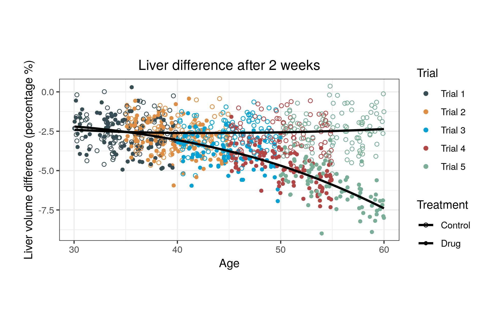

```{r global_options , echo=FALSE, message=FALSE, warning= FALSE}
rm(list=ls()) ### To clear namespace

# Libraries for loading and saving data
## Load data-set for loading xlsx data-sets
if(!require("readr")) install.packages("readr")
## Load readxl for loading xlsx data-sets
if(!require("readxl")) install.packages("readxl")
## Load haven for loading sas data-sets 
if(!require("haven")) install.packages("haven")

################################################
# Libraries for plotting
## Load ggpubr for plotting
if(!require("ggpubr")) install.packages("ggpubr") # automatically loads the ggplot2
## Load gridExtra  to arrange multiple grid-based plots on a page, and draw tables
if(!require("gridExtra")) install.packages("gridExtra")
## Load ggsci for better looking colors
if(!require("ggsci")) install.packages("ggsci")
## Load sjPlot to get easy statistical summaries and plots
if(!require("sjPlot")) install.packages("sjPlot")
## Load itsadug to have nice plots of GAMMs
if(!require("itsadug")) install.packages("itsadug")
## Load magick for graphics and image processing in R
if(!require("magick")) install.packages("magick")
## Load webshot for tranforming HTML objects into pictures
if(!require("webshot")) install.packages("webshot")
## Load lme4 for lme4
if(!require("pander")) install.packages("pander")
## Load kableExtra for better looking kable objects
if(!require("kableExtra")) install.packages("kableExtra") # automatically loads kable

################################################
# Libraries for data manipulation
## Load knitr for fine tuning
if(!require("knitr")) install.packages("knitr")
## Load dplyr for data manipulation
if(!require("dplyr")) install.packages("dplyr")

################################################
# Libraries for the statistical analysis 
## Load lme4 for lme4
if(!require("lme4")) install.packages("lme4")
## Load mfp to fit multivariable fractional polynomials
if(!require("mfp")) install.packages("mfp")
## Load lmerTest to add information into the summaries  
if(!require("lmerTest")) install.packages("lmerTest")
## Load mcgv to fit gamms and bamm
if(!require("mgcv")) install.packages("mgcv")
################################################


## General output of the chunks 
opts_chunk$set(fig.path='Figs/',                # The path where to save the figures
               echo=F,                          # Logical whether the chunck will be printed 
               warning=FALSE,                   # Logical whether the warnings will be printed
               message=FALSE,                   # Logical whether the messages will be printed
               fig.pos = " ",                   # The position of the 
               comment = ""                     #
               )

options(knitr.table.format = "html")


Sys.setenv(PATH=paste(Sys.getenv("PATH"),"C:/Program Files/MiKTeX 2.9/miktex/bin/x64/",sep=";"))
Sys.setenv(R_GSCMD = "/usr/local/bin/gs")
```


```{r loading the datasets,eval=FALSE}
IPDMA <- read_sas("Data/IPDMA.sas7bdat")
names(IPDMA) <- tolower(names(IPDMA))
IPDMA$treat =  factor(IPDMA$treat  , labels = c("Placebo","Antibiotics") )
IPDMA$study = factor(IPDMA$study, labels = c("Damoiseaux","Burke","Appelman","Little","Saux","McCormick"))
IPDMA$bilat_0 =  factor(IPDMA$bilat_0  , labels = c("No","Yes") )
Tubano <- read_csv("Data/VolledigeDS.csv")
somatostatin <- read_sav("Data/somatostatin.sav")
source("Data/somatostatin_descriptives.R")

```

\newpage

## Background

Individual participant data(IPD) meta-analysis(MA) is considered the gold standard since a variety of opportunities are offered. The investigation of treatment-effect modification is one of them, Nevertheless, effect modification over a continuous co-variables may be challenging, as non-linear interactions may be present. Most methods either ignore non-linear effect modification, or use a forward technique to model non-linearities that relies on statistical tests with arbitrary significance levels.

## Objective 
We propose a new approach to model and investigate treatment-effect modification, while modelling non-linear associations using smoothing splines. 

## Methods


## Results


## Conclusion


\newpage

##### 

# 1. Introduction

####### The effect of a treatment may differ depending on patient characteristics. One of the main goals of an individual participant data (IPD) meta-analysis (MA) is to investigate whether treatment effect differences are present, and how they are associated with these characteristics [@Simmonds_2015]. Patient characteristics can be represented by either categorical or continuous variables. Especially the latter, treatment effect modification over a continuous variable, may be challenging to investigate because the association between the outcome and the effect modifier and/or the interaction may not be known.

#######  Often, regression based approaches are used in combination with several assumptions and strategies to deal with continuous effect modifiers. A naive approach is to ignore possible non-linearity either through categorization of the continuous variable, or using the continuous variable as it is in a linear regression model. Categorization involves splitting the continuous co-variable into subgroups based on clinical reasoning. For instance, the risk of developing ovarian cancer may be associated with menopause. Therefore, if age is investigated as a potential effect modifier it is reasonable to categorize the age to younger ( $\leq$  50 years older) and older (> 50 years old) participants. Due to loss of information, categorization has been criticized for misspecification, reduced power, inflation of the type I error rates and biased results [@Royston_2005 ; @Altman_2006 ; @Austin_2004 ; @Maxwell_1993 ; @Weinberg_1995]. When clinical knowledge to define the subgroups is not available, tree-based approaches have been proposed to estimate these subgroups [@Zeileis_2008; @Seibold_2016 ; @Su_2009 ; @Mistry_2018 ; @Fokkema_2017 ;@Wang_2016].  However, tree-based approaches rely on statistical tests with arbitrary levels of significance, are data sensitive and fit well only when the underlying functional form is a step function. 

#######    Another naive approach is to include the effect modifier as it is and fit a linear model, without adjusting for non-linearity. Nevertheless, if the underlying association in not linear the results may be biased. For instance, if we assume linearity between BMI and mortality while the underlying shape is quadratic (U-shape) we may draw the conclusion that they are not associated at all. Additionally, any predictions made by a misspecified linear model will be biased and increasing the sample size will only make things worse. 

#######    Often the association between potential effect modifiers and the outcome has already been investigated and a non-linear baseline functional form may have been already known. For instance, in an IPD-MA of 44 cohort studies Liu et al. showed a J-shaped association between BMI and risk of stroke [@Liu_2018]. Researchers investigating thrombolysis treatment and potential effect modification by BMI may include this finding as an a-priori knowledge and introduce exponential or quadratic terms in their regression model. However, the association between BMI and risk of stroke may have a different shape for the treated group than for the control group. Misspecifying this functional shape may lead to the same problems as in the naive linear approach mentioned above.

#######    The aforementioned approaches were either ignoring or assuming the functional shape of the associations known. Another approach is to estimate the functional shape from the data and investigate effect modification. One commonly applied strategy is trail and error. Thereto, researchers fit regression models including various transformations of the effect modifier, such as polynomial, trigonometric (sine, cosine), exponential and logarithmic. Then, these models are compared with each other using statistical tests such as Wald and likelihood ratio tests or criteria such as AIC and BIC. The trial and error procedure may be time-consuming and automated approaches are also available. Royston and Altman [@Royston_1994] proposed multivariable fractional polynomial procedure (MFP) in order to detect the best fitting fractional polynomial. Nevertheless, their approach was initially limited to single studies and didn't include interactions. Therefore, in a subsequent article Royston and Sauerbrei [@Royston_2004] extended their algorithm to include also interactions between binary variables such as treatments and continuous co-variables. Their proposal included estimating treatment effect functions and using treatment effect plots for illustration purposes. Finally, Sauerbrei and Royston [@Sauerbrei_2011] extended fractional polynomials to IPD-MA, proposing a two-stage approach. On a first stage an appropriate statistical model is fitted per trial and either the estimated coefficients with their standard errors or the treatment effect functions with their 95% confidence intervals are extracted. On a second stage, these estimates are pooled using either multivariate or point-wise meta-analysis respectively. Nevertheless,their two-stage approach may be prone to power loss when the sample size is small and the outcome is binary [@Debray_2015] or the per trial mean of the continuous effect modifier is highly heterogeneous [@Simmonds_2007]. Furthermore, both trial and error and fractional polynomial approaches rely on tests with arbitrary $\alpha$ significance levels and estimate global functions which may not fit well on the boundaries of a continuous effect modifier.  For instance, using the previous example, BMI and mortality may on average fit well using regression models with quadratic terms, but the fit may not be adequate for extreme cases such underweight (BMI <18.5) and severely obese (BMI>40) participants. Splitting the BMI into 3 intervals of BMI [<18.5 , 18.5-40 , 40+] and fitting a model within each interval would provide better fit. Nevertheless, the resulting piece-wise functional shapes, will probably be discontinuous to the knots (18.5, 40). Therefore, piece-wise approaches are usually combined with smoothing techniques in order to show continuous functional shapes. 

#######     Wang et al. [@Wang_2016 ;  @Wang_2018] proposed a two-stage IPD-MA moving average (sliding window) approach for binary and time-to-event outcomes, called meta-STEPP. On the first stage the continuous effect modifier is split into intervals with the same number of events and within-interval and per study treatment effect are estimated using an effect size of choice. On a second stage, these within-interval treatment effects are pooled using either fixed or random effects meta-analysis. Finally, the pooled effect sizes are tested for heterogeneity using Cochran's Q $\chi^2$ test. This algorithm is repeated multiple times with overlapping sliding windows for smoother results.  Cochran's Q is the weighted average of the distances of the within-interval estimates to the average. Therefore, Cochran's Q lacks power to detect non-linear effect modification, compared to smoother approaches. Furthermore, the size of the window and the moving step may influence our results. 

#######      A more flexible approach is to use generalized additive models (GAMs). GAMs in their simplest form also split the effect modifier into knots and fit a polynomial regression within each interval. Nevertheless, these regression models are restricted to be continuous over the knots. The most often used polynomials are cubic splines while quadratic and linear are also available. Natural splines have one further restriction to be linear beyond the extreme knots. If we don't have prior knowledge for the knots these can be estimated using a cross-validation technique. Another piece-wise approach is locally (weighted) scatterplot smoothing (loess). Loess is a non-parametric regression that uses a sliding window technique for smoothing. Specifically, a weighted linear or quadratic model is fitted per data point using as a dataset its nearest observations. The number of these observations determines the size of the sliding window controls the smoothness of the functional shape.  A combination of splines and loess is smoothing splines. Hereby, the sum of the maximum likelihood and a penalty factor for wiggliness ($\lambda$) is minimized. The functional shapes are adjusted by either manually tuning the values of $\lambda$ or through an automated cross-validation procedure.

#######      Applying GAMs may be beneficial for research as they make limited assumptions and can detect complex shapes. Specifically, with GAMs we may begin with smooth functions rather than naive linearity and let the data decide the underlying functional shape. This procedure involves less assumptions, no use of multiple statistical tests and may lead to better fitted regression lines. Nevertheless, it is still unknown how should we apply GAMs, when information from multiple studies is available. Our goal is to advocate the use of flexible over naive and restricted methods, inform for the available approaches and provide a tutorial how to fit them in empirical examples of IPD-MA.

##### 
\newpage 

# 2. Methods

In our study we advocate the use of generalized additive models (GAMMs) to model and investigate treatment effect modification by a continuous variable, whilst accounting for non-linear functional shapes and within study clustering of the participants. We will present two approaches to model and two approaches to pool the results of a GAMs. 


## 2.1 Statistical approaches


As described in section 2, both empirical example datasets are composed of multiple randomized trials. We will adopt the following notation throughout our manuscript:


* The trials as j = 1,2, ...,$N_j$, 
* Trial participants as i = 1,2, ...,$n_i$, 
* Standardised  $Age_{ij}  = \frac{Age_{ij} - 30}{60}$
* The per trial mean of age as $\overline{Age_j} = \overline{\frac{Age_{ij} - 30}{60}}$
 $Age_{ij} - \overline{Age_j}$


#### 2.1.1 Natural cubic splines 

Generalized additive models are a form of penalized generalised linear models. One type of penalization is identical to the random effects’ technique introduced by McCullagh et al. [@McCullagh_1983] in the generalised mixed effects models. There we can estimate a separate functional form per trial, given the fixed effects parameters. Therefore, per trial and treatment regime a different shape will be estimate. 

The statistical model will be:

$g(Y_{ij}) = s(Age)_{kj}$, where k the treatment regime.


##### 
\newpage 


## 2.1 Data-set
## 2.1.1 Simulated data-set

We simulated 1 IPD-set which we considered an extreme case with 5 RCTs with 100 participants each, including 4 variables: 1) a binary variable **T** which corresponds to treatment 2) a uniformly distributed co-variable **Age** ranging from 30 to 60 years old and 3) a variable to indicate trial membership 4) a continuous outcome **Y**. We assumed equal treatment allocation for all trials, but different age groups randomized per trial, see table 1. **Age** was linearly associated with **Y** in the control group and quadratically in the treated group. 

```{r fig.cap="Table 1." , out.width= "25%",eval=FALSE}

a= as.data.frame(matrix(c(paste("trial", 1:5), c("30-40","35-45","40-50","45-55","50-60")), ncol=2, nrow=5))
a= tab_df(a, title = "Age ranges per trial", col.header =  c("Trial","Age range of the participants", file = "Figs/Table1.html"),  
    CSS = list(
    css.caption = 'font-weight: bold; text-align: center; font-size: 28;',
    css.centeralign = 'text-align: center; font-size: 22;', 
    css.firsttablecol = 'font-weight: bold;font-size: 22;', 
    css.firsttablerow = 'font-weight: bold;font-size: 22;'
  ))

#webshot("Figs/Table1.html", "Figs/Table1.png")
include_graphics("Figs/Table1.png")

```

We considered the following example. Patients with liver disease are randomly allocated to *placebo* and *drug*. After a period of time the difference in liver volume is measured. We assumed that patients that received *placebo* had an 2.5%  decrease in all age categories. The treatment had no-effect on young patients (around 30), and as Age increased the treatment effect increased with a quadratic shape we assumed t. 

The linear predictor for the whole IPD-set was: 
$Y_{i} =  \beta_{0} + \beta_{Age} \times \frac{Age_{i} - 30}{60} + \beta_{Treat} \times Treatment_{i} + \beta_x \times (\frac{Age_{i} - 30}{60})^2 \times Treatment_{i} + \epsilon_{i}$

Notice that we don't vary the $\beta$s per trial. 
$\beta_{0}$ = -2.5, $\beta_{Treat}$ = 0 , $\beta_{Age}$ = 0, $\beta_{X}$ = 20

```{r ,eval=FALSE}

IPD1=  data.frame(Trial = factor(rep(1:5, each = 100), levels = c(1:5), labels = paste("Trial",1:5)),
                  Age = c(runif(100, 30,40),runif(100, 35,45),runif(100, 40,50),runif(100, 45,55),runif(100, 50,60)),
                  Treatment = rbinom(1000, 1, 0.5))

IPD1$Age.d  =  round(((IPD1$Age - 30)/60),3)
IPD1$Y =  with(IPD1, -2.5 +0*Treatment+ 0* Age.d  - 20*I(Treatment*Age.d^2)  + rnorm(1000,0,1))
IPD1$Treat =  IPD1$Treatment                                                                 
IPD1$Treatment =factor(IPD1$Treatment, levels = c(0,1), labels = c("Control", "Drug"))

a= ggplot(IPD1)+ 
  geom_point( aes(x= Age, y = Y, color = Trial, shape = Treatment))+ 
  geom_smooth(data = IPD1, mapping = aes(x= Age, y = Y, fill = Treatment),method = "loess", span=1.25, se = F, color= "black")+ 
  labs(title = "Liver difference after 2 weeks")+ 
  ylab("Liver volume difference (percentage %)") +
  scale_shape_manual(values = c(1, 16))+ 
  scale_color_jama()+ 
  theme_bw() +
  theme(plot.title = element_text( hjust=0.5), 
        plot.margin = margin(2,.8,2,.8, "cm")) 
        
# ggsave(filename = "Figs/plot.png")

```


## 2.1.2 Empirical data-sets

#######  We use 2 IPD-sets to illustrate the aforementioned method. The first IPD-MA investigates the effect of antibiotics in children with acute otitis media [@Rovers_2006]. Rovers et al. collected IPD from 6 randomized clinical trials with a total of 1643 children, aged from 0-12 years old. The primary outcome was fever and/or ear-pain after 3-7 days (yes/no). They concluded that antibiotics were more beneficial in younger children (less than 2 years old) with bilateral acute otitis media. Bilateral acute otitis media (yes/no), age, otorrhea were investigated also separately for potential effect modification and only bilateral acute otitis media showed a significant result. The second IPD-set [@Gevers_2013] considers an IPD-MA to investigate the effect of somatostatin on liver volume reduction. Gevers et al. collected IPD from 3 randomized placebo-controlled trials with a total of 107 participants. In this example, the outcome was continuous (liver volume reduction), and age, sex, baseline liver volume, and diagnosis of either autosomal dominant polycystic liver or kidney disease were investigated for effect modification . They concluded that use of somatostatin was more beneficial for younger (<47) female patients. One of the 3 trials had a cross-over design, therefore participants were treated both with the active and the control treatment in different time periods. In order to use these data for our illustrative purposes, we removed the cross-over design and used all patients only once, by selecting half of the patients from the active period and the other half (sex and age-matched) from the control period. Therefore, differences between our results and those reported in the original article may occur.


# Results


```{r Centred one-stage IPD-MA ,eval=FALSE}
# print(summary(lm(formula = Y~ Age.d + Treatment + I(Treat*(Age.d)^2) , IPD1)), digits =3)
meanAge= IPD1 %>%
  group_by(Trial)%>%
  summarise(meanAge = round(mean(Age.d),3))
IPD1$meanAge =  rep(meanAge$meanAge,each = 200)
IPD1$CentredAge = (IPD1$Age.d - IPD1$meanAge)

fit = lmer(Y~ Treat + Age.d + I(Treat*meanAge)  + I(Treat  * CentredAge) +  (Treat |Trial), IPD1)

a= tab_model(fit,title =  "Centred one-stage IPD-MA results", use.viewer = T,
          show.intercept = T,show.est = T,show.ci = 0.95,show.se = T,show.r2 = T,show.icc = T,show.p = T,show.re.var = T,
                  string.pred = "Fixed terms" , 
          pred.labels = c("Intercept","Treatment","Age",
                          "Per trial mean Age - Treatment interaction","Per trial centred Age - Treatment interaction"))

webshot::webshot(url = "Figs/One-stage_IPDMA.html", file = "Figs/One-stage_IPDMA.png")
fit2= lmer(Y~ Treat + Age.d + I(Treat*meanAge)  + I(Treat  * CentredAge^2) +  (1 |Trial), IPD1)
a= tab_model(fit2,title =  "Centred one-stage IPD-MA (with quadratic terms) results", use.viewer = T,file = "Figs/One-stage_IPDMA2.html",
          show.intercept = T,show.est = T,show.ci = 0.95,show.se = T,show.r2 = T,show.icc = T,show.p = T,show.re.var = T,
          string.pred = "Fixed terms" ,  digits = 4,
          pred.labels = c("Intercept","Treatment","Age",
                          "Per trial mean Age - Treatment interaction",
                          "Per trial centred Age^2 - Treatment interaction"))
webshot::webshot(url = "Figs/One-stage_IPDMA.html", file = "Figs/One-stage_IPDMA2.png")
```


```{r One-Stage smoothing splines in Somatostatin,eval=FALSE}


# Note: this is really not the best fitting model for the data:
m1 <- bam(dif_liver_perc ~ Drug*Gender*Age + 
            s(Study,Age,bs = "re") + 
            s(Study,Gender,bs = "re") + 
            s(Study,Drug,bs="re") , data = somatostatin,method="fREML" ,  discrete=TRUE)

m1.pred =  as.data.frame(predict.gam(m1,somatostatin, se.fit = T) ); m1.pred$low = with(m1.pred, fit-1.96*se.fit) ; m1.pred$high = with(m1.pred, fit+ 1.96*se.fit)

ggplot(somatostatin, aes(x = Age, y = dif_liver_perc, color = Study) ) +
    geom_line(aes(y = exp(m1.pred$fit), linetype = Drug), size = 1) +
    geom_point() + facet_wrap(~ Gender, ncol = 2) + scale_color_futurama()


# Change the colors:
plot_data(m1, view="Age", split_by="Drug", type='p', col=c("#6A659999","#79AF9799"), alpha=1)


par(mfrow=c(2,1), cex=0.75)
plot_diff(m1, view='Age',cond = list(Gender="Male") , comp=list(Drug=c("placebo", "somatostatin")), 
    rm.ranef=TRUE, col = "darkblue",print.summary = F, main = "Men", 
    xlab = "Age (in years)",
    ylab = "Estimated treatment difference") 

plot_diff(m1, view='Age',cond = list(Gender="Female") , comp=list(Drug=c("placebo", "somatostatin")), 
    rm.ranef=TRUE, col = "darkgreen",print.summary = F, main = "Women",
    xlab = "Age (in years)",
    ylab = "Estimated treatment difference ")

```


```{r,eval=FALSE}
# version 1:
plot_smooth(m1, view="Age", plot_all="Drug", rm.ranef=TRUE, se = 2.56,print.summary = T)

```

```{r One-Stage smoothing splines in AOM study ,eval=FALSE}


miniIPD= IPDMA%>%
    filter((study != "Little"))
fit = glmer(data = miniIPD ,poutcome ~ bilat_0*treat*age + (treat|study) , family = binomial("log"))

ggplot(miniIPD, aes(x = age, y = poutcome, color = study) ) +
    geom_line(aes(y = exp(predict(fit)), linetype = treat), size = 1) +
    geom_point() + facet_wrap(~ bilat_0, ncol = 2)


# Note: this is really not the best fitting model for the data:
m1 <- bam(poutcome ~ bilat_0*treat*age + s(age) + 
            s(study,age,bs = "re") + 
            s(study,bilat_0,bs = "re") + 
            s(study,treat,bs="re") , family = binomial("log"), data = miniIPD, method="fREML" ,  discrete=TRUE)

m1.pred =  as.data.frame(predict.gam(m1, se.fit = T) ); m1.pred$low = with(m1.pred, fit-1.96*se.fit) ; m1.pred$high = with(m1.pred, fit+ 1.96*se.fit)

ggplot(miniIPD, aes(x = age, y = poutcome, color = study) ) +
    geom_line(aes(y = exp(m1.pred$fit), linetype = treat), size = 1) +
    geom_ribbon(data = m1.pred,aes( ymin = low, ymax = high), alpha = .2)+ 
    geom_point() + facet_wrap(~ bilat_0, ncol = 2) + scale_color_futurama()


par(mfrow=c(2,1), cex=0.75)
plot_smooth(m1, view="age", plot_all="treat", cond = list(bilat_0="No") ,  rm.ranef=TRUE, se = 1.96)
plot_diff(m1, view='age',cond = list(bilat_0="No") , 
          comp=list(treat=c("Placebo", "Antibiotics")), 
          rm.ranef=TRUE, col = "darkblue",print.summary = F, main = "Children with unilateral otitis media", 
          xlab = "Age (in years)", ylab = "Estimated difference (log-scale)")
```


```{r ,eval=FALSE}
par(mfrow=c(2,1), cex=0.75)
plot_smooth(m1, view="age", plot_all="treat", cond = list(bilat_0="Yes") ,  
            rm.ranef=TRUE, sim.ci=TRUE, se = 0.8, transform = "exp")
plot_diff(m1, view='age',cond = list(bilat_0="Yes") , comp=list(treat=c("Placebo", "Antibiotics")), 
    rm.ranef=TRUE, col = "darkgreen",print.summary = F, main = "Children with bilateral otitis media",
    xlab = "Age (in years)", mark.diff = T,col.diff =  "purple",sim.ci=TRUE, 
    ylab = "Estimated difference (log-scale)")
```

##### 
\newpage 
# Discussion

In our paper, we described and illustrated a new approach to model and investigate effect modification when the potential effect modifier is not linearly associated with the outcome. Furthermore, we applied our method on two empirical examples and one extreme-case simulated IPD-set. Clinical decision making may be based on either relative or absolute treatment effects. Our results show that it may be important to account for the outcome-variable functional shape. Two-stage methods suffered from ecological bias in our simulated example. Finally, we showed that effect modification may not be linear and therefore not possible to be encapsulated in a single interaction term. Thus treatment effect functions along with illustrative methods such treatment effect plots may be better options for decision making.


## 5.1 Comparison with literature


## 5.2 Strengths and limitations
The major strength of our paper is that we propose a novel approach for IPD-MA of RCTs. Particularly, we considered generalised additive mixed effects models with smoothing splines. We showed that smoothing splines make minimal shape assumptions as they minimize the sum of maximum likelihood and a penalty term for the wiggliness of the line.

## 5.3 Implications for practice

We believe that our approach may change the point of view of IPD-MA conducted. Specifically, the naive idea that....


## 5.4 Conclusions
We propose the use of one-stage generalised additive model with smoothing spline. This approach makes no assumptions over the functional shape and the cut-point where it changes. Finally, when combined with the treatment effect plot researchers .


# References


##### 
\newpage 
